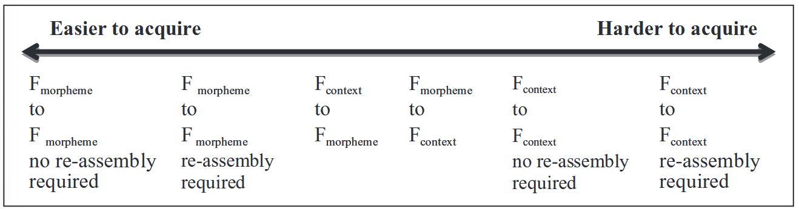
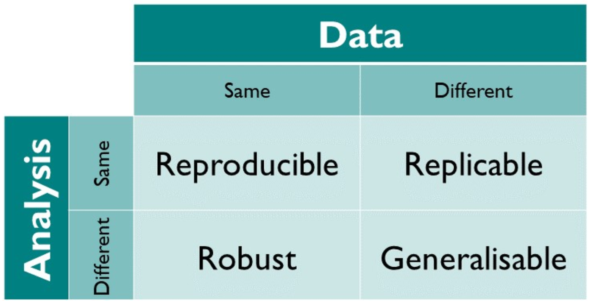
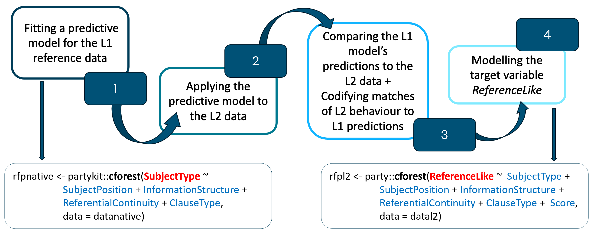
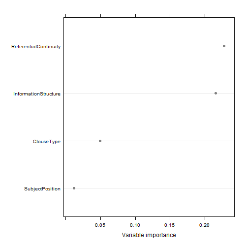
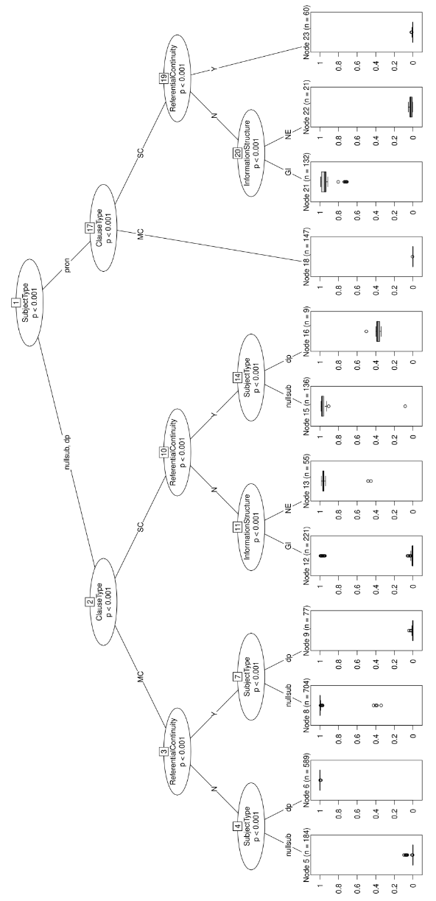
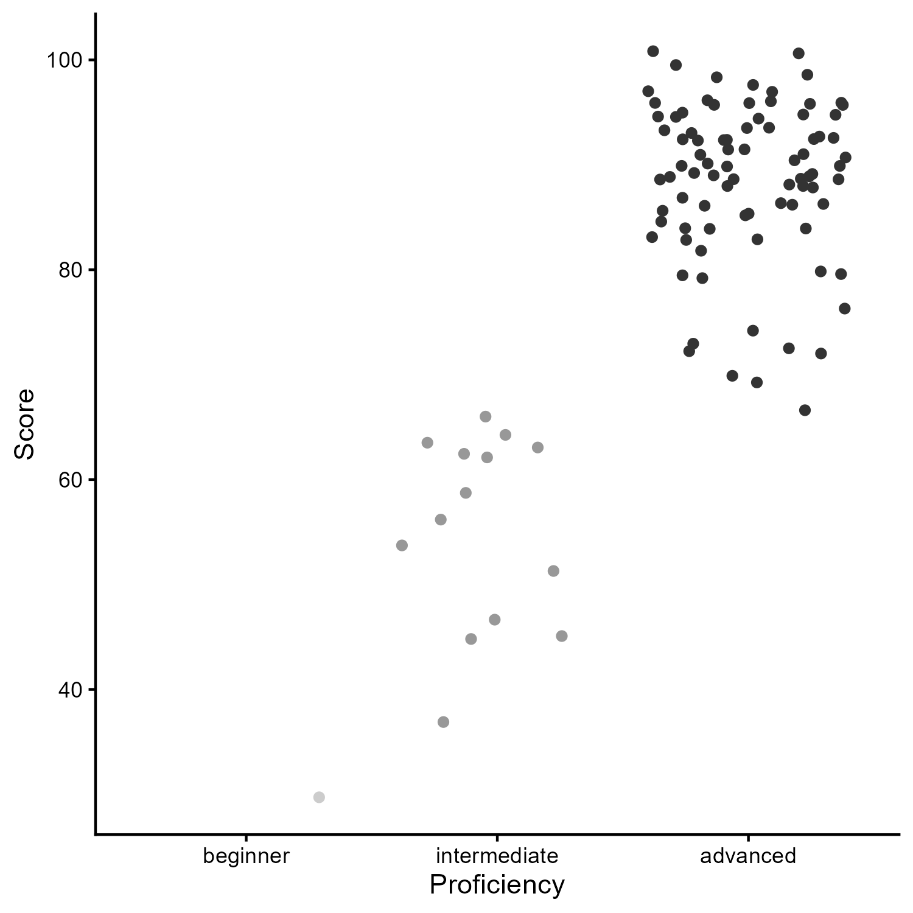
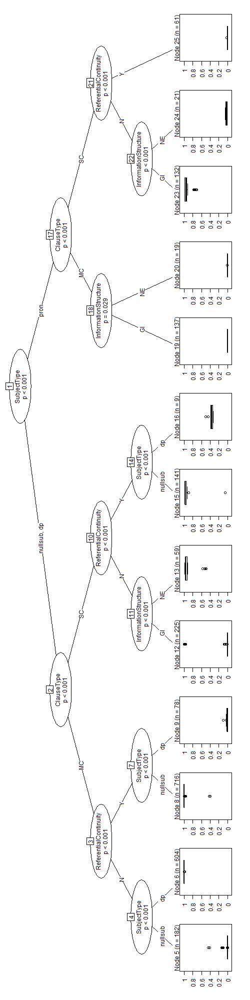
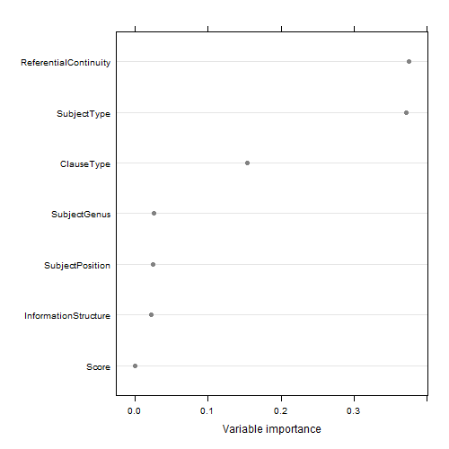
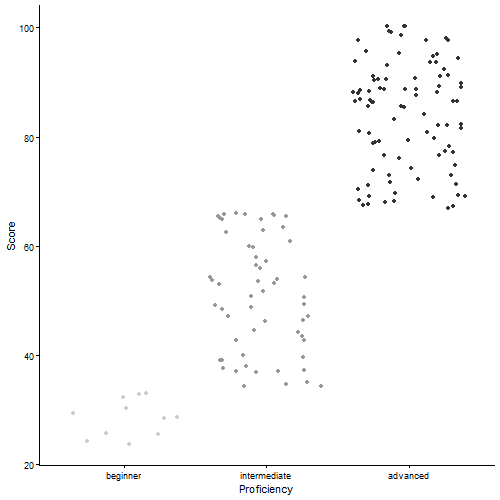
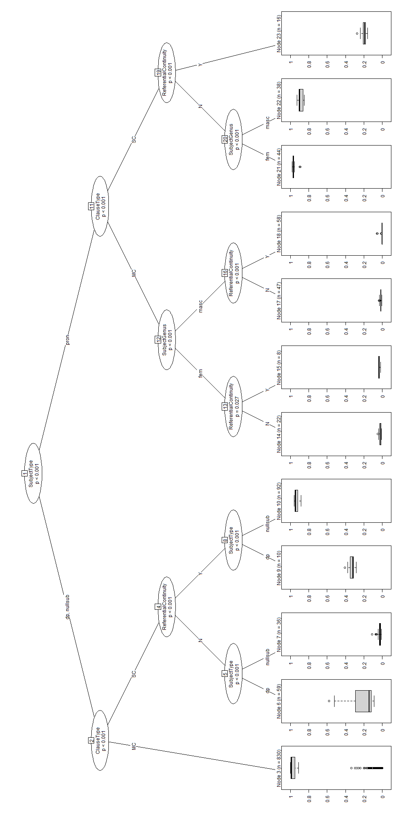

\begin{titlepage}
    \centering

    \includegraphics[width=0.2\textwidth]{logo.jpg}\par
    \vspace{0.5cm}

    {\Large Universität zu Köln \par}
    {\large Faculty of Arts and Humanities, Department of Linguistics \par}
    \vspace{1cm}
    
    {\Large\itshape Master's Thesis \par}
    \vspace{0.7cm}

    {\LARGE\bfseries Subject realisation in L2 Spanish: \par}
    {\LARGE\bfseries An extended reproduction and replication of \par} 
    {\LARGE\bfseries Kocher (2025) with L1 German and L1 English corpus data \par}
    \vspace{1cm}
    
        \begin{center}
        {\normalsize \textit{A Thesis Submitted in Partial Fulfillment of the Requirements for the Degree}}\\[0.25cm]
        
        {\Large Master of Arts}\\[0.25cm]
        {\normalsize \textit{in the}}\\[0.25cm]
        {\Large Master Linguistik}
    \end{center}
    \vfill
    {\large Author: Tiziana Ilie\par}
    {\large Matriculation Number: 7421401\par}
    \vspace{0.7cm}
    {\large Supervisor: Dr. Elen Le Foll\par}
    \vspace{0.7cm}

    {\large 30 September 2026\par}

\end{titlepage}



\pagenumbering{roman}

\tableofcontents



\listoffigures



\listoftables

```{r libraries-packages, include=FALSE}

library(knitr) # to generate HTML, PDF, Word, etc. documents from .qmd file
library(here) # to declare the location of current script or project
library(tidyverse) # collection of R packages for data science
library(irr) # to calculate the inter-annotator agreement
library(ggplot2) #for data visualisation
```

```{r loading-data, include=FALSE}

datanative<-read.csv(here::here("data", "annotations", "kocher_native_data_annotation.csv"), stringsAsFactors = TRUE) #Loading the Spanish native speaker dataset

kocher_germanL1_data <- read.csv(here::here("data", "kocher_germanL1_data.csv"), stringsAsFactors = TRUE) #Loading Kochers original L1 German dataset


raw_L1german <- read.csv(here::here("data", "raw_data", "raw_data_germanL1.csv"), sep = "\t", stringsAsFactors = TRUE) #Loading L1 German raw data from CEDEL2 

new_germanL1_segmented <- read.csv(here::here("data", "new_germanL1_segmented.csv"), stringsAsFactors = TRUE) #Loading newly added L1 German dataset

joined_germanL1_data <- read.csv(here::here("data", "joined_germanL1_data.csv"), stringsAsFactors = TRUE) #Loading the joined L1 German dataset pre-annotation and pre-exclusion of clauses

datal2german <- read.csv(here::here("data", "annotations", "withReferenceLike",  "ReferenceLike_L1German.csv"), stringsAsFactors = TRUE) #Loading German L2 Spanish learner data after full annotation


kocherssample <-read.csv(here::here("data", "annotations", "sample_kocher_germanL1_original.csv"), stringsAsFactors = TRUE) #Loading German L2 learner data sample from Kocher's data

mysample <-read.csv(here::here("data", "annotations", "sample_kocher_germanL1_annotation.csv"), stringsAsFactors = TRUE) #Loading my manually reannotated German L2 learner data sample


preannot_datal2english <-read.csv(here::here("data", "joined_englishL1_data.csv"), stringsAsFactors = TRUE) #Loading English L2 Spanish learner data pre annotation

datal2english<-read.csv(here::here("data", "annotations", "withReferenceLike",  "ReferenceLike_L1English.csv"), stringsAsFactors = TRUE) #Loading English L2 Spanish learner data after annotation
```



\pagenumbering{arabic}

# Introduction {#sec-introduction}

Spanish is a null subject language (NSL), allowing subjects to be omitted when they can be recovered from the discourse. Learners whose first language (L1) is a non-NSL, such as German or English, therefore need to acquire not only the formal possibility of null subjects but also the linguistic and discourse conditions governing the use of null subjects, overt pronouns, and determiner phrases (DPs). Previous research on subject realisation in L2 Spanish has largely relied on experimentally elicited data and has often focused on the distinction between null and overt subjects, while differences within overt subjects, between pronouns and DPs, have received comparatively little attention (see @sec-influential-factors). Kocher [-@kocher_subject_2025] addresses this gap by applying MuPDARF modelling, an innovative statistical approach from learner corpus research, to naturally occurring L2 data. Using written short-film descriptions from the CEDEL2 corpus, Kocher investigates the variables that influence subject realisation among L1 German learners of Spanish. The study therefore provides a suitable basis for reproduction and further extension.

The present thesis reproduces and extends Kocher's [-@kocher_subject_2025] study using the same CEDEL2 data and statistical analysis following the MuPDARF procedure [see @gries_theres_2020; @flach_mupdar_2022]. In addition, the L1 German dataset is enlarged to assess the robustness of the original findings. Two close replications further extend the analysis by introducing two gender-related variables. namely the grammatical gender of the subject referents ([SubjectGenus]{.smallcaps}) and the gender of the L2 speakers ([SpeakerGender]{.smallcaps}) participating in the task. The extended analysis is conducted both on the enlarged L1 German dataset and on an L1 English dataset. Comparing these two non-NSL groups allows for an investigation of both similarities and differences in L2 Spanish subject realisation.

The study addresses three main research questions. First, it investigates the reproducibility and robustness of the findings reported by Kocher [-@kocher_subject_2025]. Second, it examines whether subject realisation differs between L2 Spanish learners with L1 German and L1 English. Third, it investigates whether the gender-related variables influence the target-likeness of subject realisation and whether they interact with other variables. The thesis is structured as follows. Chapter 2 presents the theoretical background, including relevant variables and theoretical approaches to L2 subject realisation in Spanish, English, and German, as well as the *Interface Hypothesis* and *Feature-Reassembly Hypothesis*, which have emerged from previous research in this field. Chapter 3 describes the corpus, data, methodology, and replication design. Chapter 4 presents the results of the four analyses. Chapter 5 discusses the findings and examines qualitative examples from the corpus. Chapters 6 and 7 address the limitations of the study and present the conclusion, respectively.

# Theoretical background {#sec-Background}

This chapter provides the theoretical background for the present study by first comparing the different systems of subject realisation in Spanish, English, and German. It then reviews the main linguistic and discourse-related variables that have been identified as influencing subject realisation in these three languages. Building on this cross-linguistic comparison, the second part of the chapter turns to the acquisition of subject realisation in L2 Spanish. It introduces the two theoretical approaches that are particularly relevant to the present study and reviews previous research on the acquisition of subject realisation in L2 Spanish. The chapter concludes by presenting the three research questions that guide the present study.

## Comparing L1 systems of subject realisation {#sec-SubjectRealisationEsp}

### Subject realisation in Spanish

According to Chomsky, languages can be classified as "pro-drop" or "non-pro-drop languages" [-@chomsky1993: 240]. While non-pro-drop languages, such as English and French, obligatorily require overt subjects in the form of pronouns or determiner phrases (DPs), pro-drop languages, such as Spanish, Greek, and Italian, do not require subjects to be overtly expressed [see @torres_cacoullos_variationist_2019: 2]. In the latter, the subject of a sentence may remain implicit or have "a phonologically empty form" [@casteele_exploratory_2020: 437], commonly referred to as pro, a null subject, or a covert subject.

Spanish has a rich inflectional system in which verbs are inflected for person, number, tense, and aspect [see @ayoun2003: 82]. As subject information is encoded through verbal agreement and almost all Spanish verb forms are distinct, an omitted referential subject pronoun can generally be recovered grammatically from the verb form. Consequently, Spanish provides three main options for the realisation of referential subjects, as illustrated in example 1:

> (1) a\. [*Charles Chaplin*]{.underline} *está caminando por la calle.*\
>     'Charles Chaplin is walking down the street.'\
>     (example ID 2_1, kocher_native_data_annotation.csv)
>
>     b\. [*Él*]{.underline} *está caminando por la calle.*\
>     'He is walking down the street.'\
>     (own example)
>
>     c\. [Ø]{.underline} *Está caminando por la calle.*\
>     'Ø is walking down the street.'\
>     (own example)

The subject can be realised as a DP, such as *Charles Chaplin* in 1a, or as an overt pronoun, such as *él* in 1b. Alternatively, it can remain unexpressed, resulting in a covert or null subject, as in 1c. In all three sentences, the subject refers to the same person. In Spanish narratives, null subjects and DPs are generally the most frequently used forms of subject realisation [@comajoan2006: 74].

The same three options are available for embedded subjects, as illustrated in Examples 2a-c [see also @ayoun2003: 85]:

> (2) a\. *Al principio \[Charles Chaplin\] [Ø]{.underline}*~i~ *cree que [el niño]{.underline}*~j~ *ha caído de un edificio.*\
>     'At first, \[Charles Chaplin\] [*Ø*]{.underline}~i~ thinks [the boy]{.underline}~j~ has fallen from a building.'\
>     (own example)
>
>     b\. *Al principio \[Charles Chaplin\] [Ø]{.underline}*~i~ *cree que [él]{.underline}*~j~ *ha caído de un edificio.*\
>     'At first, \[Charles Chaplin\] [*Ø*]{.underline}~i~ thinks [he]{.underline}~j~ has fallen from a building.'\
>     (own example)
>
>     c\. *Al principio \[Charles Chaplin\] [Ø]{.underline}*~i~ *cree que* [*Ø*]{.underline}~j~ *ha caído de un edificio.*\
>     'At first, \[Charles Chaplin\] [*Ø*]{.underline}~i~ thinks [*Ø*]{.underline}~j~ has fallen from a building.'\
>     (example ID 12_4-5, kocher_native_data_annotation.csv)

Although Spanish allows null subjects, their use varies considerably across regional varieties and discourse types. In particular, rates of unexpressed third-person subjects differ substantially across varieties. For instance, in sociolinguistic interview narratives from Mexico City, null subjects occur in 73% of third-person singular (3sg) constructions (*N* = 450) and 88% of third-person plural (3pl) constructions (*N* = 176) [@lastramartin2015: 10]. In narratives produced by Peninsular Spanish speakers, 68.5% of singular and plural subjects are null (*N* = 402) [@comajoan2006: 60]. Similarly, in conversational Colombian Spanish, null subjects occur in 68% of 3sg instances (*N* = 1431) and 50% of 3pl instances (*N* = 1389) [@torres_cacoullos_variationist_2019: 40]. Further evidence of regional variation comes from Dominican Spanish, where a decline in null subject use and elevated rates of overt subject pronouns suggest a shift away from the pro-drop patterns observed in other varieties [@toribio2000: 339].

This variation is particularly relevant to the acquisition of L2 Spanish. On the one hand, variation in subject realisation may provide learners with a degree of flexibility in their use of overt and covert subjects without necessarily violating target-language patterns. On the other hand, the optionality of null subjects may make it more difficult for learners to develop a consistent, rule-based understanding of the conditions governing the choice between different forms of subject realisation. Thus, acquiring subject realisation in Spanish involves not only learning that subjects can be omitted, but also learning how the different subject forms are used across linguistic and discourse contexts.

### Subject realisation in English and German {#sec-SubjectRealisationGermanEnglish}

German and English are non-NSLs, meaning that their standard varieties generally require referential subjects to be overtly expressed. While Spanish is a pro-drop language, facilitated by its rich inflectional system, English and German cannot generally rely on verbal morphology to identify the subject [see @ayoun2003: 84]. This difference is particularly evident in English, where verb morphology remains largely invariant across persons. Consequently, English requires overt subjects to express and disambiguate person, as illustrated by the forms *I drink, you drink,* and *he/she drinks*. Referential subjects can be realised as proper names or noun phrases, as in 3a, or as pronouns, as in 3b.

> (3) a\. [*Charles Chaplin*]{.underline} is walking down the street*.*\
>     (own example)
>
>     b\. [*He*]{.underline} is walking down the street.\
>     (own example)
>
>     c\. ?[Ø]{.underline} is walking down the street.'\
>     (own example)

Nevertheless, subject omission does occur in English under restricted circumstances [@ayoun2003: 138]. Further, Torres Cacoullos and Travis show that, as in Spanish, the frequency of unexpressed subjects varies across discourse types. In spoken data from the USA, rates of unexpressed third-person human subjects are five times higher in narratives than in conversation [@torres_cacoullos_variationist_2019: 2]. They further report that omitted subjects are slightly more frequent in third-person singular contexts (5%, *N* = 3500) than in third-person plural contexts (2%, *N* = 6600) [@torres_cacoullos_variationist_2019: 40].

Subject omission in English can occur when two verbs are linked by coordination and conjunction, as in *I wrote home to my family and Ø said* [@torres_cacoullos_variationist_2019: 8; see also @quesada2020: 960], or in imperative constructions [@lindstrom2017: 11]. However, these constructions are not generally considered instances of true null subjects [see @torres_cacoullos_variationist_2019: 8] and can also occur in Spanish [see @etxebarriazuluaga2022: 93]. Lindstrom's research further shows that English pro-drop is subject to strict distributional constraints, as "unexpressed subjects do not occur in subordinate or interrogative clauses, nor in the environment of a contracted auxiliary" [@lindstrom2017: 58]. Instead, null subjects predominantly occur in third-person matrix clauses and, less frequently, in first-person contexts. Their use also increases with the accessibility of the referent [@lindstrom2017: 151].

A further phenomenon referred to as "diary-drop" [@scott2013: 69] occurs predominantly in written language and comprises two distinct categories. The first involves non-referential or expletive subjects, as illustrated in example 4. The second comprises first- and third-person declarative sentences, as illustrated in Examples 5 and 6 [@scott2013: 69]. In these cases, overt pronouns can replace the null subjects without affecting the meaning or acceptability of the clause [see @scott2013: 73].

> (4) [Ø*/It*]{.underline} *seems rude not to reply*\
>     [@scott2013: 70]
>
> (5) ?[Ø*/I*]{.underline} *walked to Westminster Hall*\
>     [@scott2013: 69]
>
> (6) ?[Ø*/He*]{.underline} *probably wants you to reply to his message* \
>     [@scott2013: 69]

\
These instances of subject omission further illustrate that constructions such as 3c are grammatically marked in English and that their acceptability depends on contextual variables. Such variables include the degree of formality of the register, constraints related to spatial or typographic limitations in written language, and contexts in which precise identification of the referent is not essential to the communicative function of the utterance [@scott2013: 75]. The overall frequency of subject omission also differs markedly between English and Spanish. Whereas Torres Cacoullos and Travis report unexpressed first- and third-person singular human subjects in 60% of their Spanish data, such subjects occur in only 3% of the English data [@torres_cacoullos_variationist_2019: 1].

Like English, German is a non-null subject language and generally requires subjects to be overtly realised through proper names, noun phrases, or pronouns, as illustrated in example 7.

> (7) a\. [*Charles Chaplin*]{.underline} *geht die Straße entlang.*\
>     'Charles Chaplin is walking down the street.'\
>     (own example)
>
>     b\. [*Er*]{.underline} *geht die Straße entlang.*\
>     'He is walking down the street.'\
>     (own example)
>
>     c\. ?[*Ø*]{.underline} *geht die Straße entlang.*\
>     '?Ø is walking down the street.'\
>     (own example)

As in English, however, German permits subject omission under restricted conditions. Trutkowski distinguishes between "out-of-the-blue drops", which occur with first- and second-person subjects and can be identified morphologically, and third-person *topic drop*, in which the referent can only be identified through the presence of a discourse antecedent [@trutkowski_topic_2016: 10]. The latter type of subject omission predominantly concerns third-person subjects in declarative sentences occupying the topic position and is therefore also referred to as "topic drop" [@schmitz_null_2016: 104]. In such cases, the subject can be omitted when its referent is sufficiently salient.

Nevertheless, pro-drop is only marginally used by native speakers of German. For instance, Schmitz reports a rate of only 4% (*N* = 1,286) in child-directed speech [@schmitz_null-subject_2012: 208], as illustrated in example 8. Subject omission is also considered ungrammatical in subordinate clauses, as in example 9, or when the prefield is occupied by another element, such as a *wh*-expression, as in example 10.

> (8) ?[*Ø/Er*]{.underline} *sollte das lesen*\
>     '?Ø/He should read it'\
>     [@schmitz_null-subject_2012: 212]
>
> (9) *Ich denke dass* [\*Ø*/er*]{.underline} *das lesen sollte*\
>     'I believe that \*Ø/he should read it'\
>     [@schmitz_null-subject_2012: 212]
>
> (10) *Was sollte* [\*Ø*/er*]{.underline} *unbedingt lesen?*\
>      'What should \*Ø/he absolutely read?'\
>      [@schmitz_null-subject_2012: 212]

Furthermore, subject omission in German predominantly occurs in colloquial, spoken, or dialectal varieties. Schmitz describes these contexts as ones in which "realisation and omission are discourse-pragmatically neutral; they may only reflect a different speech style, omissions belonging to an informal register" [@schmitz_null-subject_2012: 206]. Thus, in both languages, English and German, subject omission are relatively seldom and function differently than in Spanish [see @liceras_topic-drop_1999: 1]. This suggests that the informal use of null subjects in English and German is unlikely to have a strong influence on the choice of subject form in the L2 data examined in the present study. However, as Kocher [-@kocher_subject_2025: 5] points out, such patterns may be more relevant when the analysis is based on informal spoken rather than written corpus data. Rather than focusing on subject omission alone, previous research has identified a range of variables that influence L1 speakers' choice between overt and null subjects. The following section reviews these variables and compares their relevance across Spanish, English, and German.

## Influential variables in subject realisation {#sec-influential-factors}

### Information structure {#sec-InformationStructure}

Kocher's study primarily identifies several major discourse-pragmatic variables that influence subject realisation, namely information structure, referential (dis)continuity, and, closely related to the latter, contrast, as well as grammatical person. Information structure distinguishes between newly introduced subjects and subjects that have already been established in the discourse. In Spanish, newly introduced subjects tend to be realised overtly, either as pronouns or DPs, whereas subjects that have already been introduced tend to be realised as null subjects [see @kocher_subject_2025: 5].

Following Brucart's *Principio de lexicalización de los pronominales*, new information in discourse must be realised phonetically in Spanish [-@brucart_elision_1987: 219]. For Spanish, this principle is empirically supported by Comajoan, whose results show that DPs are generally used to introduce new referents [@comajoan2006: 60], whereas already introduced referents tend to be taken up as null subjects. This pattern can also be observed in example 11 from Kocher's and my extracted L1 Spanish dataset:

> (11) a\. [*El protagonista*]{.underline} *está en una zona abandonada y deprimida*,\
>      'The protagonist is in a derelict and run-down area,'\
>      (example ID 17_6, kocher_native_data_annotation.csv)
>
>      b\. [*Ø*]{.underline} *encuentra una lata con unas colillas*\
>      'Ø finds a tin containing some cigarette ends'\
>      (example ID 17_7, kocher_native_data_annotation.csv)

Example 11 is taken from one of the texts written by a native speaker in the L1 dataset. In 11a, the protagonist is newly introduced into the discourse and is therefore expressed by the definite DP *el protagonista*. In 11b, the second clause of the same sentence, the subject is given and co-referential with the subject of the first clause. It is therefore realised as a null subject.

In addition to Brucart's *Principio de lexicalización de los pronominales* [-@brucart_elision_1987: 219], this pattern can also be explained by Gundel et al.'s [-@gundel1993: 275] *Givenness Hierarchy*. The hierarchy proposes that different referring expressions, such as pronouns or determiners, signal different levels of cognitive status or activation of a referent in the hearer's mind. According to the hierarchy, when a referent is given and in focus, it is typically referred to by a pronoun in non-NSLs, i.e. by the neutral *it* in English and *es* in German.

For Spanish, the *Givenness Hierarchy* associates null subject use (*Ø*) with referents that are in focus. Pronouns such as *él* (or, less commonly, *este, ese, aquel, este* + noun) are used for activated referents. For familiar but neither activated nor focused referents, a demonstrative such as *ese/aquel* + noun is used [see @gundel1993: 284; see also @etxebarriazuluaga2022: 84].[^thesis_tizianailie-1]

[^thesis_tizianailie-1]: Posio connects the role of null subjects not only to givennes but also to the *Accessability Hierarchy* of Ariel [-@ariel1994: 30], stating that "the use of subject pronouns is considered to indicate a lower level of accessibility or givenness of the referent than the use of null anaphora which in turn requires that the referent is 'at the current center of attention'" [-@posio2013: 779].

For English and German, this relationship between information status and pronoun interpretation is supported by Hemforth et al. [-@hemforth2010] and Ellert [-@ellert2013], who, among others, found that native speakers of different languages exhibit distinct antecedent biases when interpreting overt pronouns in ambiguous contexts. Their results show that, in ambiguous sentences, personal pronouns are preferentially interpreted as referring to "the first-mentioned topical antecedent" [@ellert2013: 3], which is typically the subject. This pattern can be observed in both NSLs and non-NSLs, as illustrated in examples 12 and 13.

> (12) a\. [*Der Briefträger*~i~]{.underline} *hat [den Straßenfeger]{.underline}*~[j]{.underline}~ *getroffen*
>
>      b\. *bevor [er]{.underline}*~i/j~ *nach Hause ging.*\
>      [@hemforth2010: 2218]
>
> (13) a\. [*The postman*~i~]{.underline} *met [the streetsweeper]{.underline}*~[j]{.underline}~
>
>      b\. *before [he]{.underline}*~i/j~ *went home.*\
>      [@hemforth2010: 2218]
>
> (14) a\. [*Juan*]{.underline}~i~ *vio a [Carlos]{.underline}*~[j]{.underline}~
>
>      b\. *cuando [Ø]{.underline}*~i~ *caminaba en la playa.*
>
>      c\. *cuando [él]{.underline}*~i/j~ *caminaba en la playa.*\
>      [@keating2011 : 197]

In both English and German, the referent introduced first is generally considered the antecedent of the pronoun in the subordinate clause, rather than the referent introduced subsequently. Given the differences in pronominal realisation, however, this pattern does not apply to Spanish in quite the same way. For Italian, another NSL, the *Position of Antecedent Strategy* (PAS) proposes that null subjects tend to refer to subject antecedents, whereas pronouns show a stronger preference for non-subject antecedents [see @carminati2002]. Nevertheless, Bruscato and Baptista found that Spanish native speakers also tend to interpret overt pronouns in subordinate clauses (SC) as referring to the first-mentioned referent, that is, the subject of the matrix clause (MC), and therefore pattern relatively similarly to English and German. In Spanish, however, this pattern is considerably weaker and less consistent than the strong preference for null subjects, which represent the unmarked form in Spanish [@bruscato2022: 12].

A similar pattern was reported by Keating et al. [-@keating2011] in their study of monolingual Spanish speakers, heritage Spanish speakers (HSs), and L2 learners of Spanish. They found that "the HSs were more likely to interpret an overt pronoun as co-referential with a subject antecedent than the monolingually raised Spanish speakers and the L2 learners" [@keating2011: 210]. Another variable closely related to information structure is referential (dis)continuity. Whereas information structure concerns whether a referent is newly introduced or already given, referential (dis)continuity considers how a referent is subsequently maintained or shifted in the discourse. The following section therefore turns to referential (dis)continuity and its role in subject realisation.

### Referential (dis)continuity {#sec-ReferentialContinuity}

Referential (dis)continuity, also referred to as *topic shift* or *subject continuity* in previous studies, concerns whether a subject in subsequent discourse refers to the same referent (*continuity*) or to a different one (*discontinuity*). Grimshaw and Samek-Lodovici argue that "dropping a referential argument proves to be possible only when the missing argument is co-referential with the topic of the clause" [@grimshaw1998: 196]. Since a referent must have already been introduced to become the discourse topic, continuous referents tend to be realised as null subjects, whereas discontinuous referents are more often expressed by overt subject forms in Spanish [see also @lozano2023: 3].

This relationship between referential continuity and the form of the referring expression is also reflected in Givón's hierarchy of Topic Continuity in Discourse [-@givón1983: 3]. The hierarchy places indefinite DPs at the lowest and zero anaphora at the highest level of referential continuity, with definite DPs and pronouns occupying intermediate positions. Thus, DPs are generally associated with less continuous referents, whereas pronouns and, in Spanish, null subjects are associated with greater referential continuity. More generally, there is an "inverse relation between the degree of prominence[^thesis_tizianailie-2] of an entity and its referential continuity in discourse" [@vonheusingerschumacher2019: 4]. Prominent referents tend to recur throughout the discourse, whereas less prominent referents are mentioned less frequently and are therefore more likely to be discontinuous.

[^thesis_tizianailie-2]: See the following definitions of pragmatic prominence by von Heusinger & Schumacher:\
    „Def.1: Prominence is a relational property that singles out one element from a set of elements of equal type and structure.\
    Def.2: Prominence status shifts in time (as discourse unfolds).\
    Def.3: Prominent elements are structural attractors, i.e. they serve as anchors for the larger structures they are constituents of, and they may license more operations than their competitors." [@vonheusingerschumacher2019: 3].

This is the reason why the remention of a referent using an DP, as in example 15a is infelicitous and why native speakers tend to use a null subject to refer to the firstly introduced, most prominent referent. When recurring to an activated but less prominent referent, like *Elsa*, they predominantly use a pronoun, as in 15b [see @casteele_exploratory_2020: 441].

> 15. a\. \*[*Ana*]{.underline}~i~ *ama a [Elsa]{.underline}*~j~*, y [Ana]{.underline}*~i~ *lo sabe* (subject continuity)\
>     '[Ana]{.underline}~i~ loves [Elsa]{.underline}~j~ and [Ana]{.underline}~i~ knows it'
>
>     b\. [*Ana*]{.underline}~i~ *ama a [Elsa]{.underline}*~j~*, y [Ø]{.underline}*~i~ *lo sabe* (subject continuity: Ø = *Ana*)\
>     '[Ana]{.underline}~i~ loves [Elsa]{.underline}~j~ and [*Ø*]{.underline}~i~ knows it'
>
>     c\. [*Ana*]{.underline}~i~ *ama a [Elsa]{.underline}~j~, y [ella]{.underline}*~j~ *lo sabe* (subject discontinuity: ella = *Elsa*)\
>     '[Ana]{.underline}~i~ loves [Elsa]{.underline}~j~ and [she]{.underline}~i~ knows it'\
>     [@casteele_exploratory_2020: 441]

The preference for null subjects with continuous referents is supported by several studies of Spanish. Previous research by @rothman2007, @rothman_pragmatic_2009, @keating2011 and @jegerski2011 confirmed this referential subject usage and state that in Spanish native speaker data between 73% and 80% of null subjects in Spanish native speaker data refer to continuous subjects, whereas only 36% to 53% of overt subjects do so [see overview @casteele_exploratory_2020: 444]. Comajoan's comparison of Spanish and English data from the same *Pear Film* task further illustrates this cross-linguistic difference. Spanish speakers predominantly used null subjects (78.5%) to maintain referential continuity, followed by DPs (11%) and pronouns (2%). English speakers, by contrast, primarily used pronouns (63.8%) and DPs (15.7%), although null subjects also occurred in 20.5% of cases [@comajoan2006: 69]. The latter finding can be related to the restricted contexts in which English permits subject omission, including coordination and informal contexts, but also topic continuity [@quesada2020: 960].

Comajoan argues that the low frequency of overt pronouns in Spanish reflects their discourse function of resolving referential ambiguity. Since the referent can usually be recovered from the context, overt pronouns are mainly used when additional cues are required to distinguish between competing referents [see @comajoan2006: 68]. Example 16 illustrates this pattern:

> 16. a\. *y en esto que en el camino (ah en pues) en la otra dirección viene [una chica]{.underline}*~i~\
>     'and in all this on the road ah then in the other direction is [a girl]{.underline}~i~ coming'
>
>     b\. [*él*]{.underline}~j~ *se*~j~ [*la*]{.underline}~i~ *queda mirando\
>     '*[he]{.underline}~j~ stands there looking at [her]{.underline}~i~'
>
>     c\. *y [la chica]{.underline}*~i~ *pues (le da) le*~j~ *quita (al chico) al niño*~j~ *el sombrero que [Ø]{.underline}*~j~ *llevaba.\
>     '*and [the girl]{.underline}~i~ then takes the hat [Ø]{.underline}~j~ was wearing.'\
>     [@comajoan2006: 68]

In 16a the discourse topic is shifted from the boy to the girl. Although the boy is temporarily discontinuous, he remains highly activated and can therefore be referred to by a pronoun in 16b. The girl, likewise, can be referred to by the object pronoun *la*. In 16c, the DP *el sombrero* 'the hat' is used to introduce a new referent and to disambiguate the context. Similarly, Lozano and Quesada report that overt Spanish pronouns show a "flexible" bias towards both subject and non-subject antecedents, but are infrequent and are often replaced by repeated DPs, which show a clearer preference for non-subject antecedents [@lozano2023: 1].

English and German show a similar distinction between continuous and discontinuous referents, but differ from Spanish in their preferred forms of realisation. In both non-NSLs, personal pronouns are the default means of maintaining referential continuity, whereas DPs are predominantly used to signal discontinuity [@quesada2020: 971-972; @bosch_demonstrative_2003: 67]. In Quesada and Lozano's English data, pronouns were used in 52.7% (*N* = 58) of cases of referential continuity, compared with 16.4% (*N* = 18) DPs and 30.9% (*N* = 34) null subjects. For referential discontinuity, however, DPs were clearly preferred (79.4%, *N* = 76), while pronouns occurred in 19.6% (*N* = 19) and null subjects in only 1% of cases [@quesada2020: 970]. Example 17 illustrates the use of all three forms:

> 17. a\. *One day, [a small boy]{.underline}*~i~ *decided to catch [a frog]{.underline}*~j~
>
>     b\. *and [Ø]{.underline}*~i~ *keep [it]{.underline}*~j~ *in a jar.*
>
>     c\. [*The frog*]{.underline}~i~ *was not a fan of this living arrangement* \[...\].\
>     [@quesada2020 : 972]

In 17a, both referents are introduced by DPs. The null subject in 17b refers back to the boy in a coordinated clause, while the frog remains activated and is referred to by the pronoun *it*. In 17c, the topic shifts to the frog, which is subsequently realised as a DP.

German also uses demonstratives alongside DPs and personal pronouns, particularly to initiate a topic shift towards a less prominent but activated referent [@schumacher2015: 1; @gundel1993: 278]. German distinguishes between the demonstrative pronouns *dieser, diese, dieses* and the shorter d-pronoun forms *der, die, das*. The latter can signal a topic shift towards a less prominent or non-topical referent [@buchholz2024: 1; @schumacher2015: 2; @bosch2007 : 67; @diessel1999: 96; @vonheusingerschumacher2019: 3], as illustrated in example 18:

> 18. a\. [*Der Anwalt*]{.underline}~i~ *sprach mit [einem Klienten]{.underline}*~j~\
>     'The lawyer talked to a client.'
>
>     b\. *Da [er]{.underline}*~i~*/[der]{.underline}*~j~ nicht viel Zeit hatte, vereinbarten sie ein weiteres Gespräch nächste Woche.\
>     'Since he/he~DEM~ didn't have much time, they agreed to have another meeting next week.'\
>     [@diessel1999: 96].

In 18b, the personal pronoun *er* is predominantly interpreted as referring back to the subject *der Anwalt* 'the lawyer' and thus maintains the previous discourse topic. The demonstrative *der*, by contrast, refers to the non-topical DP *einen Klienten* 'a client' and signals a topic shift [see @diessel1999: 96].

This is further supported by Bosch et al., whose results show that personal pronouns had nominative (subject) antecedents in 86.7% of cases, whereas demonstratives referred to non-nominative antecedents in 76.4% of cases [-@bosch_demonstrative_2003: 67]. However, when also taking DPs into account, Ellert et al. found that personal pronouns were the preferred form for both first- and second-mentioned referents, although they were less preferred for second (68%) than for first-mentioned referents (87%) [see @ellert2012: 47]. As German has a relatively flexible word order, with subject position not being restricted to SVO order, several studies have also examined whether OVS constructions affect the choice of anaphoric expression. They found that, in subject-initial sentences, the first-mentioned DP of the preceding clause is the preferred antecedent for a personal pronoun [@ellert2013; @schumacher2016; @bosch2007; but @wilson2009].

### Further influential variables {#sec-ClauseType}

Kocher's data include some first-person singular (1PS) pronoun use, which tends to be realised overtly more frequently than third-person subjects [@kocher_subject_2025: 7]. As these 1PS cases are relatively rare in both the native and learner data, and the task mainly required participants to describe the plot of a film sequence, the present study focuses on third-person subjects. Several other variables may influence subject realisation and are discussed briefly in the following sections.

#### Contrast

Kocher excluded contrast from her analysis [see -@kocher_subject_2025: 7]; it is therefore considered here only briefly as a variable related to information structure and referential (dis)continuity. Given subjects tend to be realised as null subjects when they are not contrasted, whereas they tend to be realised as overt subjects when they are contrastive [@mayol_contrastive_2010: 1; @rothman2007: 335; @cameron1992: 87, 95]. Cameron distinguishes three types of contrast: *Contrast of Negation/Antonymy*, *Contrast of Scalar Opposition*, and *Contrast of Alternatives*, illustrated in examples 19-21:

> Contrast of Negation/Antonymy
>
> 19. [*Yo*]{.underline}~i~ *no soy bonita pero [ellas]{.underline}*~j~/\*Ø *son bonitas.*\
>     '[I]{.underline}~i~ no am pretty but [they]{.underline}~j~/[\*Ø]{.underline} are pretty.'\
>     [@cameron1992: 89]
>
> Contrast of Scalar Opposition
>
> 20. [*Mi señora*]{.underline}~i~ *habla bien ingles pero [yo]{.underline}*~j~[*/*\*Ø]{.underline} *lo hablo muy quebrado*.\
>     '[My wife]{.underline}~i~ speaks well English but [I]{.underline}~j~/[\*Ø]{.underline} it speak very brokenly.'\
>     [@cameron1992: 84]
>
> Contrast of Alternatives
>
> 21. [*Él*]{.underline}~i~ *tenia un toquecito de la monga ayer pero [yo]{.underline}*~j~[*/\*Ø*]{.underline} *tengo la cosa verdadera hoy.*\
>     '[He]{.underline}~i~ had a touch of the flu yesterday but [I]{.underline}~j~/\*Ø have the real thing today.'\
>     [@cameron1992: 95]

In all three examples, the second clause introduced by *pero* ('but') establishes a contrast between the subject of the first clause and another activated referent. The contrastive subject is therefore expressed by an overt pronoun rather than a null subject. Although the referent in examples 20 and 21 can be identified from the first-person singular verb forms *hablo* ('I speak') and *tengo* ('I have'), the overt pronoun serves to emphasise the contrastive referent. As Cameron notes, "stress may also be involved in the obligatory use of a subject pronoun here" [-@cameron1992: 95]. Thus, null subjects are infelicitous in these contexts because they would fail to express the intended contrast. In English and German, by contrast, non-contrastive subjects can be realised as DPs or unstressed pronouns, whereas contrastive subjects tend to be realised by stressed pronouns [@kocher_subject_2025: 7; @quesada_l2_2015: 28; @garcía-guerrero2026: 372-375].

#### Clause Type

Clause type is another variable that may affect subject realisation. In Kocher's data, MCs predominantly contain null subjects (72%, *N* = 188), whereas pronouns predominantly occur in SC (73.5%, *N* = 61) [@kocher_subject_2025: 17]. This pattern is consistent with the findings of Liceras and Diaz [-@liceras_topic-drop_1999: 32]. Although null subjects are somewhat less restricted in English than in German, they are likewise predominantly found in declarative matrix clauses [@torres_cacoullos_variationist_2019: 1].

From a discourse perspective, rather than a language-specific one, this distribution may be related to the discourse function of different clause types. In narratives, the topic of one clause is often maintained in the following clause, whereas SCs in non-coordinated structures, which may serve functions such as elaboration, can involve a topic shift [see @jegerski2011: 491]. This is also reflected in the findings of Torres Cacoullos and Travis, who compared co-referential clauses linked by a coordinating conjunction with clauses without such a conjunction in native English. They found that coordinated clauses contained more null subjects than pronouns, whereas co-referential contexts without coordination occurred less frequently and showed a slightly higher proportion of pronominal subjects [@torres_cacoullos_variationist_2019: 8-9].

#### Subject Position

Kocher explains that, in Spanish, the choice between the overt subject forms DPs and pronouns can be influenced by the position of the subject within a clause. Preverbal subjects are generally information-structurally neutral, whereas postverbal subjects are associated with focus. With unaccusative and presentative verbs, however, this pattern is reversed, with the postverbal position being information-structurally unmarked [@kocher_subject_2025: 15; see @montrul2004: 178]. Thus, the preverbal position in example 22 emphasises the subject, whereas the postverbal position in example 23 represents the unmarked order [see @alonso-ovalle2002: 161].

> 22. *Juan vino*\
>     'John came'
> 23. *Vino Juan*\
>     lit. 'Came John'\
>     [@alonso-ovalle2002: 161]

This distribution is also reflected in Kocher's data. Although preverbal subjects are strongly preferred for both subject types, pronouns occur almost exclusively preverbally, whereas postverbal DPs are more frequent [@kocher_subject_2025: 17]. Only 5% (*N* = 4) of pronouns occurred postverbally, compared with 22.5% (*N* = 40) of DPs. These figures are lower than those reported by Serrano and Aijón Oliva for Canarian Spanish (13.2%, *N* = 31) and Peninsular Spanish (17.4%, *N* = 54) [@serrano2010: 183], as well as those reported for Spanish in New York City (1.5%, *N* = 929) by Otheguy et al. [@otheguy2007: 771].

Subject position is also relevant to the *Position of Antecedent Hypothesis* (PAH), originally proposed by Carminati [-@carminati2002] for Italian. The PAH predicts that null subjects are more likely than pronouns to refer to prominent antecedents, typically preverbal subjects, whereas pronouns are more likely to refer to less prominent, typically postverbal antecedents. Alonso-Ovalle et al. [-@alonso-ovalle2002], however, show that this proposed "division of labour" [-@alonso-ovalle2002: 150] only partially applies to Spanish. As preverbal constituents typically express the sentence topic, a preverbal pronoun can also refer to a prominent subject antecedent, thereby "overriding the general preferences encoded in the PAH" [@alonso-ovalle2002]. They therefore argue that the apparent effects of the PAH may result from the interaction between subject form and syntactic position, which itself reflects the topic-focus structure of the sentence [see @alonso-ovalle2002: 150; @quesada_l2_2015: 128; @wilson2009: 31].

In English, preverbal subjects likewise tend to occupy the unmarked topic position, whereas postverbal subjects are restricted to specific constructions. These constructions include interrogatives, contexts involving unaccusative verbs and constructions with focused or heavy subjects that tend to be postverbal [@lozano2010: 1]. One example of such a construction is the "*there*-construction", which occurs with verbs of "existence and appearance" but not "change of state" [@lozano2010: 9]: .

> 24. *There appeared [a grotesque figure]{.underline}*.*\
>     (= A grotesque figure appeared)*
> 25. \**There melted [the butter]{.underline}*.\
>     *(= The butter melted)*\
>     [@lozano2010: 9]

Similarly to Spanish, postverbal subject position in English is closely associated with information structure, particularly focus. Therefore, subject position may indirectly affect the distribution of pronouns and DPs by influencing the information-structural status of the referent.

German allows greater word-order flexibility than English but likewise favours the preverbal domain as the unmarked position for topics [see @kocher_subject_2025: 17]. Both SVO and OVS orders are possible:

> 26. a\. [*Der Chefarzt*]{.underline}~i~ *untersucht [den Patienten]{.underline}*~j~*.* (SVO, preverbal)\
>     '[The head doctor]{.underline} is examining [the patient]{.underline}.'
>
>     b\. [*Den Patienten*]{.underline}~j~ *untersucht [der Chefarzt]{.underline}*~i~*.* (OVS, postverbal)\
>     = '[The head]{.underline} doctor is examining [the patient]{.underline}.'\
>     [@bosch2007: 3]

However, most studies on German do not directly examine the distribution of DPs and pronouns across pre- and postverbal subject positions. Instead, they investigate the interpretation of personal and demonstrative pronouns in contexts containing potentially ambiguous referents. Although this provides only indirect evidence for the role of subject position in subject realisation, the findings are consistent with Kocher’s observation that German subjects are typically realised preverbally [see -@kocher_subject_2025: 17]. Bosch and Umbach, for instance, found no significant effect of word order on personal pronoun interpretation, as personal pronouns can refer to subjects in both OVS and SVO contexts. Demonstratives, by contrast, were significantly more likely to refer to objects than subjects. They conclude that "the relevant antecedent parameter would be rather grammatical role than order of mention" [-@bosch2007: 7; see also @wilson2009: 73]. Thus, although subject position may contribute to the interpretation of anaphoric expressions, it does not determine their antecedent unambiguously. Consequently, subject position may constrain the distribution of overt subject types indirectly, but there is no direct evidence that preverbal or postverbal position significantly determines the choice between a DP and a pronoun [see @kocher_subject_2025: 15].

#### Subject Genus and Speaker Gender

Da Cunha (2024) provides evidence that gender is relevant to the distribution of human referents across syntactic functions and therefore characterises it as a "weak prominence feature" [-@dacunha2024: iv], alongside other prominence features such as *animacy* and *definiteness*. The results indicate that this bias persists across different genres, discourse statuses, subject positions, and semantic roles [-@dacunha2024: iii]. The strength of the bias also differs according to the frequency of masculine and feminine nouns in the respective languages: in the Spanish data, human subjects were masculine in 79% of cases, compared with 75% in English [-@dacunha2024: 154].

More specifically, Da Cunha finds that masculine human nouns are more likely to occur as subjects than feminine nouns in both Spanish and English. In Spanish, 78% (*N* = 2315) of masculine nouns occurred as subjects, compared with 67% (*N* = 516) of feminine nouns. A similar, although less pronounced, pattern was found in English, where 84% (*N* = 2209) of masculine nouns and 80% (*N* = 2209) of feminine nouns occurred as subjects [@dacunha2024: 154].

The distribution of pronouns differs considerably between the two languages. In Spanish, only 26% (*N* = 92) of masculine human pronouns and 11% (*N* = 13) of feminine human pronouns occurred as subjects, whereas in English, 87% (*N* = 3017) of masculine human pronouns and 83% (*N* = 961) of feminine human pronouns occurred as subjects [@dacunha2024: 155]. Thus, a masculine bias in subject realisation is evident across both nouns and pronouns [@dacunha2024: 173].

For inanimate nouns in Spanish, by contrast, Da Cunha finds a relatively balanced gender distribution, with approximately 52% feminine and 48% masculine nouns. The proportion occurring as subjects is similarly balanced, as 41% of masculine and 39% of feminine inanimate nouns occurred in subject position [-@dacunha2024: 160]. The gender-related subject bias therefore appears to be specific to human referents in the data. As Spanish lacks an inanimate subject pronoun and pronominal subjects are generally infrequent and marked, no comparable figures are available for inanimate pronouns [@dacunha2024: 160].

Da Cunha's model provides moderate evidence for an interaction between gender and syntactic function, with masculine human referents more frequently realised as subjects [-@dacunha2024: 175]. However, the study finds no evidence for an interaction between gender and the choice of subject form, nor for a three-way interaction between gender, syntactic function, and subject form [@dacunha2024: 175].

Furthermore, Da Cunha states that subject bias also correlates with the social gender of the speakers, such that the more masculine the bias, the higher the likelihood that the participant is male [-@dacunha2024: 189]. However, both women and men can exhibit either a positive bias favouring male subjects or a negative bias favouring female subjects [see @dacunha2024: 189]. The study further identifies an asymmetry in these biases, as women are more likely to exhibit a neutral rather than a female-favouring bias [see @dacunha2024: 194].

::: {#tbl-InfluentialFactors}
+--------------------------------------+---------------------------+---------------------------------------------+-------------------------------------------+---------------------------------------------------------------------------+
|                                      |                           | Spanish                                     | English                                   | German                                                                    |
+======================================+===========================+=============================================+===========================================+===========================================================================+
| Information structure                | New                       | DP,\                                        | DP                                        | DP                                                                        |
|                                      |                           | (pronoun)                                   |                                           |                                                                           |
+--------------------------------------+---------------------------+---------------------------------------------+-------------------------------------------+---------------------------------------------------------------------------+
| \                                    | Given\                    | Ø\                                          | pronoun\                                  | pronoun\                                                                  |
+--------------------------------------+---------------------------+---------------------------------------------+-------------------------------------------+---------------------------------------------------------------------------+
| Referential (dis)continuity          | Discontinuous             | DP, pronoun                                 | DP, (demonstrative)                       | DP, demonstrative                                                         |
+--------------------------------------+---------------------------+---------------------------------------------+-------------------------------------------+---------------------------------------------------------------------------+
| \                                    | Continuous\               | Ø\                                          | pronoun\                                  | pronoun\                                                                  |
+--------------------------------------+---------------------------+---------------------------------------------+-------------------------------------------+---------------------------------------------------------------------------+
| Clause Type                          | Matrix Clause (MC)        | DPs, Ø                                      | DP, pronoun                               | DP, pronoun                                                               |
+--------------------------------------+---------------------------+---------------------------------------------+-------------------------------------------+---------------------------------------------------------------------------+
| \                                    | Subordinated Clause (SC)\ | pronoun, Ø\                                 | pronoun\                                  | pronoun\                                                                  |
+--------------------------------------+---------------------------+---------------------------------------------+-------------------------------------------+---------------------------------------------------------------------------+
| Subject Position                     | Preverbal                 | (unmarked use), mostly DP and some pronouns | (unmarked use), DPs, personal pronoun     | (unmarked use), DPs, personal pronoun                                     |
+--------------------------------------+---------------------------+---------------------------------------------+-------------------------------------------+---------------------------------------------------------------------------+
| \                                    | Postverbal\               | DPs, (pronouns)\                            | DPs, pronoun (in focus)\                  | DPs, pronoun\                                                             |
+--------------------------------------+---------------------------+---------------------------------------------+-------------------------------------------+---------------------------------------------------------------------------+
| Subject Genus                        | Masculine Human Subjects  | recur more frequently                       | recur more frequently                     | no prior research, assumption: recur more frequently?                     |
+--------------------------------------+---------------------------+---------------------------------------------+-------------------------------------------+---------------------------------------------------------------------------+
| \                                    | Feminine Human Subjects\  | recur less frequently\                      | recur less frequently\                    | no prior research, assumption: recur less frequently?\                    |
+--------------------------------------+---------------------------+---------------------------------------------+-------------------------------------------+---------------------------------------------------------------------------+
| Speaker Gender (binary distribution) | Male Participants         | strong masculine subject usage bias         | strong masculine subject usage bias       | no prior research, assumption: strong masculine subject usage bias?       |
+--------------------------------------+---------------------------+---------------------------------------------+-------------------------------------------+---------------------------------------------------------------------------+
|                                      | Female Participants\      | less strong masculine subject usage bias\   | less strong masculine subject usage bias\ | no prior research, assumption: less strong masculine subject usage bias?\ |
+--------------------------------------+---------------------------+---------------------------------------------+-------------------------------------------+---------------------------------------------------------------------------+

Own extended overview of Kocher's most relevant variables in Spanish, German and English, focusing on the subject type predominantly used [see @kocher_subject_2025: 5].
:::

## Theoretical approaches to subject realisation in L2 Spanish {#sec-Acquisition}

In addition to the numerous studies on the acquisition of subject realisation in bilingual and heritage Spanish [see @montrul2004; @etxebarriazuluaga2022; @keating2011; @schmitz_null-subject_2012; @schmitz_null_2016], a broad range of research has investigated this phenomenon also in L2 Spanish. While early studies primarily focused on the cross-linguistic licensing of pro-drop [see @gass_properties_1989; @liceras_topic-drop_1999; @perez-leroux_null_1999; @ayoun2003], later research increasingly addressed the pragmatic aspects of subject realisation, using different task types and focusing mainly on intermediate and advanced learners [see @rothman2007; @rothman_pragmatic_2009; @keating2011; @jegerski2011]. Two theoretical approaches are repeatedly invoked to account for the findings of these studies and are particularly relevant to the present study: the *Interface Hypothesis* and the *Feature-Reassembly Hypothesis*.

### *Interface* *Hypothesis* versus *Feature-Reassembly* *Hypothesis* {#sec-InterfaceHypothesis}

In their studies of advanced L2 speakers of NSLs, Sorace and Filiaci [-@soracefiliaci2006] and [@tsimplisorace2006] found that the acquisition and use of null subjects is less problematic than that of overt subjects. To account for patterns of non-convergence and residual optionality at advanced stages of adult L2 acquisition, they proposed the ***Interface Hypothesis*** [-@sorace_pinning_2011: 1]. The hypothesis assumes that the target-like use of overt pronouns and DPs is more complex because these forms are associated with interface features, namely [+ Topic Shift] and [+ Focus], whereas null subjects are implicit and do not carry these features [see @soracefiliaci2006]. Consequently, learners are expected to experience greater difficulty with overt pronouns than with null subjects.

Finally, the *Interface Hypothesis* focusses on difficulties that arrise due to the complexity of the target grammar. It in involves external interfaces and the previously mentioned topic shift and contrast contexts [see @kocher_subject_2025: 12]. Consider example 14:

> (14) a\. [*Juan*]{.underline}~i~ *vio a [Carlos]{.underline}*~[j]{.underline}~
>
>      b\. *cuando [Ø]{.underline}*~i~ *caminaba en la playa.*
>
>      c\. *cuando [él]{.underline}*~i/j~ *caminaba en la playa.*\
>      [@keating2011 : 197]

In b, the null subject is most naturally interpreted as co-referential with the subject of the matrix clause, *Juan*. Since the topic is maintained, the null subject does not require a [+ Topic Shift] or [+ Focus] feature [see @kocher_subject_2025: 9]. In c, by contrast, the overt pronoun can signal a shift towards the former object of the matrix clause, *Carlos*, which is then interpreted as the focus. The pronoun therefore carries the relevant \[+ Topic Shift\] and \[+ Focus\] features in this example.

While the *Interface Hypothesis* focuses on the complexity of the target grammar, the ***Feature-Reassembly Hypothesis*** addresses the role of differences between the L1 and L2. Laufer and Eliasson [-@laufer_what_1993] identify three variables that affect the learnability of L2 forms, namely the "inherent complexity of the item or construction" and the similarities and differences between the L1 and L2 [-@laufer_what_1993: 37]. Subject realisation provides an example of how these variables interact. Although pronouns are available in German, English, and Spanish, their distribution and discourse functions differ across these languages. Moreover, functions expressed by overt pronouns in German and English can be expressed by null subjects in Spanish. Learners must therefore adjust the form-meaning mappings associated with familiar forms when acquiring Spanish.

Liceras [-@liceras_feature-assembly_2008] refers to this process as the *Feature-Reassembly Hypothesis*, according to which learners need to "correctly remap the syntactic and semantic features" associated with L1 forms in the L2 [@liceras_feature-assembly_2008: 18]. Kocher applies Lardière's [-@liceras_feature-assembly_2008] *Feature-Reassembly Hypothesis* to the acquisition of Spanish pronouns by L1 German learners (see @fig-feature-reassembly1).

![Schematic application of feature transfer and feature reassembly to L1 German pronoun use [from @kocher_subject_2025: 26].](images/Kocher_Feature-Reassembly.png){#fig-feature-reassembly1 fig-alt="Scheme comparing subject realisation in German and Spanish in the context of feature transfer and feature reassembly. For German, the development from a pronoun with the functions Fᵢ, Fⱼ, Fₖ to a pronoun is shown. For Spanish, pronouns and null subjects are compared, each with the functions Fᵢ, Fⱼ, Fₖ. Arrows illustrate feature transfer from German to Spanish, as well as bidirectional feature reassembly, whereby some functions of a form in L1 can be transferred to L2 in the same way. In the course of second language acquisition, some functions have to be reassembled and must therefore be relearned, as the L2 form can have different functions to those in the L1."}

The first stage of the proposed reassembly process involves transferring the contexts in which pronouns are used in German to Spanish. Thus, learners initially assume that Spanish pronouns are used in the same contexts as their German equivalents, represented by the contexts *F*~i~, *F*~j~, *F*~k~. With increasing proficiency, learners recognise the "form-meaning mismatches" [@dominguez_early_2022: 189] between the two languages and gradually learn that Spanish pronouns are appropriate in contexts such as *F*~i~, *F*~m~ and *F*~l~, but not in *F*~j~, *F*~k~. The same process applies to null subjects. Initially, learners transfer the contexts associated with German pronouns to Spanish null subjects. With increasing proficiency, they reassemble these form-meaning mappings and learn that null subjects are appropriate in contexts such as *F*~i~ and *F*~k~, whereas another subject form is required in *F*~j~. Through this "transfer and subsequent reassembly of features from L1 to L2 expressions" [@kocher_subject_2025: 9], learners develop new form-meaning mappings.

The *Feature-Reassembly Hypothesis* has also been applied to L1 English learners of Spanish, for instance by Phinney [-@phinney_pro-drop_1987: 229] and Domínguez and Arche [-@dominguez_early_2022]. Cho and Slabakova [-@cho2014: 8] further propose that the acquisition of functional features varies in difficulty depending on how those features are realised in the L1 and L2 (see @fig-feature-reassembly2).

{#fig-feature-reassembly2 fig-alt="A horizontal continuum ranging from \"Easier to acquire\" on the left to \"Harder to acquire\" on the right. It presents six combinations of feature mappings and the corresponding need for feature reassembly: Fₘₒᵣₚₕₑₘₑ to  Fₘₒᵣₚₕₑₘₑ with no reassembly required; Fₘₒᵣₚₕₑₘₑ to Fₘₒᵣₚₕₑₘₑ with reassembly required; F𝚌ₒₙₜₑₓₜ to  Fₘₒᵣₚₕₑₘₑ; Fₘₒᵣₚₕₑₘₑ to F𝚌ₒₙₜₑₓₜ; F𝚌ₒₙₜₑₓₜ to F𝚌ₒₙₜₑₓₜ with no reassembly required; and F𝚌ₒₙₜₑₓₜ to F𝚌ₒₙₜₑₓₜ with reassembly required. The diagram represents increasing acquisition difficulty depending on the type of feature mapping and whether feature reassembly is necessary."}

The easiest features to acquire are those that are explicitly or morphologically expressed in the L1 and are likewise expressed morphologically in the L2, as these do not require reassembly. More difficult are features that are expressed only contextually in the L1 but morphologically in the L2. Conversely, morphologically expressed features in the L1 that are expressed only contextually in the L2 are even more difficult to acquire. The most difficult cases involve features that are expressed only contextually in both languages but nevertheless require reassembly. The following section applies these two theoretical approaches to L1 German and L1 English learners and reviews previous research on subject realisation in L2 Spanish prior to Kocher [-@kocher_subject_2025].

### Subject realisation by L1 English and L1 German learners of L2 Spanish {#priorresearch-resumee}

Given the low target-likeness of pronoun use, even among advanced learners, pronoun reassembly remains difficult, as learners seem to transfer the L1 use of pronouns to L2 Spanish in the vast majority of cases [see @kocher_subject_2025: 26; @casteele_exploratory_2020: 443]. The only target-like pronoun use identified by Kocher occurred in topic shift contexts [@kocher_subject_2025: 26]. At the same time, even the less advanced learners showed almost target-like use of null subjects and DPs. However, the L1 German data revealed an overuse of null subjects in MCs with topic shifts and an overuse of DPs in SCs with topic shifts, where Spanish native speakers would typically use pronominal subjects [@kocher_subject_2025: 25]. Thus, although interface complexity contributes to difficulties in L2 subject realisation, it cannot by itself account for the overuse of null subjects and DPs predicted by the *Interface Hypothesis*. Kocher therefore argues that the *Interface Hypothesis* should be considered as intertwined with the *Feature-Reassembly Hypothesis*. Following the logic of both hypotheses, the results suggest that L1 German learners initially use more formally complex pronouns as a "close functional match to Spanish null subjects" [@kocher_subject_2025: 26].

Similar difficulties have been observed among L1 English learners of Spanish. In their story-retelling and paired-discussion study, Domínguez and Arche found that acquisition difficulties also affect null subjects at early stages and are therefore not restricted to overt subjects at the syntax-pragmatics interface [-@dominguez_early_2022: 217]. Consequently, the *Interface Hypothesis* alone cannot account for the acquisition difficulties observed in their data. They argue instead that L2 acquisition is shaped by feature reassembly in combination with interface complexity, the choice of oral versus written tasks, and learners' overall oral production proficiency [@dominguez_early_2022: 217].

Prior to Kocher [-@kocher_subject_2025] and Domínguez and Arche [-@dominguez_early_2022], Liceras and Díaz [-@liceras_topic-drop_1999] investigated subject acquisition in spoken data from three L1 German speakers and briefly discussed subject realisation in film-plot descriptions. Contrary to their expectation that null subjects would be more frequent in MCs than in SCs, the three L2 participants used null subjects more frequently in SCs, diverging from the Spanish native speakers in their study [@liceras_topic-drop_1999: 32]. Overall, the body of research on the behaviour of L1 German learners is relatively limited, whereas a broader research base has investigated subject realisation among L1 English learners, particularly with regard to variables such as referential (dis)continuity, contrast, and clause type.

In their meta study, Casteele and Palomares Ortiz compare findings from several studies investigating whether L1 English learners of L2 Spanish interpret continuous subjects as null or overt subjects [-@casteele_exploratory_2020: 444]. Their comparison shows that intermediate learners in @rothman2007 as well as @rothman_pragmatic_2009 showed a strong preference for interpreting both null and overt subjects as continuous, although the proportion was higher for null subjects (84-92%) than for overt subjects (61-65%). While the interpretation of null subjects as continuous is consistent with native speaker patterns, the interpretation of overt subjects diverges from native speaker results. Native speakers interpreted 80% of null subjects but only one third (36%) of overt pronouns as continuous (see @sec-ReferentialContinuity). The proportion of continuous interpretations of overt subjects was even higher in the studies by Keating et al. [-@keating2011] and Jegerski et al. [-@jegerski2011]. They found that L2 Spanish learners, including advanced learners, assigned continuous interpretations to overt subjects in 54-56% of cases and to null subjects in 60-61% of cases. All of these findings are consistent with Lozano's observation that even advanced L1 English learners tend to overproduce overt subjects in continuous contexts where a null subject would be pragmatically appropriate [@lozano2009: 157].

Lozano further reports a smaller, non-significant tendency for learners to underproduce overt subjects by using null subjects in topic shift contexts [@lozano2009: 157]. A similar pattern is found in the advanced L2 study by Clements and Domínguez, whose learners "over-accept null subjects and find it difficult to reject them when an overt pronoun is preferred by the controls" [-@clements_reexamining_2016: 1]. Taken together, these findings suggest that maintaining a topic may be more difficult for L2 learners than signalling a topic shift. As Quesada summarises, "topic-continuity contexts appear to be more problematic than topic shift and contrastive focus contexts, at least in L2 Spanish" [-@quesada2020: 960].

Clause type represents another potential source of cross-linguistic influence. In German and English, null subjects are infrequent and mainly restricted to MCs, whereas Spanish permits them in both MCs and SCs [see @torres_cacoullos_variationist_2019: 1]. L1 German and English learners might therefore be expected to transfer their L1 patterns and use null subjects primarily in MCs. Kocher's results partly support this expectation: like Spanish native speakers, L1 German learners used DPs and null subjects mainly in MCs and pronouns mainly in SCs. However, L1 German learners significantly overused pronouns in MCs (40.8%, *N* = 147) compared with the native speakers (26.5%, *N* = 22) [see @kocher_subject_2025: 17]. This finding contrasts with Liceras and Díaz, who found fewer null subjects in SCs than in MCs among Spanish native speakers. This is a pattern also observed among L1 English learners but not among the L1 German learners in their study [@liceras_topic-drop_1999: 32]. As Kocher notes, these inconsistent findings suggest that subject type may depend more directly on other variables, such as referential (dis)continuity and information structure, while clause type may influence subject realisation only indirectly [see @kocher_subject_2025: 15].

## Research Questions

This reproduction and close replication study addresses three research questions:

**RQ1** examines whether the findings reported in @kocher_subject_2025 are reproducible and robust. Given that most of the code underlying Kocher's MuPDARF analysis is publicly accessible through their [OSF](https://osf.io/zr9wh/overview) repository, the analysis is expected to be reproducible using the CEDEL2 dataset.

**RQ2** examines the extent to which subject realisation differs between L2 Spanish speakers of L1 German and English. Both learner groups are expected to show broadly similar patterns of target-likeness, as both start from a non-NSL background and therefore face the shared demands involved in acquiring Spanish subject realisation. However, differences may arise from the distinct subject-realisation systems of the two L1s. In particular, English permits subject omission in a limited range of discourse contexts, whereas subject omission in German is more restricted and is rarely used in formal or written language. L1 English learners may therefore show different patterns of subject omission and, consequently, different degrees of target-likeness compared with L1 German learners.

**RQ3** investigates whether the gender of the L2 speakers and the gender of the subject referents influence the target-likeness of subject realisation and whether these gender-related variables interact with other variables of subject realisation. Masculine human referents appear to be more prominent in the CEDEL2 corpus, reflecting both the higher number of human masculine referents compared with human feminine referents and the tendency for human subjects to be predominantly masculine. Therefore, masculine referents are expected to occur more frequently in absolute terms and to be therefore realised in a more heterogeneous manner by using overt and covert subjects. Furthermore, following @dacunha2024, who reports a masculine subject bias among both male and female speakers, masculine subjects are expected to be predominantly realised by male L1 Spanish speakers and potentially by L2 speakers as well. The following chapter describes the data, methodology, and replication design used to address these research questions.

# Methodology {#sec-Methodology}

The following methodology chapter presents the fourfold design of the study, comprising (1) the reproduction of Kocher's original data and analyses, (2) the robustness check of the annotation and L1 German speaker results through dataset extension, (3) the close replication extending the original model by adding gender as two new variables, and (4) the further close replication applying the extended model to an L1 English speaker dataset. It introduces the CEDEL2 corpus, describes the data selection and pre-processing, outlines the exclusion criteria and annotation procedure, and explains the replication design, including the concept of repetitive research and the statistical modelling approach.

## CEDEL2 Corpus {#sec-Corpus}

Kocher's study is based on narrative texts produced by native speakers of Spanish and L2 learners of Spanish from the freely available *Corpus Escrito del Español como L2* (CEDEL2) [@lozano_cedel2_2022: 975; @kocher_subject_2025: 14]. CEDEL2 is a multi-first-language corpus comprising L2 learners of Spanish with twelve different L1s across all proficiency levels [@lozano_cedel2_2022: 965]. In addition, it includes several native Spanish control subcorpora and data from approximately 4400 speakers, amounting to more than 1,100,000 words in total [@lozano_cedel2_2022: 965]. The corpus consists primarily of written production data and contains additional demographic metadata for each participant. The data were collected via dedicated online forms [@lozano_cedel2_2022: 974].

The data extracted for the present study stem from the *Retell the Chaplin* video task, which is particularly suitable for investigating subject realisation and anaphora resolution in both native and L2 Spanish [see @lozano_cedel2_2022: 971]. Participants were allowed to watch the video multiple times, and there appears to have been no time limit for completing the task, with an average completion time of 60.4 minutes [@kocher_subject_2025: 14]. All participants completed the same task, which limits the generalisability of the findings beyond this particular elicitation context. However, as recommended in contrastive interlanguage analysis [see @granger2015: 9], comparing the data of native speakers and L2 learners provides a precise and meaningful contrast and thereby ensures maximum comparability [@lozano_cedel2_2022: 968]. In addition to completing the main production task, participants provided information about their demographic and linguistic background and completed a Spanish placement test [see @lozano_cedel2_2022: 970].

```{r age, include=FALSE}

#Native speakers
datanative_age_min <- min(datanative$Age) #calculating age min (21)
datanative_age_max <- max(datanative$Age) #calculating age max (51)
datanative_age_mean <- mean(datanative$Age) #calculating average age (34.0)

#L1 German speakers
datal2german_age_min <- min(datal2german$Age) #calculating age min (19)
datal2german_age_max <- max(datal2german$Age) #calculating age max (71)
datal2german_age_mean <- mean(datal2german$Age) ##calculating average age (26.3)

#L1 English speakers
datal2english_age_min <- min(datal2english$Age) #calculating age min (16)
datal2english_age_max <- max(datal2english$Age) #calculating age max (74)
datal2english_age_mean <- mean(datal2english$Age) ##calculating average age (25.6)

# Count participants who stayed abroad

abroad_germans <- datal2german |> 
  group_by(Textnr) |> 
  summarise(stayed_abroad = any(AbroadSpanishCountry == "Yes")) |> 
  summarise(percentage = round(mean(stayed_abroad) * 100, 1))

abroad_english <- datal2english |> 
  group_by(Textnr) |> 
  summarise(stayed_abroad = any(AbroadSpanishCountry == "Yes")) |> 
  summarise(percentage = round(mean(stayed_abroad) * 100, 1))

```

The Spanish native speakers are mainly from different areas of Spain, which may have affected the homogeneity of the L1 comparison group [see @kocher_subject_2025: 14]. They are between `{r} datanative_age_min` and `{r} datanative_age_max` years of age (mean `{r} round(datanative_age_mean, digits = 1)`). The L1 German speakers are between `{r} datal2german_age_min` and `{r} datal2german_age_max` years of age (mean `{r} round(datal2german_age_mean, digits = 1)`), whereas the L1 English speakers are between `{r} datal2english_age_min` and `{r} datal2english_age_max` years of age (mean `{r} round(datal2english_age_mean, digits = 1)`). Of all L1 German speakers, `{r} abroad_germans`% have lived abroad in a Spanish-speaking country, compared with `{r} abroad_english`% of L1 English speakers.

## Data

### Data selection and pre-processing {#sec-data-selection-prerocessing}

First, to ensure that Kocher's study results could be reproduced by rerunning the original scripts with the original data, I used the manually annotated data for native Spanish and L1 German speakers available in the study's [OSF](https://osf.io/zr9wh/overview) repository, from which I also retrieved the R scripts underlying the present reproduction study. The repository contains a `readme.md` file providing an overview of the available files and data frames, as well as brief information on the exclusion criteria, the key variables included in the final model, the packages used, the analysis procedure, and how to cite Kocher's scripts and data. In addition, it contains a folder with the processed and annotated native and L1 German speaker data, an R script for the descriptive analyses (see `descriptive.R` in Appendix A), the MuPDARF analysis (see `mupdarfanalysis.R` in Appendix A), and a further script in which proficiency levels were calculated (see `demographics.R` in Appendix A). The created figures were saved in a separate `Figures` folder within the repository.

The main reason for using Kocher's L1 German speaker dataset rather than extracting the data from CEDEL2 again is that the dataset had already been pre-processed and manually annotated, thereby facilitating the robustness check conducted later in the study. Although Kocher's L1 German dataset was based on the complete L1 German speaker dataset from the *Charlie Chaplin* task available in CEDEL2 at the time of their study, the native Spanish speaker dataset used in the study was based only on a selection of the available CEDEL2 data and contains `{r} nrow(datanative)` clauses.

After rerunning Kocher's scripts with the original L1 German and native Spanish speaker data, I tested the robustness of Kocher's [@kocher_subject_2025] results by adding more recent L1 German speaker data that had not yet been included in the corpus at the time of Kocher's study. In total, I extracted `{r} nrow(new_germanL1_segmented)` clauses from 17 additional L1 German speakers from CEDEL2 on 31 March 2026. The annotation filter criteria applied in CEDEL2 [@lozano_cedel2_2022] are presented in @tbl-corpuscriteria.

::: {#tbl-corpuscriteria}
| Corpus Filter Criteria         | Selection              |
|--------------------------------|------------------------|
| **Result Type**                | Texts                  |
| **Subcorpus**                  | Learners of L2 Spanish |
| **Medium**                     | Written                |
| **Task Title**                 | Chaplin                |
| **Sex, Proficiency, Filename** | Any                    |
| **L1**                         | L1 German - L2 Spanish |

The corpus filter criteria for data extraction in CEDEL2. The remaining categories that are adjustable with a slider stayed in default mode selecting the full range.
:::

Prior to the manual annotation, the newly added L1 German data and the complete L1 English dataset were segmented into clauses. Following Kocher's procedure, SCs were separated from their corresponding MCs and presented in the subsequent row. Within the MCs, omitted SCs were indicated by square brackets (\[...\]).

The annotation procedure largely followed the methodology established by Kocher in order to ensure comparability across datasets. However, additional information is required for the variables *NSLhome* and *NSLadditional*, as their creation is not explained in @kocher_subject_2025. The variable *NSLhome* was created based on the information provided in the *Languages.spoken.at.home* column and indicates whether a participant acquired an NSL in the home environment. *NSLadditional* was derived from the *ForeignLanguage* column and indicates whether participants learned an NSL later through formal instruction or other means. For participants who had already acquired an NSL at home, *NSLadditional* was also coded as *Yes*, reflecting their continued exposure to an NSL. For participants without home exposure to an NSL, *NSLhome* was coded as *Yes* only if they had subsequently learned an NSL. For example, in the newly added L1 German dataset, only one participant had learned Italian as an additional language, whereas all remaining participants had learned only English, a non-NSL.[^thesis_tizianailie-3] Finally, I joined the pre-processed L1 German dataset with the already annotated original L1 German data from @kocher_subject_2025, resulting in a dataset of `{r} nrow(joined_germanL1_data)` clauses.

[^thesis_tizianailie-3]: The separate .qmd file in Appendix A (see 0_Preprocessing.qmd) provides a detailed description of the pre-annotation process.

To further assess the robustness of Kocher's annotation, I extracted a sample of `{r} nrow(kocherssample)` clauses from three L1 German speakers. A seed was set [see @reiter2025] to ensure that the randomly generated sample could be reproduced, and the selected clauses were re-annotated (see @sec-RobustnessAnnotation for the results).

```{r english-preannotation, include=FALSE}

preannot_rows <- preannot_datal2english |>
  filter(sample == "sample") |> 
  count() # displaying sample pre-annotation

```

For the second close replication study comparing subject realisation in L1 English learners of Spanish, I applied the same filter criteria used for the L1 German data, changing only the learner group to "L1 English - L2 Spanish". After extracting the dataset, I segmented it so that each clause was displayed in a separate row. For this process, I used the machine-based tools *Meta Llama 3.3 70B Instruct* and *DeepSeek R1 Distill Llama 70B* via the University of Cologne's academic cloud access. Subsequently, I added the *NSLadditional* and *NSLhome* columns and selected a data sample of `{r} preannot_rows` clauses.

### Exclusion criteria and data annotation {#sec-data-annotation}

The annotation procedure largely followed the methodology established by @kocher_subject_2025 in order to ensure comparability across datasets, while introducing a number of additional exclusion criteria. In general, Kocher included only sentences with referential subjects, that is, declarative and interrogative sentences containing a referential subject. Imperative verb forms (e.g. example 27) and impersonal constructions, such as indefinite *se* constructions (e.g. example 28) or impersonal sentences (e.g. example 29), were excluded and the corresponding clauses were deleted [see @kocher_subject_2025: 15]. I decided to not only omit these cases from the annotation, but also to delete the excluded clauses, to prevent them from being selected by accident in the random sample used for the L1 English data analysis. Impersonal forms such as example 30, by contrast, were retained because they do not contain imperative forms.

> 27. *\[...\] que dice "por favor ama y cuida ese huérfano"\
>     '*\[...\] which says, "Please love and look after that orphan"*'*\
>     (datal2german, DE_WR_43_29_7_14_KP, excluded)
>
> 28. *En el video se ve un hombre\
>     '*In the video, you can see a man*'*\
>     (datal2german, DE_WR_30_28_2_14_GV, excluded)
>
> 29. *Hay un inffantil*\
>     'There is a kid'\
>     (datal2english, EN_WR_14_23_1_14_B, excluded)
>
> 30. *y le arrojaron basura\
>     '*and they threw rubbish at him*'*\
>     (datal2english, EN_WR_21_19_2_14_JB, ID35_2)
>
> 31. *\[...\] que dice: \[Please love and take care of this orphan Child.\]\
>     '*\[...\] which says: \[Please love and look after this orphaned child.\]'\
>     (datal2german, DE_WR_27_19_1_14_AB, ID9_28)

Clauses containing English direct speech were excluded but not deleted entirely, as illustrated in example 31, whereas Spanish direct speech was retained \[see also example 27 above\]. In addition, clauses without a verb (e.g. example 32), clauses containing English lexical items within otherwise Spanish utterances (e.g. example 33), and clauses in which the intended verb could not be identified (e.g. example 34) were excluded from the annotation.

> 32. *¿Quizás la madre de otra bebé?\
>     '*Perhaps the mother of another baby?*'*\
>     (datal2english, EN_WR_32_59_1_14_TC, excluded)
> 33. *La cop chase the el hombre\
>     '*The cop chases the man*'*\
>     (datal2english, EN_WR_12_30_0.7_14_NC, excluded)
> 34. *Entonces el hombre montanió el bebé\
>     '*Then the man picked up the baby*'*\
>     (datal2english, EN_WR_30_20_3_14_BRB, excluded)

Furthermore, meta-commentaries and first-person statements expressing personal opinions were annotated as *1st_person* and removed from the newly added L1 German and the complete L1 English datasets before annotation in order to prevent their inclusion in the randomly selected samples. Occurrences in Kocher's originally annotated clauses were retained to preserve the original dataset for the reproduction study but were excluded from the inferential statistical analysis. These cases include comments referring to the task itself, such as example 35, as well as first-person singular or plural reflections, as illustrated in examples 36 and 37. Such clauses were excluded because they were too infrequent to permit reliable analyses of first-person subject expression or meaningful statistical interpretation. In contrast, @kocher_subject_2025 generally removed such clauses only after assigning ID numbers, resulting in gaps in the annotated dataset. Their exclusion was also not applied consistently, however, as a small number of first-person clauses remain in Kocher's annotated dataset (e.g. example 38) and consequently entered their statistical analyses.

> 35. *\[...\] pero \[la película\] es muy bueno\
>     '*but \[the film\] is really good*'*\
>     (datal2english, EN_WR_14_23_1_14_BB, excluded)
> 36. *I do not know what else to write.*\
>     (datal2english, EN_WR_20_21_4_14_PKO, excluded)
> 37. *Al inicio del short lo vemos vestido mal con la ropa desarreglada\
>     '*At the start of the short film, we see him dressed badly, with his clothes in disarray*'*\
>     (datal2english, EN_WR_39_62_2_14_MA, excluded)
> 38. *Nunca aprendí español\
>     '*I never learnt Spanish*'*\
>     (kocher_germanL1_data, DE_WR_20_50_2_14_HO, ID35_2)

After applying Kocher's exclusion criteria, the final L1 German dataset used for the robustness check and the first close replication contained `{r} nrow(datal2german)` clauses, whereas the L1 English dataset consisted of `{r} nrow(datal2english)` clauses. The next step was the manual annotation of the data. I followed Kocher's annotation scheme and extended it by adding the two gender-related variables *SpeakerGender* and *SubjectGenus* (see @tbl-variables). The variables included in the annotation are summarised below.

::: {#tbl-variables}
+-----------------------------------------+------------------------------------------------------------------------------------+
| Variables                               | Annotated values                                                                   |
+=========================================+====================================================================================+
| [**SubjectType**]{.smallcaps}           | nullsub, dp, pron                                                                  |
+-----------------------------------------+------------------------------------------------------------------------------------+
| [**SubjectPosition**]{.smallcaps}       | PRE, POST, NA (for nullsub)                                                        |
+-----------------------------------------+------------------------------------------------------------------------------------+
| [**ClauseType**]{.smallcaps}            | MC, SC                                                                             |
+-----------------------------------------+------------------------------------------------------------------------------------+
| [**InformationStructure**]{.smallcaps}  | GI(VEN), NE(W), NA                                                                 |
+-----------------------------------------+------------------------------------------------------------------------------------+
| [**ReferentialContinuity**]{.smallcaps} | Y(ES), N(O), NA                                                                    |
+-----------------------------------------+------------------------------------------------------------------------------------+
| [**(Proficiency)Score**]{.smallcaps}    | 0-100                                                                              |
+-----------------------------------------+------------------------------------------------------------------------------------+
| [**Verb**]{.smallcaps}                  | verb of each clause                                                                |
+-----------------------------------------+------------------------------------------------------------------------------------+
| [**VerbConstruction**]{.smallcaps}      | simple-finite, periphrasis-lexical, periphrasis-gerund, modal, infinitive, passive |
+-----------------------------------------+------------------------------------------------------------------------------------+
| [**SpeakerGender**]{.smallcaps}         | binary distinction: male, female                                                   |
+-----------------------------------------+------------------------------------------------------------------------------------+
| [**SubjectGenus**]{.smallcaps}          | masc, fem, (unknown, 1st_person)                                                   |
+-----------------------------------------+------------------------------------------------------------------------------------+

Variables with annotated values included in Kocher's final model, as well as the extended variables *SpeakerGender*, extracted from Kocher [-@kocher_subject_2025: 15] as well as *SubjectGenus*.
:::

The annotation includes nine explanatory variables, following Kocher [-@kocher_subject_2025: 15-18], with *SpeakerGender* and *SubjectGenus* added for the present study. *SubjectType* represents the formal realisation of the subject and distinguishes between null subjects (*nullsub*), pronouns (including personal, demonstrative, relative, interrogative, and *wh*-pronouns, encoded as *pron*), and full determiner phrases or proper names (*dp*). *SubjectPosition* encodes the position of overtly realised subjects relative to the finite verb, distinguishing between preverbal (*PRE*) and postverbal (*POST*) subjects. *ClauseType* classifies each separated clause as either a MC or a SC.

*InformationStructure* distinguishes between new (NE), when a referent is introduced into the discourse for the first time, and given (GI), when the referent has already been mentioned. When the subject is not identifiable, *NA* is assigned. Rather than annotating the (dis)continuity of a referent at the discourse or text level, *ReferentialContinuity* considers only the relation to the preceding sentence. Kocher distinguishes between continuous referents (Y\[ES\]), whose antecedent is the subject of the preceding sentence, and discontinuous referents (N\[O\]), whose antecedent is not. When the subject is not identifiable, *NA* is assigned.

*(Proficiency)Score* measures the language proficiency of the L2 speakers included in the analysis. It is based on the participants' performance on a standardised language proficiency test and is reported as a score ranging from 0 to 100, corresponding to the percentage of correctly answered test items [see @lozano_cedel2_2022: 969]. *Verb* identifies the predicate of the clause with which the subject agrees in gender and number. *VerbConstruction* classifies the predicate into one of six categories: *simple-finite*, *periphrasis-lexical*, *periphrasis-gerund*, *modal*, *infinitive*, and *passive*.

*SpeakerGender* indicates the binary social gender reported by the participants and recorded in the CEDEL2 corpus metadata. In addition, I added the columns *Textnr*, *Sentence*, and *ID*. *SpeakerGender* had already been annotated in Kocher's dataset but was not included in the final model. *SubjectGenus* encodes the grammatical gender of the subject and distinguishes between the values *masc*, *fem*, *unknown*, and *1st_person*. The latter two were excluded from the descriptive and inferential statistics because their total number of occurrences is small and they do not contribute to the interpretability of the plots. The variable does not further distinguish between third-person singular and third-person plural subjects. Further, the category *unknown* includes cases in which the subject cannot be clearly identified from the preceding context or in which an impersonal form is used, as illustrated in examples 39-41.

> 39. *Cuando de repente le tiran basura\
>     '*When rubbish is suddenly thrown at him*'*\
>     (datal2german, DE_WR_41_44_30_14_AD, ID98_3)
>
> 40. *Por siguiente, se cae algo de arriba\
>     '*Next, something falls from above*'*\
>     (datal2german, DE_WR_27_21_7_14_SG, ID11_3)
>
> 41. *que alguien se olvide \[…\] el bebe\
>     '*that someone forgets \[…\] the baby*'*\
>     (datal2german, EN_WR_28_20_7.5_14_EC, ID61_3)

Apart from these variables, Kocher states that they systematically tested the "impact of demographic (and other) \[variables\]" when determining the final models, but that "\[t\]he models including these variables were not superior on goodness-of-fit measures nor in explanatory power, and therefore these variables are not included in the final models" [@kocher_subject_2025: 15]. Neither the paper nor the scripts specify which variables were originally planned for inclusion in the study. It is possible that knowledge of an additional NSL, represented by the *NSLadditional* column, was among the variables that Kocher originally planned to integrate into the analysis and subsequently excluded, as "the distribution of subject types does not differ significantly between the speakers who know an additional NSL, and those who do not" [@kocher_subject_2025: 14].

Furthermore, the variable *Specificity*, which was included in Kocher's annotation scheme, was not incorporated into the final model. I therefore decided not to annotate it in the L1 English data. Finally, the variable *SentenceType*, which likewise did not enter the final model, is neither explained in the paper nor in the scripts. It was not included in Kocher’s final model, therefore it was also not annotated in the L1 German data extension or the L1 English dataset. The challenges involved in applying another author's annotation scheme and rerunning their analysis scripts are discussed in the results section (see @sec-Results).

## Replication design {#sec-replication-design}

### Repetitive research {#sec-repetitive-research}

Repetitive research [@schöch2023: 373] refers to the research practice of re-examining previously tested hypotheses using the same data and/or analysis methods as the original studies. As this is a relatively recent area of research that is being explored across a range of fields, including linguistics, psychology, marketing, computer science, and second language acquisition research [see @röseler2025: 8], there are almost as many definitions of reproducibility and replication [see @voelkl2025; @barba2018] as there are fields investigating them. It is therefore necessary to clarify the terminology used in the present study.

First, I examine **computational reproducibility** following Stodden's [-@stodden2014] approach. Computational reproducibility refers to "making computational environments available for replication purposes" and involves providing "information about codes, softwares, hardwares and implementation used" [see @theturingwaycommunity2025]. For the present study, I use a Microsoft Surface Pro 9 running Windows 11 x64 (build 26200), with R version 4.6.0 (2026-04-24 ucrt, called *Because it was There*) and RStudio version 2026.07.1. Kocher's original code, which I use for the reproduction and robustness check (see folders `1_Reproduction_Kocher` and `2_Robustness_Check`), as well as the adapted scripts containing the model extension and analyses of the L1 English and L1 German datasets (see folders `3_Extension1_GenderGenus` and `4_Extension2_EnglishGenus`), are provided in Appendix A.

In addition, **statistical reproducibility** "repeat\[s\] results for validation purposes" [@stodden2014] and therefore requires detailed information "about the choice of statistical tests, model parameters, and threshold values" [@theturingwaycommunity2025]. Further information on the statistical analysis of @kocher_subject_2025 is provided separately in @sec-statistical-modelling. **Inferential reproducibility**, by contrast, refers to drawing "qualitatively similar conclusions from either an independent replication of a study or a reanalysis of the original study" [@goodman2016: 4]. This distinction is particularly relevant because different investigators may draw different conclusions from the same statistical results. The inferential reproducibility of the present study is addressed in the discussion (see @sec-Discussion).

In addition to these dimensions of reproducibility, research distinguishes between results that are **reproducible**, **replicable**, **robust**, and **generalisable**. Following Le Foll [-@lefoll2026: 316], I adopt the terminology proposed by @theturingwaycommunity2025 to define these concepts as they apply to the present study (see @fig-theturingway).

{#fig-theturingway fig-alt="Overview of how The Turing Way defines reproducible research, presented as a 2×2 matrix. The horizontal axis is Data, with columns labeled Same and Different. The vertical axis is Analysis, with rows also labeled Same and Different. The four outcomes are: Reproducible (same data, same analysis), Replicable (different data, same analysis), Robust (same data, different analysis), and Generalisable (different data, different analysis)." width="303"}

The first part of the present study constitutes a **reproduction** study, as Kocher's original L1 German dataset is analysed using the same analysis steps and scripts. A **replication**, by contrast, uses the same analysis steps on a different dataset and aims "to confirm, consolidate, and extend knowledge and understanding within empirical fields of study by confronting existing claims and ideas using new evidence" [@mcmanus2024: 1302]. @mcmanus2024 conceptualise replication as a continuum ranging from **exact replication**, involving no major changes or manipulation of variables, through **close replication**, involving one major change, and **approximate replication**, involving two major changes, to **conceptual replication**, involving three major changes. They further argue that the greater the manipulation of the original study design, the less appropriate the resulting study becomes for confirming the results of the original study [-@mcmanus2024: 1302].

The concept of **robustness** is additionally defined in @fig-theturingway as a study in which "the same dataset is subjected to different analysis workflows to answer the same research question \[...\] and a qualitatively similar or identical answer is produced" [@theturingwaycommunity2025]. **Generalisable** results, and **generalisability** itself, are not achieved simply by applying different analysis procedures to different datasets but by "combining replicable and robust findings" [@theturingwaycommunity2025]. The following section describes how these concepts are operationalised in the reproduction, replication, and robustness studies conducted in the present study.

To assess the findability, accessibility, interoperability, and reusability of Kocher's study, data, and scripts, I use Wilkinson et al.'s [-@wilkinson2016: 4] **FAIR principles** as a guiding framework. My evaluation of Kocher's study according to these principles is presented in @sec-evaluation-FAIRness. To make my own study as **findable** and **accessible** as possible, I share the datasets before and after annotation (the latter is provided in the subfolder annotations in the *data* folder), as well as the analysis scripts in my [Github repository](https://github.com/TizianaIlie/Github_thesis_TizianaIlie) (see also Appendix A). The numbered folders containing the reproduction, replication, and robustness analyses provide the files and data required to rerun the respective analyses. Folder `1_Reproduction_Kocher` contains the original data used by Kocher, the generated figures, and the `.R` scripts (`descriptive.R`, `demographic.R`, `mupdarfanalysis.R`), together with adapted versions (e.g. `descriptive_TI.R`) in which adjustments were required to run the code on my system. The datasets and annotation schemes used for the remaining analyses are stored in the separate `data` folder.

In addition to the original three `.R` scripts and the `Figures` folder, `2_Robustness_Check` contains the robustness analysis (`RobustnessCheck_inner_annotator_agreement.qmd`) of the sample of three speaker texts that I re-annotated and for which I calculated inter-annotator agreement (see @sec-statistical-modelling). Folder `3_Extension1_GenderGenus` contains the corresponding `.qmd` file with the extended analysis, including the additional variables, as well as the figures generated from this analysis. Since the same extended L1 German dataset is used in `2_Robustness_Check` and `3_Extension1_GenderGenus`, there is no need to provide the `descriptive.R` and `demographic.R` scripts again. These scripts are included in `4_Extension2_GenusEnglish`, where they are required because the analysis is based on a new L1 English dataset.

To ensure **interoperability**, I provide information about the operating system and the R and RStudio versions, as well as the names and versions of the packages used in the analyses. Finally, to make the data and scripts **reusable**, I named the annotated datasets used for the analyses *datal2german* and *datal2english*, allowing the same scripts to be applied to other datasets containing L1 German and L1 English data. In addition, each clause was assigned a unique ID based on *Textnr_Sentence*, and most of Kocher's original column and variable names were retained. Where columns were renamed, removed, or added, the corresponding changes are explained in the scripts. Finally, I commented on most of Kocher's and my own code lines to make the purpose of the individual functions and analysis steps transparent.

### Statistic modelling {#sec-statistical-modelling}

#### MuPDARF and decision tree models

The main inferential statistical analyses in Kocher's study are implemented in the `MuPDARFanalysis_TI.R` script. **MuPDARF**, short for *Multifactorial Prediction and Deviation Analysis Using Regression/Random Forests*, is a "multi-step analysis procedure developed for learner corpus researcher" [@kocher_subject_2025: 18] that compares L1 and L2 data within a single multifactorial modelling framework. The method quantifies the extent to which non-native speakers deviate from the linguistic choices that native or reference speakers would be expected to make in the same context [see @griesdeshors2014: 132]. This deviation is expressed through a measurable variable referred to as *reference-likeliness* or *target-likeliness*. MuPDARF was developed as an alternative to traditional regression- and tree-based approaches and consists of four consecutive modelling steps [see @griesdeshors2014: 132], which are illustrated for Kocher's study in @fig-flowchart.

{#fig-flowchart fig-alt="Flowchart illustrating the four-step MuPDAR/F workflow: (1) train a predictive model on L1 reference data, (2) apply the model to L2 data, (3) compare L1 predictions with L2 observations to code whether L2 behavior matches native-speaker predictions (ReferenceLike), and (4) model the resulting ReferenceLike variable. Example cforest model codes for steps 1 and 4 are shown below the workflow containing all variables that entered into the model." width="662"}

In the first step, a predictive model is trained on the L1 data, which serve as the reference dataset. In the second step, this model is applied to the L2 data to predict the linguistic choice that a reference speaker would most likely make in the communicative context of each learner observation. The third step compares these predictions with the observed learner productions and determines whether the learner made the canonical choice predicted by the L1 model. Matches between the predicted and observed forms are then encoded in a new variable, *ReferenceLike*. Finally, in the fourth step, this newly created variable is modelled as the response variable in a second regression model [compare @gries_theres_2020: 69].

To implement this procedure, Kocher uses random forests, or "ensembles of decision trees" [@molnar_interpretable_2019: 11], as the primary modelling technique. Decision trees recursively partition the data by selecting, at each split, the predictor variable most strongly associated with the response variable. Through this recursive partitioning process, the data are divided into increasingly homogeneous subsets until no further statistically meaningful partitioning is possible [see @kocher_subject_2025: 19]. In Kocher's implementation, the individual trees are conditional inference trees fitted using the `cforest()` function.

Random forests are widely used in machine learning and are particularly suited to complex corpus-linguistic data because they combine the predictions of hundreds of individual decision trees into a single ensemble model. As "blends of several models" [@molnar_interpretable_2019: 11], they generally outperform individual decision trees and many alternative modelling approaches. However, their complexity also makes them difficult to interpret. Random forests are therefore commonly described as "black box models" [@molnar_interpretable_2019: 13], as they cannot be readily visualised [@gries_classification_2019: 5] and their internal decision-making process is largely opaque to human interpretation [@molnar_interpretable_2019: 11].

A common approach to interpreting random forests, and the one adopted by Kocher, is to calculate variable importance scores, which "quantify the size of the effect that a predictor has on the response" [@gries_classification_2019: 5]. Nevertheless, variable importance provides only limited insight into the structure of the underlying model, as Kocher also notes [-@kocher_subject_2025: 20]. To facilitate interpretation, the study additionally employs surrogate modelling.

A surrogate decision tree is a simplified approximation of the underlying random forest. Unlike a random forest, which consists of a large ensemble of decision trees trained on random subsets of the data, a surrogate model consists of a single decision tree trained on the predictions of the underlying black-box model [see @kocher_subject_2025: 20]. Although considerably less complex, surrogate trees remain flexible while offering a much higher degree of interpretability and can be easily visualised [see @gries_classification_2019: 20]. They therefore allow researchers to draw more intuitive conclusions about the predictions and interaction patterns learned by the underlying random forest model [see @molnar_interpretable_2019: 163, 166].

#### Modelling of the reproduction and replication study

The present study begins with a computational reproduction of Kocher's analysis in order to assess whether the reported results can be reproduced by rerunning the original scripts on the original data. To this end, Kocher's original R scripts were rerun without modification on the original Spanish native speaker and L1 German learner datasets (see Appendix A, folder `1_Reproduction_Kocher`). The reproduction comprises three scripts. The `demographic.R` script calculates the Spanish proficiency scores of the learners and assigns them to the beginner, intermediate, or advanced proficiency groups [see @kocher_subject_2025: 14]. The `descriptive.R` script performs an exploratory analysis of the data and calculates descriptive statistics prior to modelling. These include the distribution of subject types according to whether learners possess knowledge of an additional NSL [see @kocher_subject_2025: 14], as well as the distribution of subject constructions in preverbal and postverbal position, the latter being associated with the expression of focus [see @kocher_subject_2025: 15].

As described in the previous subsection, the principal inferential analyses are implemented in the `MuPDARFanalysis_TI.R` script. In the first MuPDARF step, a conditional inference random forest is trained on the native speaker data using the `cforest()` function of the {partykit} package (version 1.2-27; see @hothorn2015), which employs conditional inference trees as base learners [@hothorn2026: 2]. The model predicts *SubjectType* from the explanatory variables *SubjectPosition*, *InformationStructure*, *ReferentialContinuity*, and *ClauseType* (see @fig-flowchart). Subsequently, the `varimp.cforest()` function from the same package is used to calculate the variable importance scores of the native speaker model [@hothorn2026: 54]. Model accuracy is assessed by constructing a confusion matrix and using the `predict()` function of the {stats} package, version 4.6.0 [@rcoreteam2026: 1347], to calculate the proportion of correctly predicted observations relative to the total number of predictions.

In the second MuPDARF step, the trained L1 model is applied to the L2 German learner dataset. During prediction, only the explanatory variables included in the L1 model are supplied, namely *SubjectPosition*, *ClauseType*, *InformationStructure*, *ReferentialContinuity* and *(Proficiency)Score*, while the observed values of the response variable, *SubjectType*, remain hidden [see @kocher_subject_2025: 19]. For each learner observation, the model predicts the subject form that a native speaker would most likely have produced in the same context, namely a null subject, pronoun, or DP.

The third step compares the predicted and observed subject realisations. Based on this comparison, Kocher creates the categorical variable *ReferenceLike*, which indicates whether a learner's production matches the prediction of the native speaker model. Matching predictions are labelled *correct*, whereas mismatches are classified according to the subject type predicted by the model (*predictpron*, *predictdp*, or *predictnullsub*) [see @kocher_subject_2025: 19].

In the fourth step, *ReferenceLike* serves as the response variable in a second random forest model fitted to the L2 learner data. The explanatory variables comprise *SubjectType*, *SubjectPosition*, *InformationStructure*, *ReferentialContinuity*, *ClauseType*, and *(Proficiency)Score*. As shown in the code presented in @fig-flowchart, Kocher fitted this model using the `cforest()` function of the {party} package (version 1.3-20; see @hothorn2005).

As in the first modelling step, Kocher calculated model accuracy, inspected the predictions for pronouns, DPs, and null subjects, and calculated the importance of the variables. Random forests are non-parametric models and therefore "do not make any distributional assumptions about the population that the sample was drawn from. They are relatively robust in cases of data scarcity, high variability of data and collinearity of variables" [@kocher_subject_2025: 19]. Kocher therefore reports prediction accuracy and variable importance rather than conventional assumption diagnostics. The native speaker model is reported to have a "moderate accuracy of 64%" [@kocher_subject_2025: 20], whereas the final L2 learner model achieves a prediction accuracy of 99% [@kocher_subject_2025: 22]. For the native speaker model, Kocher additionally reports:

> "An alternative model of the L1 data, containing more predictor variables targeting a large range of potential linguistic factors and also including demographic factors, only lead to an increase of accuracy of 1%. It is possible that additional linguistics factors are at play, or that a larger dataset could lead to a higher accuracy" [@kocher_subject_2025: 20].

To increase model interpretability, Kocher additionally uses a surrogate decision tree generated with the `surro()` function from the {moreparty} package (version 0.4.1; @robette2025). The resulting surrogate tree has an R² of 0.94, which Kocher interprets as indicating a good fit to the underlying random forest model [@kocher_subject_2025: 23].

Following the computational reproduction, two separate robustness checks are conducted. First, the reliability of Kocher's annotation is assessed using a sample of three speakers comprising `{r} nrow(mysample)` clauses. The inter-annotator agreement between Kocher's original annotation and my re-annotation of the same clauses is calculated using Cohen's K, implemented in the {irr} package (version 0.84.1). The resulting agreement values are interpreted according to the scale proposed by @landiskoch1977, see @sec-RobustnessAnnotation.

Second, the robustness of Kocher's reported results is assessed by rerunning the three original scripts on the extended L1 German learner dataset, while leaving the MuPDARF analysis unchanged. This allows the original analysis to be tested on a larger L1 German dataset containing participants who were not included in Kocher's study. I use the term *robustness* here in a broader sense than the definition provided by @theturingwaycommunity2025, which refers to applying different analysis workflows to the same dataset. In the present study, the robustness check instead examines whether the results remain stable when the same analysis is applied to an extended dataset containing additional participants.[^thesis_tizianailie-4]

[^thesis_tizianailie-4]: Using the term *robustness check* for repeating the same analysis with a slightly extended dataset is debatable, as it could also be viewed as a form of replication, because in the end the analysis remains the same. However, in my research, extending the dataset with a small number of additional data points primarily serves to assess the robustness of the results, rather than to replicate them using completely different data.

Finally, **two close replication studies** are conducted. In the first replication, [SpeakerGender]{.smallcaps} and [SubjectGenus]{.smallcaps} are introduced as additional predictor variables into the model trained on the extended L1 German learner dataset. In the second replication, this extended model is applied to an L1 English learner dataset. This design enables comparisons not only of the role of gender-related variables in the production of subject forms by L1 German learners, but also of the original and extended variable sets across two learner populations whose L1s are both non-NSLs but differ in their subject-realisation systems. As Röseler argues, "reproduction and replication should always be considered together and if possible, reproduction should come before replication" [-@röseler2025: 26]. The present study follows this sequence by first reproducing Kocher's original analyses, then assessing the robustness of the findings through annotation re-analysis and dataset extension, and finally extending the model through two close replications.

# Results {#sec-Results}

This chapter presents the computational, statistical, and inferential reproduction of Kocher's [-@kocher_subject_2025] original study, examines changes in the results obtained in the robustness check (@sec-RobustnessCheck), and reports the results of applying the model containing the two gender-related variables to the extended native and L1 German speaker data [@sec-close-repl1]. Finally, it compares the descriptive statistics and model results of the extended native and L1 German datasets with those of the L1 English dataset.

## Reproduction of Kocher (2025) {#sec-results-reproduction}

### Descriptive statistics and demographic variables

The proportions and frequencies reported in Kocher's descriptive statistics tables [-@kocher_subject_2025: 16-17] could be reproduced exactly. The only difference occurred in the plotting of the *(Proficiency)Score* variable, shown in @fig-scores-german-kocher.

{#fig-scores-german-kocher fig-alt="This scatter plot shows the placement score of each L2 Spanish speaker by proficiency level. The x-axis shows three proficiency categories (beginner, intermediate and advanced), and the y-axis shows placement scores. Beginners are represented in light grey, with scores ranging from 1 to 33, while intermediate speakers are shown in grey, with scores ranging from 33 to 66. Advanced speakers are shown in black, with scores above 66. The plot clearly separates the three proficiency groups, with higher placement scores corresponding to higher proficiency levels, and it is strongly right-skewed given the larger number of advanced speakers." width="250"}

Although the distribution of the intermediate and advanced speakers is plotted slightly differently in the original figure, the reproduced figure conveys the same overall pattern: the L1 German learners of L2 Spanish are predominantly advanced. Only one speaker has a score below 33, while 12 speakers have scores between 33 and 66. The remaining 69 speakers have scores of 66 or higher [see also @kocher_subject_2025: 18]. Of the 82 speakers, 18 have knowledge of an additional NSL. However, the distribution of subject types does not differ significantly between speakers who know an additional NSL and those who do not (X² = 1.7, *p* \> 0.05) [compare @kocher_subject_2025: 14].

### Variable importance and model accuracy {#varimp-repro}

```{r model-accuracy-native, echo = FALSE}

confusionmatrixrfpnative <- readRDS("1_Reproduction_Kocher/Analysis/Data/Calculations/confusionmatrixrfpnative.rds")

model_accuracy_native_kocher <- round(sum(diag(confusionmatrixrfpnative)) /sum(confusionmatrixrfpnative)*100, 1) #TI: 64% as in the paper

#full codes are provided in 1_Reproduction_Kocher/Analysis/mupdarfanalysisTI.R
```

The model accuracy of Kocher's native speaker model is `{r} model_accuracy_native_kocher`%, as stated in the original study [-@kocher_subject_2025: 20]. The variable importance plot of Kocher's original native speaker model [-@kocher_subject_2025: 21] is reproduced in @fig-varimp-natives-kocher. It shows the same distribution as the original figure, with [ReferentialContinuity]{.smallcaps} and [InformationStructure]{.smallcaps} being by far the most influential variables in the native speaker model.

{#fig-varimp-natives-kocher fig-alt="Variable importance plot showing four predictors ranked by their contribution to the model. ReferentialContinuity has the highest variable importance, followed by InformationStructure, ClauseType, and SubjectPosition." width="300"}



I was likewise able to reproduce Figure 5 of @kocher_subject_2025: 22, which shows the variable importance of the random forest model predicting the target-likeness of the L2 speakers (see @fig-varimp-l2-kocher). The reproduced figure shows the same overall distribution as the original, with [ReferentialContinuity]{.smallcaps} and [SubjectType]{.smallcaps} being the most influential variables, followed by [ClauseType]{.smallcaps} and [informationStructure]{.smallcaps}. [SubjectPosition]{.smallcaps} and the ([Profociency)Score]{.smallcaps} contribute little to the model.

![Variable importance of the random forest model of the [TargetLinkeness]{.smallcaps} of the L1 German speakers.](1_Reproduction_Kocher/Analysis/Figures/varimp_l2.png){#fig-varimp-l2-kocher fig-alt="Variable importance plot showing the relative contribution of six predictors to the model. ReferentialContinuity is the most important variable, followed by SubjectType. ClauseType has moderate importance, while InformationStructure and SubjectPosition contribute less. The (Proficiency)Score has the lowest variable importance." width="300"}

```{r tbl-model-accuracy-l2, echo = FALSE}

confusionmatrixrfpl2 <- readRDS("1_Reproduction_Kocher/Analysis/Data/Calculations/confusionmatrixrfpl2.rds")

knitr::kable(
  confusionmatrixrfpl2,
  caption = "Reproduced confusion matrix for the German L2 Spanish learner data. Rows indicate predicted subject types, columns indicate actual subject types")

model_accuracy_l2_kocher <- round(sum(diag(confusionmatrixrfpl2)) /sum(confusionmatrixrfpl2)*100, 1) #99.6 whereas the study states 99%

#full codes are provided in 1_Reproduction_Kocher/Analysis/mupdarfanalysisTI.R
```

The results for the L2 speakers likewise closely match those reported by Kocher. Whereas Kocher reports that the model has an "extremely high accuracy of prediction of 99%", the reproduced model achieves an accuracy of `{r} model_accuracy_l2_kocher`%. In total, only 10 observations are classified incorrectly in the reproduced model, whereas this number is 11 in the original analysis.

### Surrogate Decision Tree {#sec-1_surro}

First, I attempted to reproduce Kocher's original surrogate decision tree [-@kocher_subject_2025: 24], but was not able to reproduce it completely. For comparison, Kocher's original tree [@fig-kocher-surro-original] is presented first.

{#fig-kocher-surro-original fig-alt="Kocher's original decision-tree plot showing the recursive partitioning results for subject realisation. The tree first splits by SubjectType into pronoun versus nullsub, dp. The pronoun branch splits by ClauseType into MC and SC, followed by ReferentialContinuity and InformationStructure. The nullsub, dp branch similarly splits by ClauseType, then ReferentialContinuity, InformationStructure, and SubjectType. Terminal nodes display boxplots or distributions of the outcome values, with sample sizes ranging from 9 to 704. The split labels indicate statistical significance, with most splits marked p < 0.001." fig-align="right"}

@fig-kocher-surro-repro shows the surrogate tree reproduced using the same data.

```{r rsquare_surro_kocher, echo = FALSE}

Rsquare_surro_kocher <- readRDS("1_Reproduction_Kocher/Analysis/Data/Calculations/Rsquare_surro_kocher.rds") 

Rsquare_surro_kocher <- round(Rsquare_surro_kocher, 3) 
#TI: 0.945 match, in the 0.94 in the original study 
```

![Reproduced surrogate tree of the random forest model of the [TargetLikeness]{.smallcaps} of the German L2 speakers with based on the original dataset.](1_Reproduction_Kocher/Analysis/Figures/surro_l2_landscape.png){#fig-kocher-surro-repro fig-alt="Reproduced decision tree showing subject realisation among L1 German L2 Spanish speakers. The first split is by SubjectType into pronoun and nullsub, dp. Both branches are then divided by ClauseType into main clauses (MC) and subordinate clauses (SC), followed by splits based on ReferentialContinuity, InformationStructure, SubjectType, and, for one pronoun branch, Score. The terminal nodes display distributions of the outcome variable with sample sizes ranging from 9 to 704. Most splits are statistically significant at p < 0.001. The tree illustrates that subject realisation varies according to subject form, clause type, referential (dis)continuity, information structure, and, in one branch, also the proficiency score."}



Alike the original tree, the reproduced tree has a high R² of `{r} Rsquare_surro_kocher`, suggesting a good fit to the underlying random forest model. The only difference between the two trees occurs at the first split on the right-hand side, which represents the use of pronouns (node 17, [ClauseType)]{.smallcaps}. In Kocher's tree, the left branch of this node does not divide further and leads directly to terminal node 18. In the reproduced tree, by contrast, MCs are further divided according to the speakers' [(Proficency-)Score]{.smallcaps} and the [ReferentialContinuity]{.smallcaps} of the subject (see node 20-22).

The boxplots at the terminal nodes represent the degree of reference- or target-likeness, with 0 indicating a non-target-like and 1 a fully target-like realisation. Consistent with Kocher's original tree, the MC branch of the reproduced tree indicates that L1 German speakers do not behave as predicted by the Spanish native speaker model when they use pronouns, regardless of their [(Proficency-)Score.]{.smallcaps} In other words, when L1 German learners use pronouns in these contexts, the native speaker model predicts a different subject type, either a null subject or a DP.

Among nodes 19-25, only node 20 shows a high degree of target-likeness. This reproduces Kocher's finding that pronouns are particularly difficult for L1 German learners to use in a target-like manner across proficiency levels. Node 23 represents the target-like use of pronouns in SC contexts when the subject is discontinuous but already given in the discourse. Thus, pronouns tend to be used target-like in topic shift contexts. As the remaining branches and boxplots closely correspond to Kocher's findings, the use of DPs and null subjects is not discussed further in the reproduction. Instead, these patterns are examined in the following chapter in the context of the surrogate tree obtained in the robustness check of Kocher's data (see @sec-robustness-surro).

## Robustness Check {#sec-RobustnessCheck}

### Robustness of Kocher's annotation {#sec-RobustnessAnnotation}

The robustness check of Kocher's annotation was conducted on a sample of three speakers comprising `{r} nrow(mysample)` clauses. The aim was to assess the reliability and consistency of Kocher's annotation scheme. To this end, inter-annotator agreement between Kocher's original annotation and my re-annotation of the same clauses was calculated using Cohen's K, implemented in the R package {irr} (version 0.84.1).

```{r IAA_table_plotted, echo = FALSE}

IAA_table <- readRDS("2_Robustness_Check/Calculations/IAA_table.rds")

kable(IAA_table,
  caption = "Inter-annotator agreement and Cohen's Kappa values"
)

CohensK_InformationStructure <- readRDS("2_Robustness_Check/Calculations/CohensK_InformationStructure.rds")

CohensK_SubjectPosition <- readRDS("2_Robustness_Check/Calculations/CohensK_SubjectPosition.rds")
```

The resulting agreement values were interpreted according to the scale proposed by @landiskoch1977 (see Appendix A, folder `1_Reproduction_Kocher`). The re-annotation yielded high levels of agreement between Kocher's original annotation and my annotation. Cohen's K ranged from `{r} round(CohensK_InformationStructure$value, 2)` to `{r} round(CohensK_SubjectPosition$value, 2)`, corresponding to substantial to almost perfect agreement according to Landis and Koch [-@landiskoch1977: 165]. These results indicate that the annotation scheme was applied consistently and suggest that the manually annotated variables are sufficiently robust for the subsequent analyses.

### Robustness Check by L1 German data extension

The second part of the robustness check examines whether Kocher's results remain stable when the same analysis is applied to an extended L1 German dataset. The original scripts were therefore rerun using the extended dataset, which contains additional L1 German speakers not included in Kocher's original analysis.

#### Descriptive statistics and demographic variables

```{r descriptive-overview, include=FALSE}

table(datal2german$SubjectType)

round(table(datal2german$SubjectType) / sum(table(datal2german$SubjectType)) * 100, 1)

```

::: {#tbl-overview-frequencies}
+------------------------------+-------------+-------------+-------------+
|                              | dp          | nullsub     | pron        |
+==============================+=============+=============+=============+
| Spanish natives (L1), Kocher | 34.1%\      | 50%\        | 15.9%\      |
|                              | (178)\      | (261)\      | (83)\       |
+------------------------------+-------------+-------------+-------------+
| L1 German learners of\       | 37%\        | 47.5%\      | 15.5%\      |
| L2 Spanish (L2), Kocher      | (865)\      | (1110)\     | (360)\      |
+------------------------------+-------------+-------------+-------------+
| L1 German learners of\       | 37.5%\      | 47.2%\      | 15.4%\      |
| L2 Spanish (L2),\            | (1103)\     | (1389)\     | (453)\      |
| extended reproduction        |             |             |             |
+------------------------------+-------------+-------------+-------------+

Proportion and frequency of subject type in the Spanish native speaker and the L1 German learner of L2 Spanish data.
:::

The overall distribution of DPs, null subjects, and pronouns in the extended dataset is very similar to that of Kocher's original dataset [see -@kocher_subject_2025: 16]. DPs account for 37.5% (1103), null subjects for 47.2% (1389), and pronouns for 15.4% (453) of the extended L1 German data.

```{r descriptive-info-structure, include=FALSE}

datal2german |> 
  count(SubjectType, InformationStructure) |> 
  group_by(SubjectType) |> 
  mutate(Percent = round(n / sum(n) * 100, 1))

chisq.test(table(datal2german$SubjectType, datal2german$InformationStructure))
```

::: {#tbl-info-structure}
+--------------------------+--------+--------+---------+---------+--------+--------+
|                          | dp     | dp     | nullsub | nullsub | pron   | pron   |
+==========================+:======:+:======:+:=======:+:=======:+:======:+:======:+
|                          | Given  | New    | Given   | New     | Given  | New    |
+--------------------------+--------+--------+---------+---------+--------+--------+
| L1, Kocher               | 59.5%\ | 40.5%\ | 96.1%\  | 3.9%\   | 84.1%\ | 15.9%\ |
|                          | (106)\ | (72)\  | (248)\  | (10)\   | (69)-\ | (13)\  |
+--------------------------+--------+--------+---------+---------+--------+--------+
| L2, Kocher               | 71.1%\ | 28.9%\ | 98.5%\  | 1.5%\   | 89.4%\ | 10.6%\ |
|                          | (615)\ | (250)\ | (1084)\ | (16)\   | (322)\ | (38)\  |
+--------------------------+--------+--------+---------+---------+--------+--------+
| L2 extended Reproduction | 72.3%\ | 27.6%\ | 97.2%\  | 1.4%\   | 89.2%\ | 9.1%\  |
|                          | (798)\ | (304)\ | (1350)\ | (20)\   | (404)\ | (41)\  |
+--------------------------+--------+--------+---------+---------+--------+--------+

Proportion and frequency of new versus given subjects by subject type in the Spanish native speaker and the L1 German learner of L2 Spanish data.[^thesis_tizianailie-5]
:::

[^thesis_tizianailie-5]: The missing percentages to 100% are undisplayed values that are classified as NA in the extended dataset.

The distribution of new and given subjects by subject type likewise remains similar to that reported by Kocher [-@kocher_subject_2025: 16]. As in Kocher's dataset, the differences between new and given referents are particularly pronounced in the L2 data. In the extended dataset, given referents account for 72.3% of DPs, 97.2% of null subjects, and 89.2% of pronouns, while new referents account for 27.6%, 1.4%, and 9.1%, respectively. The association between [SubjectType]{.smallcaps} and [InformationStructure]{.smallcaps} is statistically significant (X² = 386.03, *p* \< 0.001).

```{r descriptive-continuity, include=FALSE}
  
datal2german |> 
    count(SubjectType, ReferentialContinuity) |> 
    group_by(SubjectType) |> 
    mutate(Percent = round(n / sum(n) * 100, 1))

chisq.test(table(datal2german$SubjectType, datal2german$ReferentialContinuity))

```

::: {#tbl-referential-continuity}
+--------------------------+------------+---------------+------------+---------------+------------+---------------+
|                          | dp         | dp            | nullsub    | nullsub       | pron       | pron          |
+==========================+:==========:+:=============:+:==========:+:=============:+:==========:+:=============:+
|                          | Continuous | Discontinuous | Continuous | Discontinuous | Continuous | Discontinuous |
+--------------------------+------------+---------------+------------+---------------+------------+---------------+
| L1, Kocher               | 9%\        | 91%\          | 61.5%\     | 38.5%\        | 29%\       | 71%\          |
|                          | (16)\      | (162)\        | (158)\     | (99)\         | (24)\      | (59)\         |
+--------------------------+------------+---------------+------------+---------------+------------+---------------+
| L2, Kocher               | 10%\       | 90%\          | 76%\       | 24%\          | 32%\       | 68%\          |
|                          | (86)\      | (779)\        | (835)\     | (265)\        | (115)\     | (245)\        |
+--------------------------+------------+---------------+------------+---------------+------------+---------------+
| L2 extended Reproduction | 11%\       | 89%\          | 75%\       | 24.3%\        | 33.6%\     | 66.4%\        |
|                          | (121)\     | (982)\        | (1042)\    | (337)\        | (152)\     | (301)\        |
+--------------------------+------------+---------------+------------+---------------+------------+---------------+

Proportion and frequency of (dis-)continuous referents by type in the Spanish native speaker and the L1 German learner of L2 Spanish data.[^thesis_tizianailie-6]
:::

[^thesis_tizianailie-6]: The missing percentages to 100% are undisplayed values that are classified as NA in the extended dataset.

The distribution of continuous and discontinuous referents also remains similar to Kocher's results [-@kocher_subject_2025: 16]. In the extended dataset, null subjects are predominantly used with continuous referents, whereas DPs and pronouns occur more frequently with discontinuous referents. The association between [SubjectType]{.smallcaps} and [ReferentialContinuity]{.smallcaps} is statistically significant (X² = 1061.3, *p* \< 0.001).

```{r descriptive-clausetype, include=FALSE}

datal2german |> 
  count(SubjectType, ClauseType) |> 
  group_by(SubjectType) |> 
  mutate(Percent = round(n / sum(n) * 100, 1))

chisq.test(table(datal2german$SubjectType, datal2german$ClauseType))

```

::: {#tbl-clause-type}
+--------------------------+--------+--------+---------+---------+--------+--------+
|                          | dp     | dp     | nullsub | nullsub | pron   | pron   |
+==========================+:======:+:======:+:=======:+:=======:+:======:+:======:+
|                          | MC     | SC     | MC      | SC      | MC     | SC     |
+--------------------------+--------+--------+---------+---------+--------+--------+
| L1, Kocher               | 75.8%\ | 24.2%\ | 72%\    | 28%\    | 26.5%\ | 73.5%\ |
|                          | (135)\ | (43)\  | (188)\  | (73)\   | (22)\  | (61)\  |
+--------------------------+--------+--------+---------+---------+--------+--------+
| L2, Kocher               | 77%\   | 23%\   | 80%\    | 20%\    | 40.8%\ | 59.2%\ |
|                          | (666)\ | (199)\ | (888)\  | (222)\  | (147)\ | (213)\ |
+--------------------------+--------+--------+---------+---------+--------+--------+
| L2 extended Reproduction | 76.8%\ | 23.2%\ | 79.9%\  | 20.1%\  | 42.8%\ | 57.2%\ |
|                          | (847)\ | (256)\ | (1110)\ | (279)\  | (194)\ | (259)\ |
+--------------------------+--------+--------+---------+---------+--------+--------+

Proportion and frequency of MCs versus SCs by type in the Spanish native speaker and the L1 German learner of L2 Spanish data.
:::

The distribution of MCs and SCs likewise shows little change compared with Kocher's dataset. DPs and null subjects occur more frequently in MCs, whereas pronouns are more frequent in SCs in both the original and extended datasets [-@kocher_subject_2025: 17]. The association between [SubjectType]{.smallcaps} and [ClauseType]{.smallcaps} is statistically significant (X² = 251.21, *p* \< 0.001).

```{r descriptive-subject-position, include=FALSE}

datal2german |>
  filter(!is.na(SubjectPosition)) |>
  count(SubjectType, SubjectPosition) |>
  group_by(SubjectType) |>
  mutate(Percent = round(n / sum(n) * 100, 1))

prondp_chisq <- datal2german |>
  filter(!is.na(SubjectPosition),
    SubjectType == "dp" | SubjectType == "pron") |> 
  droplevels()

chisq.test(table(prondp_chisq$SubjectType, prondp_chisq$SubjectPosition)
)
```

::: {#tbl-subject-position}
+--------------------------+-----------+------------+-----------+------------+
|                          | dp        | dp         | pron      | pron       |
+==========================+:=========:+:==========:+:=========:+:==========:+
|                          | Preverbal | Postverbal | Preverbal | Postverbal |
+--------------------------+-----------+------------+-----------+------------+
| L1, Kocher               | 77.5%\    | 22.5%\     | 95%\      | 5%\        |
|                          | (138)\    | (40)\      | (77)\     | (4)\       |
+--------------------------+-----------+------------+-----------+------------+
| L2, Kocher               | 86%\      | 14%\       | 96.1%\    | 3.9%\      |
|                          | (737)\    | (119)\     | (346)\    | (14)\      |
+--------------------------+-----------+------------+-----------+------------+
| L2 extended Reproduction | 86.3%\    | 13.7%\     | 96.1%\    | 3.9%\      |
|                          | (934)\    | (148)\     | (423)\    | (17)\      |
+--------------------------+-----------+------------+-----------+------------+

Proportion and frequency of pre- and postverbal subjects by type in the Spanish native speaker and the L1 German learner of L2 Spanish data.
:::

The distribution of preverbal and postverbal subjects is also highly similar to Kocher's dataset. As preverbal position is the unmarked subject position with most Spanish verbs, both subject types are expected to occur predominantly in this position [see -@kocher_subject_2025: 17]. In the extended dataset, 86.3% of DPs and 96.1% of pronouns occur preverbally. As in the native speaker data, pronouns are used almost exclusively in preverbal position, whereas DPs occur slightly more frequently postverbally. The association between [SubjectType]{.smallcaps} and [SubjectPosition]{.smallcaps} is statistically significant (X² = 30.167, *p* \< 0.001). As in Kocher's dataset, most of the postverbal subjects in the extended L2 data occur with presentative *ser* and unaccusative verbs such as *venir, aparecer, pasar, caer,* and *estar* [compare @kocher_subject_2025: 18].

```{r descriptive-genus, include=FALSE}

#SubjectGenus in Spanish data, excluding 1st person subjects and the only subject mentioning both a masc and a fem character
datanative |>
  filter(SubjectGenus != "1st_person" & SubjectGenus != "both") |>
  count(SubjectGenus, SubjectType) |>
  group_by(SubjectGenus) |>
  mutate(Percent = round(n / sum(n) * 100, 1))
  
genus_native_chisq <- datanative |>
  filter(SubjectGenus != "1st_person" & SubjectGenus != "both") |> 
  droplevels()

chisq.test(table(genus_native_chisq$SubjectType, genus_native_chisq$SubjectGenus)
)

#SubjectGenus in L1 German learner of L2 Spanish data, excluding 1st person subjects

datal2german |>
  filter(SubjectGenus != "1st_person") |>
  count(SubjectGenus, SubjectType) |>
  group_by(SubjectGenus) |>
  mutate(Percent = round(n / sum(n) * 100, 1))

genus_L1German_chisq <- datal2german |>
  filter(SubjectGenus != "1st_person") |>
  droplevels()

chisq.test(
  table(genus_L1German_chisq$SubjectGenus, genus_L1German_chisq$SubjectType))

#Grouped not by SubjectGenus but by SubjectType:

datanative |>
  filter(SubjectGenus != "1st_person" & SubjectGenus != "both") |>
  count(SubjectGenus, SubjectType) |>
  group_by(SubjectType) |>
  mutate(Percent = round(n / sum(n) * 100, 1))

datal2german |>
  filter(SubjectGenus != "1st_person" & SubjectGenus != "both") |>
  count(SubjectGenus, SubjectType) |>
  group_by(SubjectType) |>
  mutate(Percent = round(n / sum(n) * 100, 1))
```

::: {#tbl-genus}
|   | masc | masc | masc | fem | fem | fem | unknown | unknown | unknown |
|--------|--------|--------|--------|--------|--------|--------|--------|--------|--------|
|  | dp | nullsub | pron | dp | nullsub | pron | dp | nullsub | pron |
| L1 | 31.8 (127) | 55.9% (223) | 12.3% (49) | 48.5% (48) | 27.3% (27) | 24.2% (24) | 10% (2) | 40% (8) | 50% (10) |
| L2 extended dataset | 36.3% (822) | 51.5% (1167) | 12.3% (278) | 46% (274) | 31% (185) | 23% (137) | 5.1% (3) | 30.5% (18) | 64.4% (38) |

Proportion and frequency of masculine and feminine subjects by type in the Spanish native speaker and the L1 German learner of L2 Spanish data.
:::

The annotation of [SubjectGenus]{.smallcaps} makes it possible to examine the distribution of masculine and feminine referents across subject types. Null subjects can refer to either masculine or feminine referents, so grammatical gender cannot be inferred from the formal realisation of the subject alone. The predominance of masculine referents in the data can be attributed to their unequal distribution in the corpus. The film sequence contains substantially more predominantly human masculine subjects (*N* = 2267), including *Chaplin, el bebé, el otro bebé, el viejo, el policía, el señor,* and *el protagonista*, than feminine subjects (*N* = 596), such as *la mujer, la policía, la persona, la madre,* and *la carta*.

Within this overall distribution, masculine and feminine referents also differ in their proportional realisation across subject types. In both the L1 and L2 datasets, masculine referents are most frequently realised as null subjects, whereas feminine referents are most frequently realised as DPs. Feminine referents are also proportionally more often realised as pronouns than masculine referents. Subjects whose referents cannot be identified are most frequently realised as pronouns, but also occur as null subjects.

The association between [SubjectGenus]{.smallcaps} and [SubjectType]{.smallcaps} is statistically significant in both the Spanish native speaker data (X² = 45.511, *p* \< 0.001) and the L2 data (X² = 202.16, *p* \< 0.001). Thus, the results do not support Da Cunha's finding that masculine referents are generally realised more diversely than feminine referents [-@dacunha2024: iii]. However, the data support the prediction that masculine subjects are more frequently realised as DPs than as pronouns, whereas the distribution of DPs and pronouns is more balanced among feminine referents. In both the L1 and L2 datasets, however, masculine referents predominantly occur as null subjects (86.4% and 85.2%[^thesis_tizianailie-7], respectively).

[^thesis_tizianailie-7]: When grouped not by SubjectGenus but by SubjectType.

```{r gender-genus-German, include=FALSE}

#SubjectGenus in Spanish data, excluding 1st person subjects and the only subject mentioning both a masc and a fem character

datanative <- datanative |>
  rename(SpeakerGender = Sex)

datanative |>
  filter(SubjectGenus != "1st_person" & SubjectGenus != "both") |>
  count(SpeakerGender, SubjectGenus) |>
  group_by(SpeakerGender) |>
  mutate(Percent = round(n / sum(n) * 100, 1))
  
gender_genus_native_chisq <- datanative |>
  filter(SubjectGenus != "1st_person" & SubjectGenus != "both") |> 
  droplevels()

chisq.test(table(gender_genus_native_chisq$SpeakerGender, gender_genus_native_chisq$SubjectGenus)
)

#SubjectGenus in L1 German learner of L2 Spanish data, excluding 1st person subjects

#datal2german <- datal2german |>
#  rename(SpeakerGender = Sex)

datal2german |>
  filter(SubjectGenus != "1st_person") |>
  count(SpeakerGender, SubjectGenus) |>
  group_by(SpeakerGender) |>
  mutate(Percent = round(n / sum(n) * 100, 1))

gender_genus_German_chisq <- datal2german |>
  filter(SubjectGenus != "1st_person") |> 
  droplevels()

chisq.test(table(gender_genus_German_chisq$SpeakerGender, gender_genus_German_chisq$SubjectGenus)
)

```

::: {#tbl-gender-genus}
+---------------------+--------+--------+---------+---------+--------+---------+
|                     | Male   | Male   | Male    | Female  | Female | Female  |
+=====================+:======:+:======:+:=======:+:=======:+:======:+:=======:+
|                     | masc   | fem    | unknown | masc    | fem    | unknown |
+---------------------+--------+--------+---------+---------+--------+---------+
| L1                  | 77%\   | 19.5%\ | 3.5%\   | 77%\    | 18.9%\ | 4.1%\   |
|                     | (154)\ | (39)\  | (7)\    | (245)\  | (60)\  | (13)\   |
+---------------------+--------+--------+---------+---------+--------+---------+
| L2 extended dataset | 80%\   | 19.3%\ | 0.8%\   | 77.1%\  | 20.6%\ | 2.3%\   |
|                     | (411)\ | (99)\  | (4)\    | (1856)\ | (497)\ | (55)\   |
+---------------------+--------+--------+---------+---------+--------+---------+

Proportion and frequency of masculine and feminine subjects by the speaker's gender in the Spanish native speaker and the L1 German learner of L2 Spanish data.
:::

The distribution of subject genus by speaker gender shows a similar pattern to that reported by Da Cunha for male and female speakers [-@dacunha2024: 189]. In the present native speaker and L1 German data, both male and female speakers predominantly produce masculine subjects. Thus, unlike Da Cunha's study, the present data do not show a "biais nul" among female speakers [-@dacunha2024: 194]. However, the differences between male and female speakers are not statistically significant in either the native speaker data (X² = 0.13566, *p* \> 0.05) or the L2 German data (X² = 5.6061, *p* \> 0.05).

As the native speaker data remain unchanged in the robustness check, it is not necessary to repeat the reproduction of the native speaker model accuracy and variable importance. The following section therefore focuses on the extended L1 German data, beginning with the distribution of clauses across the three proficiency groups.

@fig-scores-german-extended shows that the proficiency distribution among the L2 speakers remains skewed towards advanced learners. Only one speaker has a score below 33, while 14 speakers have scores between 33 and 66; the remaining 85 speakers have scores of 66 or higher [see also @kocher_subject_2025: 18]. As in the original dataset, there is no significant difference in the distribution of subject types depending on whether speakers have knowledge of an additional null subject language (X² = 1.5, *p* \> 0.05).

{#fig-scores-german-extended width="250"}



#### Variable importance and Model accuracy of the extended German L2 learners of Spanish dataset

As neither the native speaker data nor the native speaker model was changed in the robustness check, the native speaker variable importance plot and model accuracy remain unchanged. I therefore report only the variable importance of the final L1 German model. Despite the larger dataset, the distribution of variable importance is very similar to that obtained in the reproduction based on Kocher's original data.

![Variable importance of the random forest model of the [TargetLinkeness]{.smallcaps} of the L2 speakers.](2_Robustness_Check/Figures/varimp_l2.png){#fig-varimp-germanl2-extended fig-alt="Dot plot showing the variable importance of six predictors in an L2 Spanish subject-realisation model. ReferentialContinuity has the highest variable importance, followed by SubjectType. As for less important variables follow ClauseType, InformationStructure, SubjectPosition, and Score. The x-axis represents variable importance." width="300"}



The confusion matrix for the extended L2 German dataset is presented below. As in the original analysis, the columns represent the observed subject types in the L2 data, whereas the rows represent the subject types predicted by the L1 model [see @kocher_subject_2025: 21].

```{r model-accuracy-extended, echo = FALSE}

confusionmatrixrfp_extended <- readRDS( "2_Robustness_Check/Calculations/confusionmatrixrfp_extended.rds") #TI: saving as rds to read in thesis document

knitr::kable(
  confusionmatrixrfp_extended,
  caption = "Reproduced confusion matrix for the extended German L2 Spanish learner data. Rows indicate predicted subject types, columns indicate actual subject types")

model_accuracy_extended <- round(sum(diag(confusionmatrixrfp_extended)) /sum(confusionmatrixrfp_extended)*100, 1) #TI: 99.4%; 99% in the paper

#full codes are provided in 2_Robustness_Check/Calculations/Robustness_Check_mupdarfanalysis.R

```

The extended L2 German model achieves an accuracy of `{r} model_accuracy_extended`%, which is the same as the accuracy obtained with Kocher's original L2 dataset. In total, 14 observations are classified incorrectly.

#### Surrogate Decision Tree {#sec-robustness-surro}

```{r rsquare-extended-l2german, echo = FALSE}

Rsquare_surro_extended <- readRDS("2_Robustness_Check/Calculations/Rsquare_surro_extended.rds") 

Rsquare_surro_extended <- round(Rsquare_surro_extended, 3)  #TI: 0.945 match, 0.94 in the original study

```

@fig-robustness-surro displays the surrogate tree of the random forest model of the target-likeness of the L1 German learners of Spanish based on the extended dataset. The surrogate model has an R² of `{r} Rsquare_surro_extended`, which, as in the original analysis, indicates a good fit to the underlying random forest model.

{#fig-robustness-surro fig-alt="A recursive partitioning tree showing subject realisation in the Spanish native speaker data. The first split is by SubjectType, separating pronoun from nullsub, dp. Both branches are then divided by ClauseType into main clauses (MC) and subordinate clauses (SC). Subsequent splits involve ReferentialContinuity, InformationStructure, and, in several branches, SubjectType. The terminal nodes display distributions of the outcome variable, with sample sizes ranging from 9 to 604."}



The main difference between the surrogate tree obtained in the reproduction and that obtained in the robustness check concerns the branch starting at node 17 on the right-hand side of the tree, after the initial split between pronoun use and the use of null subjects and DPs. In the robustness-check tree, [ClauseType]{.smallcaps} interacts with [InformationStructure]{.smallcaps} (nodes 19 and 20), rather than with the ([Proficiency)Score]{.smallcaps} and [ReferentialContinuity,]{.smallcaps} as in the reproduced tree (see @fig-kocher-surro-repro).

Despite this difference, the resulting pattern of pronoun use is consistent with the findings of the reproduction. Nodes 19 and 20 show that L1 German learners of L2 Spanish exhibit very low target-likeness when using pronouns in MCs, regardless of their proficiency level (p = 0.029). Their only target-like use of pronouns occurs in SCs with discontinuous but given subjects. These findings therefore support Kocher's observation that pronouns constitute "the biggest difficulty" and that L1 German learners show "the largest discrepancies" in their use [-@kocher_subject_2025: 25]. In the extended dataset, 33.3% of pronoun uses match the behaviour of the Spanish native speakers, compared with 34% in Kocher's analysis.

The left branch of the surrogate tree, representing null subject and DP use, again contains complex interactions between [ClauseType, ReferentialContinuity, InformationStructure,]{.smallcaps} and [SubjectType,]{.smallcaps} similar to those reported by Kocher [-@kocher_subject_2025: 23]. Most null subject uses are target-like, with 75.1% matching the behaviour of the Spanish native speakers, compared with 75% in Kocher's analysis. The overuse of null subjects in MCs with discontinuous subjects identified by Kocher is also present in the extended dataset (node 5). Following Kocher, this pattern constitutes an "innovation", as "\[b\]oth in German and Spanish, the preferred subject type would be pronoun" \[[-@kocher_subject_2025]: 23\].

The target-likeness of DP use is likewise consistent with Kocher's findings, although the pattern is less uniform than for null subjects. Overall, 77.3% of DP uses in the extended dataset match Spanish native speaker behaviour, compared with 77% in Kocher's analysis. L1 German learners use DPs target-like in MCs with discontinuous subjects (node 6), whereas their DP use in contexts with continuous subjects is less target-like, with a slight overuse of DPs. In these continuous contexts, Spanish native speakers predominantly use null subjects, whereas pronouns are the preferred form in the corresponding English contexts (see @tbl-InfluentialFactors). Overall, the surrogate tree obtained from the extended L1 German dataset reproduces the main patterns identified by Kocher. In particular, the difficulties associated with pronoun use, the high target-likeness of null subjects, and the largely target-like use of DPs remain stable despite the addition of further L1 German learners. The extended analysis therefore supports the robustness of Kocher's findings.

## Close replication 1: Gender model on L1 German data {#sec-close-repl1}

### Variable importance and accuracy in the extended model

The descriptive statistics and demographic variables do not differ from those presented in the robustness check above and are therefore not repeated here.

```{r model-accuracies-selection, echo = FALSE}

#Original model from Kocher
MA_orig <- readRDS("3_Extension1_GenderGenus/Calculations/MA_orig.rds") #0.6398 > 64.0% moderate accuracy
MA_orig <- round(MA_orig * 100, 1) 

#Model with predictor variable 'SpeakerGender'
MA_Gender <- readRDS("3_Extension1_GenderGenus/Calculations/MA_Gender.rds") #0.637931 > 63.8%
MA_Gender <- round(MA_Gender * 100, 1) 

#Model with predictor variable 'SubjectGenus'
MA_Genus <- readRDS("3_Extension1_GenderGenus/Calculations/MA_Genus.rds") #0.6724138 > 67.2%
MA_Genus <- round(MA_Genus * 100, 1) 

#Model with predictor variables 'SpeakerGender' and 'SubjectGenus'
MA_GenderGenus <- readRDS("3_Extension1_GenderGenus/Calculations/MA_GenderGenus.rds")# 0.6321839 > 63.2%
MA_GenderGenus <- round(MA_GenderGenus * 100, 1) 

```

A comparison of the accuracies of the four native speaker models shows that they all provide moderate accuracy. The original model has an accuracy of `{r} MA_orig`%, compared with `{r} MA_Gender`% for the model including [SpeakerGender]{.smallcaps} and `{r} MA_Genus`% for the model including [SubjectGenus]{.smallcaps}. The model containing both gender-related variables has a lower accuracy of `{r} MA_GenderGenus`%. As the model containing [SubjectGenus]{.smallcaps} alone achieves the highest accuracy, it was selected as the final model for further analysis.

The variable importance plot of the selected model (@fig-varimp-natives-closerepl1) shows that [ReferentialContinuity]{.smallcaps} and [InformationStructure]{.smallcaps} remain the most important variables. [SubjectGenus]{.smallcaps} is the third most important predictor variable, followed by [ClauseType,]{.smallcaps} whereas [SubjectPosition]{.smallcaps} has almost no importance.

![Variable importance of the Spanish native speaker model including [SubjectGenus]{.smallcaps}](3_Extension1_GenderGenus/Figures/varimp_native_genus.png){#fig-varimp-natives-closerepl1 fig-alt="Dot plot showing the variable importance of five predictors in a Spanish native speaker subject realisation model. ReferentialContinuity has the highest variable importance, followed by InformationStructure, SubjectGenus, ClauseType, and SubjectPosition. The x-axis represents variable importance." width="300"}

```{r model-accuracy-closerepl1, echo = FALSE}

confusionmatrixrfpnative_genus <- readRDS( "3_Extension1_GenderGenus/Calculations/confusionmatrixrfpnative_genus.rds") #TI: saving as rds to read in thesis document

#full codes are provided in 2_Robustness_Check/Calculations/Robustness_Check_mupdarfanalysis.R

```

The variable importance of the L2 target-likeness model is shown in @fig-varimp-Germans-closerepl1. The distribution is similar to that of the original model, with [ReferentialContinuity]{.smallcaps} and [SubjectType]{.smallcaps} by far the most influential variables, followed by [ClauseType and SubjectPosition. SubjectGenus, InformationStructure,]{.smallcaps} and [(Proficiency)Score]{.smallcaps} contribute little to the model.

{#fig-varimp-Germans-closerepl1 fig-alt="Dot plot showing the variable importance of seven predictors in an L2 Spanish subject realisation model. ReferentialContinuity has the highest variable importance, followed by SubjectType and ClauseType. SubjectGenus and SubjectPosition have lower and similar importance, followed by InformationStructure and Score. The x-axis represents variable importance." width="300"}

In total, 15 observations are classified incorrectly, compared with 11 in Kocher's original dataset:

```{r confusion-matrix-l2-closerepl1, echo = FALSE}

confusionmatrixrfl2_genus <- readRDS("3_Extension1_GenderGenus/Calculations/confusionmatrixrfl2_genus.rds")  

knitr::kable(
  confusionmatrixrfl2_genus,   
  caption = "Confusion matrix for the German L2 learners of Spanish data including 'SubjectGenus'. Rows indicate predicted subject types, columns indicate actual subject types") #15 observations are classified incorrectly

model_accuracy_closerepl1 <- round(sum(diag(confusionmatrixrfl2_genus))/sum(confusionmatrixrfl2_genus)* 100, 1) #99.5% (original model and paper: 99.5%)

```

The final model for the extended L1 German learner dataset, including [SubjectGenus]{.smallcaps}, achieves an accuracy of `{r} model_accuracy_closerepl1`%.

### Surrogate Decision Tree {#closerepli1_surro}

The proportion of correct predictions is higher for pronouns (40.7%, compared with 33.3% in the robustness check without [SubjectGenus]{.smallcaps}), while it is slightly lower for null subjects (74.3%, compared with 75.1%) and DPs (72.9%, compared with 77.3%). These differences are reflected in the surrogate tree shown in @fig-closerepl1-surro.

![Surrogate tree of the random forest model of the [TargetLikeness]{.smallcaps} of the L1 German learner of Spanish (extended model including SubjectGnder).](3_Extension1_GenderGenus/Figures/surro_l2german_landscape.png){#fig-closerepl1-surro fig-alt="A recursive partitioning tree showing subject realisation among L1 German speakers. The first split is by ClauseType, separating main clauses (MC) from subordinate clauses (SC). The MC branch splits by SubjectType, followed by ReferentialContinuity and SubjectGenus for pronouns, and InformationStructure for null subjects. The SC branch splits by SubjectType into pronoun and nullsub, pron, with subsequent splits by SubjectPosition, InformationStructure, and ReferentialContinuity. Terminal nodes display distributions of the outcome variable, with sample sizes ranging from 1 to 866."}



```{r rsquare_surro_closerepl1, echo = FALSE}

Rsquare_surro_closerepl1 <- readRDS("3_Extension1_GenderGenus/Calculations/Rsquare_surro_closerepl1.rds") 

Rsquare_surro_closerepl1 <- round(Rsquare_surro_closerepl1, 3) #TI: 0.932 match
```

The surrogate model has a high R² of `{r} Rsquare_surro_closerepl1`, suggesting a good fit to the data. On the left side of the tree, [ClauseType]{.smallcaps}, which separates MCs from SCs, interacts with [SubjectType]{.smallcaps}. As in the previous trees, null subjects and DPs are separated from pronouns. In MCs, [ClauseType]{.smallcaps} and [SubjectType]{.smallcaps} interact with [ReferentialContinuity, SubjectGenus,]{.smallcaps} and [InformationStructure.]{.smallcaps} In SCs, they interact with [SubjectPosition, InformationStructure,]{.smallcaps} and [ReferentialContinuity]{.smallcaps}. In MCs, DPs are highly target-like when used with discontinuous subjects (node 6), but are overused with continuous subject referents (node 9). Conversely, null subjects are highly target-like in continuous-subject contexts (node 8), as expected given the prominence of continuity for null subject use. Null subjects are, however, also overused in some discontinuous contexts (node 5). All pronominal subjects used in MCs show low target-likeness, consistent with the findings of the reproduction and robustness check. In the close replication, pronouns interact with [SubjectGenus]{.smallcaps} (nodes 11-14) and, for masculine referents, also with [InformationStructure]{.smallcaps} (nodes 13-14).

In SCs, the tree separates null subjects and pronouns from DPs after node 15, which differs from the previous trees, in which pronouns behaved differently from the other two subject types. DPs in preverbal position are generally used with low target-likeness, regardless of the referent's [InformationStructure]{.smallcaps}. This is noteworthy given that preverbal position is the default position for overt subjects. By contrast, postverbal DPs are used with high target-likeness. Both null subjects and pronouns in SCs interact with [ReferentialContinuity]{.smallcaps}. Null subjects are highly target-like with continuous subjects (node 19) but are overused with discontinuous subjects. Pronouns, by contrast, are highly target-like with discontinuous subjects (node 21) and slightly overused with continuous subjects (node 22).

Overall, the L1 German model including [SubjectGenus]{.smallcaps} shows a pattern similar to that observed in the previous surrogate trees, namely that pronouns are generally overused, except in topic shift contexts in SCs. At the same time, the interactions involving [SubjectGenus]{.smallcaps} suggest that gender is relevant to the target-likeness of pronominal subjects.

## Close replication 2: Gender inclusive model on L1 English data

### Descriptive statistics of L1 English data

In the L1 English speaker data, the distribution of subject types does not differ significantly between speakers who know an additional NSL and those who do not. This is also the case in Kocher's L1 German speaker data.

```{r descriptive-overview-L2English, include=FALSE}

#native
table(datanative$SubjectType)
round(table(datanative$SubjectType) / sum(table(datanative$SubjectType)) * 100, 1)

#L1German in close replication 1
table(datal2german$SubjectType)
round(table(datal2german$SubjectType) / sum(table(datal2german$SubjectType)) * 100, 1)
  
#L1English in close replication 2
datal2english <- datal2english |>
  filter(SubjectType != "unknown") #excluding the only "unknown" subject type case ("shes en ve el segundo bebé", ID 1_37)

table(datal2english$SubjectType)
round(table(datal2english$SubjectType) / sum(table(datal2english$SubjectType)) * 100, 1)

```

::: {#tbl-overview-frequencies-L2English}
+------------------------------------------------+----------+----------+----------+
|                                                | dp       | nullsub  | pron     |
+================================================+==========+==========+==========+
| Spanish natives (L1), Kocher                   | 34.1%\   | 50%\     | 15.9%\   |
|                                                | (178)\   | (261)\   | (83)\    |
+------------------------------------------------+----------+----------+----------+
| L1 German learners of\                         | 37.5%\   | 47.2%\   | 15.4%\   |
| L2 Spanish (L2 German), extended Reproduction  | (1103)\  | (1389)\  | (453)\   |
+------------------------------------------------+----------+----------+----------+
| L1 English learners of\                        | 37.3%\   | 44.2%\   | 18.5%\   |
| L2 Spanish (L2 English), extended Reproduction | (470)\   | (557)\   | (233)\   |
+------------------------------------------------+----------+----------+----------+

Proportion and frequency of subject type in the Spanish native speaker and the L1 English learner of L2 Spanish data.
:::

The overall distribution of DPs, null subjects, and pronouns does not differ substantially from that of the Spanish native speaker and extended L1 German learner datasets. In all three groups, null subjects are the most frequent subject type, accounting for approximately half of all subjects, while DPs account for around one third and pronouns are used less frequently.

```{r descriptive-info-structure-L2English, include=FALSE}

datal2english |> 
  filter(!is.na(InformationStructure)) |> # excluding the two "NA" cases which are found the subordinate clauses "para cuidar al bebe" (ID 21_10) and "para amar un bebe" (ID 22_13)
  count(SubjectType, InformationStructure) |> 
  group_by(SubjectType) |> 
  mutate(Percent = round(n / sum(n) * 100, 1))

InfoStr_chisq <- datal2english |>
  filter(!is.na(InformationStructure),
         SubjectType != "unknown") |>
  droplevels()

chisq.test(table(InfoStr_chisq$SubjectType, InfoStr_chisq$InformationStructure)
)
```

::: {#tbl-info-structure-L2English}
+------------+--------+--------+---------+---------+--------+--------+
|            | dp     | dp     | nullsub | nullsub | pron   | pron   |
+============+:======:+:======:+:=======:+:=======:+:======:+:======:+
|            | Given  | New    | Given   | New     | Given  | New    |
+------------+--------+--------+---------+---------+--------+--------+
| L1, Kocher | 59.5%\ | 40.5%\ | 96.1%\  | 3.9%\   | 84.1%\ | 15.9%\ |
|            | (106)\ | (72)\  | (248)\  | (10)\   | (69)\  | (13)\  |
+------------+--------+--------+---------+---------+--------+--------+
| L2 German  | 72.3%\ | 27.6%\ | 97.2%\  | 1.4%\   | 89.2%\ | 9.1%\  |
|            | (798)\ | (304)\ | (1350)\ | (20)\   | (404)\ | (41)\  |
+------------+--------+--------+---------+---------+--------+--------+
| L2 English | 77.9%\ | 22.1%\ | 97.5%\  | 2.5%\   | 97.9%\ | 2.1%\  |
|            | (366)  | (104)\ | (543)\  | (14)\   | (228)\ | (5)\   |
+------------+--------+--------+---------+---------+--------+--------+

Proportion and frequency of new versus given subjects by type in the Spanish native speaker and the L1 English learner of L2 Spanish data.
:::

The distribution of new and given referents in the L1 English learner data differs slightly from that observed in Kocher's data and the L1 German learner data [-@kocher_subject_2025: 16]. L1 English learners realise DPs predominantly with given referents, even more strongly than the L1 German learners and Spanish native speakers. They also use pronouns more exclusively with given referents than the other two groups. The association between [SubjectType]{.smallcaps} and [InformationStructure]{.smallcaps} is statistically significant (X² = 130.15, *p* \< 0.001).

```{r descriptive-continuity-L2English, include=FALSE}
  
datal2english |> 
    count(SubjectType, ReferentialContinuity) |> 
    group_by(SubjectType) |> 
    mutate(Percent = round(n / sum(n) * 100, 1))

cont_english_chisq <- datal2english |>
  filter(SubjectType != "unknown",
    !is.na(ReferentialContinuity)) |>
  droplevels()


  chisq.test(table(cont_english_chisq$SubjectType, cont_english_chisq$ReferentialContinuity))

```

::: {#tbl-referential-continuity-L2English}
+------------+------------+---------------+------------+---------------+------------+---------------+
|            | dp         | dp            | nullsub    | nullsub       | pron       | pron          |
+============+:==========:+:=============:+:==========:+:=============:+:==========:+:=============:+
|            | Continuous | Discontinuous | Continuous | Discontinuous | Continuous | Discontinuous |
+------------+------------+---------------+------------+---------------+------------+---------------+
| L1, Kocher | 9%\        | 91%\          | 61.5%\     | 38.5%\        | 29%\       | 71%\          |
|            | (16)\      | (162)\        | (158)\     | (99)\         | (24)\      | (59)\         |
+------------+------------+---------------+------------+---------------+------------+---------------+
| L2 German  | 11%\       | 89%\          | 75%\       | 24.3%\        | 33.6%\     | 66.4%\        |
|            | (121)\     | (982)\        | (1042)\    | (337)\        | (152)\     | (301)\        |
+------------+------------+---------------+------------+---------------+------------+---------------+
| L2 English | 18.3%\     | 81.7%\        | 74.5%\     | 25.5%\        | 35.2%\     | 64.8%\        |
|            | (86)\      | (384)\        | (415)\     | (142)\        | (82)\      | (151)\        |
+------------+------------+---------------+------------+---------------+------------+---------------+

Proportion and frequency of (dis-)continuous referents by type in the Spanish native speaker, the extended L1 German and L1 English learner of L2 Spanish data.
:::

The distribution of continuous and discontinuous referents likewise differs only slightly from that of the Spanish native speaker and L1 German learner data. As in the other groups, DPs and pronouns are predominantly used for discontinuous referents, whereas null subjects are mainly used for continuous referents. However, the use of null subjects and pronouns is more evenly distributed across continuous and discontinuous contexts in the L1 English data than in the DP data. These differences are statistically significant (X² = 338.05, *p* \< 0.001).

```{r descriptive-clausetype-L2English, include=FALSE}

datal2english |> 
  count(SubjectType, ClauseType) |> 
  group_by(SubjectType) |> 
  mutate(Percent = round(n / sum(n) * 100, 1))

chisq.test(table(datal2german$SubjectType, datal2german$ClauseType))

```

::: {#tbl-clause-type-L2English}
+------------+--------+--------+---------+---------+--------+--------+
|            | dp     | dp     | nullsub | nullsub | pron   | pron   |
+============+:======:+:======:+:=======:+:=======:+:======:+:======:+
|            | MC     | SC     | MC      | SC      | MC     | SC     |
+------------+--------+--------+---------+---------+--------+--------+
| L1, Kocher | 75.8%\ | 24.2%\ | 72%\    | 28%\    | 26.5%\ | 73.5%\ |
|            | (135)\ | (43)\  | (188)\  | (73)\   | (22)\  | (61)\  |
+------------+--------+--------+---------+---------+--------+--------+
| L2 German  | 76.8%\ | 23.2%\ | 79.9%\  | 20.1%\  | 42.8%\ | 57.2%\ |
|            | (847)\ | (256)\ | (1110)\ | (279)\  | (194)\ | (259)\ |
+------------+--------+--------+---------+---------+--------+--------+
| L2 English | 85.3%\ | 14.7%\ | 77%\    | 23%\    | 57.9%\ | 42.1%\ |
|            | (401)\ | (69)\  | (429)\  | (128)\  | (135)\ | (98)\  |
+------------+--------+--------+---------+---------+--------+--------+

Proportion and frequency of MCs versus SCs by type in the Spanish native speaker, the L1 German and L1 English learner of L2 Spanish data.
:::

The distribution across MCs and SCs also differs between the L1 English and L1 German learner data. The main difference concerns pronoun use. Unlike the L1 German learners and Spanish native speakers, the L1 English learners use pronouns more evenly across MCs and SCs, although pronouns still occur more frequently in MCs. DPs are predominantly realised in MCs, whereas the distribution of null subjects is more similar to that of the Spanish native speakers. The differences between [SubjectType]{.smallcaps} and [ClauseType]{.smallcaps} are statistically significant (X² = 251.21, *p* \< 0.001).

```{r descriptive-subject-position-L2English, include=FALSE}

datal2english |>
  filter(!is.na(SubjectPosition)) |>
  count(SubjectType, SubjectPosition) |>
  group_by(SubjectType) |>
  mutate(Percent = round(n / sum(n) * 100, 1))

prondp_english_chisq <- datal2english |>
  filter(!is.na(SubjectPosition),
    SubjectType == "dp" | SubjectType == "pron") |> 
  droplevels()

chisq.test(table(prondp_english_chisq$SubjectType, prondp_english_chisq$SubjectPosition)
)
```

::: {#tbl-subject-position-L2English}
+------------+-----------+------------+-----------+------------+
|            | dp        | dp         | pron      | pron       |
+============+:=========:+:==========:+:=========:+:==========:+
|            | Preverbal | Postverbal | Preverbal | Postverbal |
+------------+-----------+------------+-----------+------------+
| L1, Kocher | 77.5%\    | 22.5%\     | 95%\      | 5%\        |
|            | (138)\    | (40)\      | (77)\     | (4)\       |
+------------+-----------+------------+-----------+------------+
| L2 German  | 86.3%\    | 13.7%\     | 96.1%\    | 3.9%\      |
|            | (934)\    | (148)\     | (423)\    | (17)\      |
+------------+-----------+------------+-----------+------------+
| L2 English | 96.4%\    | 3.6%\      | 99.1%\    | 0.9%\      |
|            | (453)\    | (17)\      | (231)\    | (2)\       |
+------------+-----------+------------+-----------+------------+

Proportion and frequency of pre- and postverbal subjects by type in the Spanish native speaker, the L1 German and L1 English learner of L2 Spanish data.
:::

The distribution of subject position is also similar to that of Kocher's dataset, although the L1 English data show a clearer distinction between preverbal and postverbal subjects. As preverbal position is the unmarked position for subjects with most Spanish verbs, both subject types are expected to occur predominantly in this position [see -@kocher_subject_2025: 17]. In contrast to the Spanish native speaker and L1 German groups, the L1 English learners realise pronouns exclusively preverbally. They also use DPs more frequently in preverbal position than the other groups. However, these differences are not statistically significant (X² = 3.5201, *p* \> 0.05). As in the extended L2 German dataset, most postverbal cases in the L1 English data occur with presentative *ser* and unaccusative verbs such as *venir, aparecer, pasar, caer,* and *estar* [compare @kocher_subject_2025: 18].

```{r descriptive-genus-L2English, include=FALSE}

datal2english |>
  filter(SubjectGenus != "1st_person") |>
  count(SubjectGenus, SubjectType) |>
  group_by(SubjectGenus) |>
  mutate(Percent = round(n / sum(n) * 100, 1))

genus_English_chisq <- datal2english |>
  filter(SubjectGenus != "1st_person") |>
  droplevels()

chisq.test(
  table(genus_English_chisq$SubjectGenus, genus_English_chisq$SubjectType))

#Grouped not by SubjectGenus but by SubjectType:

datanative |>
  filter(SubjectGenus != "1st_person" & SubjectGenus != "both") |>
  count(SubjectGenus, SubjectType) |>
  group_by(SubjectType) |>
  mutate(Percent = round(n / sum(n) * 100, 1))

datal2german |>
  filter(SubjectGenus != "1st_person" & SubjectGenus != "both") |>
  count(SubjectGenus, SubjectType) |>
  group_by(SubjectType) |>
  mutate(Percent = round(n / sum(n) * 100, 1))

datal2english |>
  filter(SubjectGenus != "1st_person" & SubjectGenus != "both") |>
  count(SubjectGenus, SubjectType) |>
  group_by(SubjectType) |>
  mutate(Percent = round(n / sum(n) * 100, 1))

#general distribution of pronouns, DPs and null subjects
datanative |>
  filter(SubjectGenus != "1st_person" & SubjectGenus != "both") |>
  count(SubjectGenus) |>
  mutate(Percent = round(n / sum(n) * 100, 1))


datal2german |>
  filter(SubjectGenus != "1st_person" & SubjectGenus != "both") |>
  count(SubjectGenus) |>
  mutate(Percent = round(n / sum(n) * 100, 1))


datal2english |>
  filter(SubjectGenus != "1st_person" & SubjectGenus != "both") |>
  count(SubjectGenus) |>
  mutate(Percent = round(n / sum(n) * 100, 1))

```

::: {#tbl-genus-L1English}
|   | masc | masc | masc | fem | fem | fem | un-known | un-known | un-known |
|--------|--------|--------|--------|--------|--------|--------|--------|--------|--------|
|  | dp | nullsub | pron | dp | nullsub | pron | dp | nullsub | pron |
| L1 | 71.8% (127) | 86.4% (223) | 59% (49) | 27.1% (48) | 10.5% (27) | 28.9% (24) | 1.1% (2) | 3.1% (8) | 12% (10) |
| L2 German | 74.8% (822) | 85.2% (1167) | 61.4% (278) | 24.9% (274) | 13.5% (185) | 30.2% (137) | 0.3% (3) | 1.3% (18) | 8.4% (38) |
| L2 English | 76.4% (359) | 88.5% (493) | 67.4% (157) | 23.6% (111) | 11.5% (64) | 32.6% (76) | 0% (0) | 0% (0) | 0% (0) |

Proportion and frequency of masculine and feminine subjects by type in the Spanish native speaker, the L1 English and L1 German learner of L2 Spanish data.
:::

The overall comparison shows that subjects are masculine in 77.0% of the L1 Spanish data, 77.6% of the L1 German data, and 80% of the L1 English data. The distribution of masculine and feminine referents across subject types in the L1 English data is similar to that observed in the other two groups (see @tbl-genus-L1English). Between 85.2% and 88.5% of masculine subjects are realised as null subjects, whereas approximately half of feminine referents are realised as DPs. In both learner datasets, subjects whose referents cannot be identified are preferably realised as pronouns, but also occur as null subjects. The association between [SubjectGenus]{.smallcaps} and [SubjectType]{.smallcaps} is statistically significant in the L1 English data (X² = 52.39, *p* \< 0.001).

```{r gender-genus-English, include=FALSE}

#SubjectGenus in L1 English learner of L2 Spanish data, excluding 1st person subjects

#datal2english <- datal2english |>
#  rename(SpeakerGender = Sex)

datal2english |>
  filter(SubjectGenus != "1st_person") |>
  count(SpeakerGender, SubjectGenus) |>
  group_by(SpeakerGender) |>
  mutate(Percent = round(n / sum(n) * 100, 1))

gender_genus_English_chisq <- datal2english |>
  filter(SubjectGenus != "1st_person") |> 
  droplevels()

chisq.test(table(gender_genus_English_chisq$SpeakerGender, gender_genus_English_chisq$SubjectGenus)
)

```

::: {#tbl-SpeakerGender-L1Engl}
+------------+--------+--------+---------+---------+--------+---------+
|            | Male   | Male   | Male    | Female  | Female | Female  |
+============+:======:+:======:+:=======:+:=======:+:======:+:=======:+
|            | masc   | fem    | unknown | masc    | fem    | unknown |
+------------+--------+--------+---------+---------+--------+---------+
| L1         | 77%\   | 19.5%\ | 3.5%\   | 77%\    | 18.9%\ | 4.1%\   |
|            | (154)\ | (39)\  | (7)\    | (245)\  | (60)\  | (13)\   |
+------------+--------+--------+---------+---------+--------+---------+
| L2 German  | 80%\   | 19.3%\ | 0.8%\   | 77.1%\  | 20.6%\ | 2.3%\   |
|            | (411)\ | (99)\  | (4)\    | (1856)\ | (497)\ | (55)\   |
+------------+--------+--------+---------+---------+--------+---------+
| L2 English | 80.2%\ | 19.8%\ | 0%\     | 80%\    | 20%\   | 0%\     |
|            | (280)\ | (69)\  | (0)\    | (729)\  | (182)\ | (0)\    |
+------------+--------+--------+---------+---------+--------+---------+

Proportion and frequency of masculine and feminine subjects by the speaker's gender in the Spanish native speaker and the L1 German learner of L2 Spanish data.
:::

The distribution of subject genus by speaker gender in the L1 English learner data likewise supports the male gender bias reported by Da Cunha for both male and female speakers [-@dacunha2024: 189]. As in the Spanish native speaker and L1 German data, female speakers do not show a "biais nul" but use masculine subjects as frequently as male speakers [see -@dacunha2024: 194]. The differences are not statistically significant (X² = 1.316e-05, *p* \> 0.05). The (Proficiency)Scores of each L1 English learners of L2 Spanish from the corpus are displayed below:

{width="250"}

There are more beginner-level participants among the L1 English learners (*N* = 11) than in the L1 German dataset (see @fig-scores-german-extended). However, the L1 English dataset is likewise right-skewed towards intermediate (*N* = 57) and advanced learners (*N* = 92).

### Variable importance and model accuracy of the L1 English speaker data

The L1 English learners show a distribution of correct predictions similar to that of the L1 German learners in the first close replication. While 67.8% of null subjects are predicted correctly (65.6% in the extended L1 German dataset), the corresponding figure for DPs is 72.1% (75.8% in the L1 German dataset). Pronouns appear to be the most problematic subject type, with only 22.2% predicted correctly, compared with 50.6% in the L1 German dataset from the first close replication. The variable importance of the [target-likeness]{.smallcaps} model for the L1 English learners of L2 Spanish is shown in @fig-varimp-l2English below.

![Variable importance of the random forest model of the [TargetLinkeness]{.smallcaps} of the L1 English learners of L2 Spanish.](4_Extension2_EnglishGenus/Figures/varimp_EnglishL1.png){#fig-varimp-l2English fig-alt="Dot plot showing the variable importance of seven predictors in an L1 English subject realisation model. SubjectType has the highest variable importance, followed by ReferentialContinuity and ClauseType. InformationStructure and SubjectPosition have lower importance, while SubjectGenus and Score have very low importance. The x-axis represents variable importance." width="300"}

The variable importance plot shows a distribution similar to that of the L1 German model, with [SubjectType]{.smallcaps} and [ReferentialContinuity]{.smallcaps} by far the most influential variables, followed by [ClauseType. InformationStructure, SubjectGenus, (Proficiency)Score,]{.smallcaps} and [SubjectPosition]{.smallcaps} contribute little to the model. The confusion matrix of the L1 English learner model is presented below.

```{r tbl-model-accuracy-closerepl2, echo = FALSE}

confusionmatrix_english_closerepl2 <- readRDS("4_Extension2_EnglishGenus/Calculations/confusionmatrix_english_closerepl2.rds") 

knitr::kable(   
  confusionmatrix_english_closerepl2,   
  caption = "Reproduced confusion matrix for the L1 English learner of Spanish. Rows indicate predicted subject types, columns indicate actual subject types") #18 observations incorrectly

model_accuracy_english_closerepl2 <- round(sum(diag(confusionmatrix_english_closerepl2)) /sum(confusionmatrix_english_closerepl2)*100, 1) #TI: 98.6 or 99% as in the original study  

```

The L1 English learner model achieves an accuracy of `{r} model_accuracy_english_closerepl2`%, which is similarly high to that of the L1 German learner model. In total, 18 observations are classified incorrectly.

### Surrogate Decision Tree

The proportion of correct predictions is lowest for pronouns (41%), similar to the L1 German learners taken from the first close replication (40.7%). Target-likeness is highest for null subjects (73.6%, compared with 74.3% for the L1 German learners), followed by DPs (72.1%, compared with 72.9% for the L1 German learners). These patterns are reflected in the surrogate tree for the L1 English learners (see @fig-surro-closerepl2).

{#fig-surro-closerepl2 fig-alt="A recursive partitioning tree showing subject realisation in the L2 English speaker data. The first split is by SubjectType, separating pronoun from dp, nullsub. The pronoun branch is then split by ClauseType into main clauses (MC) and subordinate clauses (SC). In the MC branch, SubjectGenus and ReferentialContinuity further divide the data; in the SC branch, ReferentialContinuity is followed by SubjectGenus. The dp, nullsub branch is split by ClauseType; its SC branch is further divided by ReferentialContinuity and SubjectType. Terminal nodes display distributions of the outcome variable, with sample sizes ranging from 8 to 830."}



```{r rsquare_surro_closerepl2, echo = FALSE}

Rsquare_surro_closerepli2 <- readRDS("4_Extension2_EnglishGenus/Calculations/Rsquare_surro_closerepli2.rds") 

Rsquare_surro_closerepli2 <- round(Rsquare_surro_closerepli2, 3) #TI: 0.467 match
```

The L1 English surrogate tree has an R² of `{r} Rsquare_surro_closerepli2`, suggesting a moderate fit to the model. It shows that [SubjectType]{.smallcaps} and [ClauseType]{.smallcaps} enter into complex interactions with [ReferentialContinuity]{.smallcaps} for null subjects and DPs, while [SubjectGenus]{.smallcaps} also enters into the interaction for pronominal subjects. Specifically, L1 English learners of L2 Spanish show target-like use of null subjects and DPs in MCs (node 3), whereas in SCs this is only the case for continuous null subjects (node 10). The learners show difficulties with DP use in SCs, reflected in their low target-likeness with both continuous and discontinuous subjects (nodes 6 and 9). This overuse occurs with both continuous and discontinuous referents (nodes 6 and 9). It is also associated with the overuse of null subjects with discontinuous referents (node 7), a context in which Spanish native speakers likewise do not tend to use null subjects.

After the first right-hand branch splits pronouns from null subjects and DPs (node 11), [SubjectType]{.smallcaps} and [ClauseType]{.smallcaps} interact with [SubjectGenus and ReferentialContinuity]{.smallcaps}. The only target-like use of pronouns occurs in SCs with discontinuous referents, regardless of [SubjectGenus]{.smallcaps} (nodes 21 and 22). This pattern is related to the previously described overuse of null subjects and DPs in SCs (nodes 6 and 7). L1 English learners overuse pronouns in contexts in which they are not used by L1 Spanish native speakers, while they partly fail to use them in contexts in which the Spanish native speaker model predicts them. This finding indicates that, like the L1 German learners, L1 English learners experience difficulties with pronouns in MCs, where Spanish native speakers generally use DPs or null subjects. Pronouns therefore generally show low target-likeness, given that they are used relatively infrequently in Spanish, particularly in MCs.

# Discussion {#sec-Discussion}

## RQ1: Reproducibility, robustness and FAIRness of Kocher (2025) {#sec-evaluation-FAIRness}

As Kocher provided the scripts used for the analysis, as well as most of the required data, the majority of the necessary materials were findable and enabled me to reproduce most of the descriptive and demographic results. However, applying another author's annotation scheme and rerunning their analysis scripts presented several challenges. Although the data are assigned globally unique and persistent identifiers, they are not accompanied by sufficiently rich metadata. For instance, the purpose and use of the code in individual lines are not explained. Furthermore, no scripts documenting the preprocessing of the [NSLhome]{.smallcaps} and [NSLadditional]{.smallcaps} variables are available. Nor is it explained how individual clauses were annotated, which unit was considered a clause, or how particular cases were assigned to categories, such as the categories used for the verbs in the [VerbConstruction]{.smallcaps} column. Similarly, the weight choices for neither the native speaker nor the final L2 model in the MuPDARF procedure are provided. Finally, when inspecting the pronouns in `mupdarfanalysis_TI.R` (lines 138-148), an error and `"<table of extent 0>"` are returned because the column [SubjectTypeOld]{.smallcaps} does not exist, preventing this line of code from being executed (see Appendix A).

However, the data and code were published in the authors' [OSF](https://osf.io/zr9wh/overview) repository and accompanied by a `README.md` file containing metadata (see @sec-data-selection-prerocessing). They are therefore openly accessible and available for reuse. The study can also be considered interoperable, as Kocher uses "a formal, accessible, shared, and broadly applicable language for knowledge representation" and includes a variety of vocabulary and "qualified references to other data" [@wilkinson2016: 4]. This includes references to related studies on L2 subject realisation, on the one hand, and to the MuPDARF procedure and the interpretation of decision trees, on the other.

The datasets are generally reusable, given the individual ID assigned to each clause and the open accessibility of the CEDEL2 corpus. Consequently, a separate data usage licence for the corpus data is not necessary. Kocher also cites some of the packages used for the analyses, but does not specify their versions. In addition, some clauses that Kocher states were excluded prior to annotation are still included in the annotated data (see @sec-data-annotation). The code used to generate the descriptive statistics reported in Kocher [-@kocher_subject_2025: 16] was not provided, nor is it explained which other demographic variables were initially considered and subsequently excluded when they did not improve the model's R² [-@kocher_subject_2025: 15].

These findings illustrate that reproducing learner corpus research can be considerably more difficult when only part of the underlying code, annotation decisions, and metadata is available.[^thesis_tizianailie-8] Nevertheless, the robustness analysis indicates that Kocher's main findings remain stable when the dataset is extended. The surrogate trees contain the same nodes and splits, with the only recurring difference being the additional split into nodes 20-22. As discussed in @sec-robustness-surro, these additional nodes show the same general pattern: pronouns have low target-likeness overall, irrespective of the speakers (Proficiency) Score. The additional splits therefore do not alter the substantive interpretation of the surrogate tree based on the original dataset. Given that the extended dataset contains only a moderate increase in the number of clauses, the largely stable results are consistent with the expectation that the original findings would remain robust.

[^thesis_tizianailie-8]: For explicit comments regarding the missing codes for preprocessing steps and the missing information on the data exclusion criteria, see `0_Preprocessing.qmd` file.

## RQ2: Comparison L1 German versus L1 English

### Hypothesis interplay

The data used for the comparison between L1 German and L1 English are those from the close replication studies, using the extended L1 German dataset and the model including [SubjectGenus]{.smallcaps}. As in Kocher's study, the variables that contribute to subject realisation in the native speaker data also influence the target-likeness of L2 subject realisation, although their effects differ across contexts. In both the L1 German and L1 English final models, [SubjectType, ClauseType,]{.smallcaps} and [ReferentialContinuity]{.smallcaps} are among the most important variables. This is consistent with Kocher's findings [-@kocher_subject_2025] and with previous research identifying these variables as relevant to subject realisation [see @lozano2009; @clements_reexamining_2016; @quesada2020].

When overt subjects are considered separately, Kocher's results clearly distinguish between the target-likeness of DPs and pronouns, with DPs being more target-like overall than pronouns. This finding led Kocher to argue that the *Interface Hypothesis* cannot account for all of the observed patterns, since the hypothesis predicts that both overt subject types should be similarly complex to acquire [-@kocher_subject_2025: 25]. The extended L1 German data support this interpretation. In MCs, pronouns clearly behave differently not only from null subjects but also from DPs.

Even in SCs, where null subjects and pronouns are separated at a later stage of the surrogate tree, both forms show overuse and low target-likeness in some contexts. Pronouns in particular remain low in target-likeness overall. This pronoun behaviour suggests that the complexity associated with the interface cannot by itself account for the differences between DPs and pronouns, as both overt subject types would be expected to pose similar difficulties under the *Interface Hypothesis*. The *Feature-Reassembly Hypothesis* therefore also needs to be taken into account. From a feature-reassembly perspective, learners may have acquired the individual subject forms but may not yet have fully mastered the form-meaning mappings governing their distribution. [ClauseType]{.smallcaps} itself is therefore unlikely to provide a sufficient explanation, as previous research suggests that its influence on subject realisation is largely mediated by variables such as [ReferentialContinuity]{.smallcaps} and [InformationStructure]{.smallcaps}.

For the L1 English data, the interplay between the two hypotheses is less clear, as the clear distinction between pronoun usage complexity is mostly apparent in MCs, but not in SCs: On the one hand, DPs are used in a target-like manner in MCs, whereas pronouns are not. This would support that the overt subjects are different in complexity. In SCs, however, DPs show low target-likeness regardless of referential (dis)continuity, whereas pronouns are used in a target-like manner with discontinuous referents, meaning that both seem to be similarly complex for L1 English learners. Thus, although they are differently distributed, DPs and pronouns display similar levels of target-likeness in the L1 English data. Although previous research suggests that interface complexity and feature reassembly both contribute to the acquisition of overt subject forms, the results for L1 English do not clearly demonstrate the respective contributions of these two hypotheses in the same way as the results for L1 German.

The use of null subjects provides a further point of comparison between the two learner groups. In the L1 English data, null subjects are predominantly used in a highly target-like manner, apart from their overuse in topic shift contexts in SCs. In MCs, by contrast, L1 German learners appear to experience greater difficulties with null subjects and DPs than L1 English learners, as they overuse both more frequently. This difference may indicate that the reassembly of a feature expressed only contextually in the L1 is more difficult for the L1 German learners than for the L1 English learners. One possible explanation is that English permits subject omission in a somewhat wider range of discourse contexts than German, even though English is not classified as a null subject language like Spanish [see @quesada2020: 960]. The L1 English learners may therefore have more experience with contexts in which subjects are omitted. However, this interpretation remains tentative, as the present study does not directly test the influence of the learners' L1 subject omission patterns. The following sections discuss the different instances of DP, null subject, and pronoun overuse in the two learner groups using examples from the corpus.

### DP overuse

The L1 German learners use DPs less target-like than expected, given that even the less advanced learners in Kocher's analysis showed almost target-like use of DPs [see @kocher_subject_2025: 25]. This finding is consistent with @rothman2007 and @rothman_pragmatic_2009 for L1 English learners of L2 Spanish, but contrasts with Kocher's findings for L1 German learners.

For the L1 German learners, it is particularly noteworthy that DPs in SC contexts split from null subjects and pronouns at one of the first tree splits. This constitutes a novel finding, as DPs and null subjects had previously shown more similar patterns than pronouns. The only target-like use of DPs in SCs occurs with postverbal subjects (node 24 in @fig-closerepl1-surro). Conversely, DPs in preverbal position show low target-likeness. This pattern is unexpected because preverbal position is the unmarked subject position and is therefore considerably more frequent than postverbal position. The reason for the low target-likeness of preverbal DPs in SCs (nodes 26 and 27), compared with the small number of postverbal DP subjects (node 25), therefore remains unclear (see @tbl-InfluentialFactors).

The overuse of DPs in MCs with continuous referents (node 8) is also noteworthy. In these contexts, neither Spanish nor German would be expected to favour a DP: Spanish typically uses a null subject, whereas German favours a pronoun. Previous research has consistently shown that L1 English learners tend to overuse overt subjects in contexts of referential continuity, even when a null subject would be pragmatically more appropriate [see overview in @casteele_exploratory_2020; @kocher_subject_2025: 25; @lozano2009]. Although referents are classified as continuous or discontinuous, they may already have been introduced in the preceding MC and are therefore sufficiently accessible to permit the use of a null subject or pronoun. Repeatedly expressing such referents with a DP consequently results in redundant referential expression. This pattern is illustrated by the following corpus extraction (example 42c):

```{r German-DPs, include=FALSE}

# table of L1 German DPs in MCs with continuous referents 

L1German_DPs <- datal2german |> 
  filter(
    ReferenceLike == "FALSE",
    SubjectType == "dp",
    ClauseType == "MC",
    ReferentialContinuity == "Y")

```

> 42. a\. *Por eso [Chaplin]{.underline}*~i~ [*lo*]{.underline}~j~ *toma en [sus]{.underline}*~i~ *brazos y*\
>     'That's why [Chaplin]{.underline}~i~ takes [him]{.underline}~j~ in [his]{.underline}~i~ arms and'
>
>     b\. [*Ø*]{.underline}~*i*~ *quiere buscar[la]{.underline}*~k~*.\
>     '*[Ø]{.underline}~i~ wants to find [her]{.underline}~k~.'
>
>     c\. *Muy presto [Chaplin]{.underline}~i~ ve [una mujer]{.underline}*~k~ \[...\]\
>     'Very soon, [Chaplin]{.underline}~i~ sees [a woman]{.underline}~k~ \[...\]'
>
>     d\. [*che*]{.underline}~k~ *tiene [un hijo]{.underline}*~l~\
>     '[who]{.underline}~k~ has [a son]{.underline}~l~'
>
>     e\. *y por eso [Ø]{.underline}*~i~ *piensa*\
>     'and that is why [*Ø*]{.underline}~i~ thinks'
>
>     f\. *que [ella]{.underline}*~k~ *pueda ser [la madre]{.underline}*~k/m.~\
>     'that [she]{.underline}~k~ might be [the mother]{.underline}~k/m~.'
>
> (extracted from DE_WR_39_24_4_14_VIP, ReferenceLike_L1German.csv)

Example 42c illustrates the overuse of a DP in an MC with a continuous referent. In (42a), *Chaplin* is already given and constitutes the current discourse topic, which remains the case in (42b), although *la mujer* (the potential mother) is introduced as an object referent. Reintroducing *Chaplin* with a DP in (42c) is therefore redundant, as he continues to function as the discourse topic while the woman has so far only been activated as an object referent. The use of *una mujer* as a feminine referent further increases the potential for ambiguity with the male protagonist *Chaplin*. A null subject, typically be used by Spanish native speakers, could maintain the reference to *Chaplin* while distinguishing him from the subsequent events involving the woman in (42d). A target-like use of a null subject in a topic shift context can be observed in (42e). Thus, repeating the DP *Chaplin* in two consecutive sentences results in redundant reference.

```{r English-DPs, include=FALSE}

# table of L1 English DPs in SCs 

L1English_DPs <- datal2english |> 
  filter(
    ReferenceLike == "FALSE",
    SubjectType == "dp",
    ClauseType == "SC",
    ReferentialContinuity == "N")

```

In the L1 English learner data, the highly target-like use of DPs in MCs and the overuse of discontinuous DP subjects in SCs are largely consistent with the predictions of the Spanish native speaker model. Spanish native speakers mainly use DPs in MCs, whereas in SCs with a topic shift they tend to use pronouns to reactivate an already given referent in the discourse. The overuse of overt subjects in discontinuous contexts is also consistent with previous findings for L1 English learners [@rothman_pragmatic_2009; @rothman2007]. The Spanish native speaker model predicted pronouns for all topic shift cases. The overuse of DPs is illustrated by the following example of a discontinuous DP subject in an SC (example 43c).

> 43. a\. [*El*]{.underline}~i~ *tomó [el niño]{.underline}*~j~\
>     '[He]{.underline}~i~ took [the child]{.underline}~j~'
>
>     b\. *porque [un policia]{.underline}*~k~ *era cerca.*\
>     'because [a police officer]{.underline}~k~ was nearby.'
>
>     c\. *Cuando [Chaplin]{.underline}*~i~ [*se*]{.underline}~i~ *sentó por el lado de calle,*\
>     'When [Chaplin]{.underline}~i~ sat down on the side of the street,'
>
>     d\. [*él*]{.underline}~i~ *descubrió [un carta]{.underline}*~l~ \[...\]*.*\
>     '[he]{.underline}~i~ discovered [a letter]{.underline}~l~ \[...\].'
>
>     (extracted from EN_WR_34_20_8_14_ER, ReferenceLike_L1English.csv)

In this sequence, the topic shifts from Chaplin (*El*) 'he' in (43a) to *un policía* 'a policeman' in (43b) and then back to *Chaplin* in (43c) and (43d). Unlike the L1 German example discussed above, L1 English learners often used DPs in fronted SCs or in SCs involving multiple referents. In both cases, the contexts involve [+ Topic Shift] and [+ Focus]. Moreover, in ambiguous contexts, a pronoun could potentially be interpreted as referring to the most recently mentioned referent [see example 14; @keating2011: 197]. The use of a DP is therefore less redundant than in the L1 German example discussed above, as it serves to disambiguate the intended referent. Nevertheless, because the referent is recoverable from the discourse context, the DP does not correspond to the target-like use predicted by the Spanish native speaker model. Overall, DP use in the L1 German and L1 English data is strongly influenced by [ClauseType]{.smallcaps}and [ReferentialContinuity]{.smallcaps}, while [SubjectPosition]{.smallcaps} additionally contributes to the target-likeness of DP use in the L1 German data.

### Pronoun overuse

As pronouns are rarely used in MCs in the Spanish native speaker data, their overall low target-likeness in MCs in both the L1 German and L1 English data is expected (see @tbl-InfluentialFactors). Their relatively high target-likeness in SCs with discontinuous referents is likewise expected, as pronouns are used in these contexts by both L1 German and L1 English learners.

It is noteworthy that pronouns were classified as slightly overused in SCs with continuous referents, where the native model predicted null subjects. Similar patterns have previously been reported by @rothman2007, @rothman_pragmatic_2009, and @keating2011, who found a strong preference among L2 learners for interpreting both null and overt subjects as continuous. The corpus data further reveal that the most common instances of low target-like pronoun use involve SCs introduced with a relative pronoun. Example 44 illustrates an SC that has been introduced with a relative pronoun.

```{r German-prons, include=FALSE}

# table of L1 German prons in SCs with new referents 

L1German_prons <- datal2german |> 
  filter(
    ReferenceLike == "FALSE",
    SubjectType == "pron",
    ClauseType == "SC",
    ReferentialContinuity == "Y")

```

> 44. \[...\] [*que*]{.underline}~i~ *encontró [el bebé]{.underline}*~j~ *en el suelo,\
>     '*\[...\] [who]{.underline}~i~ found [the baby]{.underline}~j~ on the floor.'\
>     (exemplo ID 59_26, DE_WR_40_20_9_14_SK, ReferenceLike_L1German.csv)

In all of these contexts, the native model predicted null subjects. This prediction reflects the assumption that the referent can be sufficiently disambiguated from contextual knowledge and the preceding discourse. Thus, although most pronoun use in SCs is relatively target-like, the instances of pronoun overuse in contexts of topic continuity cannot be fully explained by the present analysis.

In the L1 English data, pronouns likewise show low target-likeness overall in MCs, as Spanish native speakers predominantly use DPs or null subjects in these contexts. In both learner groups, target-likeness is also low for pronouns in SCs with continuous referents. In the L1 English data, the only target-like use of pronouns in SCs occurs in topic shift contexts, regardless of the [SubjectGenus]{.smallcaps} (nodes 21 and 22). In contexts of topic continuity, pronoun use is non-target-like because the native speaker model predicts a null subject.

```{r English-prons, include=FALSE}

# table of L1 English prons in SCs with continuous referents 

L1English_prons <- datal2english |> 
  filter(
    ReferenceLike == "FALSE",
    SubjectType == "pron",
    ClauseType == "SC",
    ReferentialContinuity == "Y")
```

Approximately half of these cases are SCs introduced with a relative pronoun, whereas the other half involve redundant use of personal pronouns. The latter pattern is illustrated in example 46c:

> 46. a\. *Cuando [el hombre]{.underline}*~i~ *vea [la policia]{.underline}*~j~\
>     'When [the man]{.underline}~i~ sees [the police]{.underline}~j~'
>
>     b\. [*el*]{.underline}~*i*~ *corre*\
>     '[he]{.underline}~i~ runs'
>
>     c\. *porque [el]{.underline}*~i~ *no quiere problema con [udstedes]{.underline}*~j~*.*\
>     'because [he]{.underline}~i~ does not want any trouble with [him/them]{.underline}~j~.'
>
>     d\. *Cuando [el]{.underline}*~i~ *vea [la mujier]{.underline}*~k~\
>     'When [he]{.underline}~i~ sees [the woman]{.underline}~k~'
>
>     e\. [*el*]{.underline}~i~ *quiere*\
>     '[he]{.underline}~i~ wants'
>
>     f\. [*ella*]{.underline}~k~ *tomar [le bebé]{.underline}*~l~*.*\
>     '(that) she takes [the baby]{.underline}~l~.'\
>     (extracted from EN_WR_15_19_1_14_YD, ReferenceLike_L1English.csv)

Since *el hombre* is already the discourse topic in (46a) and remains so in (46b), referring to it again with a pronoun in (46c) is redundant. The same pattern recurs in (46e), where *Chaplin* is again referred to with a personal pronoun after having already been the discourse topic in (46d). If two masculine referents were competing instead of one masculine and one feminine referent, the use of a pronoun could even have a counterproductive effect, as the pronoun might be interpreted as referring to the more recently mentioned referent (*the police* or *the woman* in this example; see example 14). The slight overuse of pronouns in topic-continuity contexts is consistent with previous research showing that L2 Spanish learners tend to interpret overt subjects as continuous subjects more frequently than native speakers do [see @casteele_exploratory_2020: 444; @lozano2009: 157].

The low overall target-likeness of pronouns in both the L1 German and L1 English data suggests that intermediate and advanced learners have acquired target-like use of pronouns to some extent, but still have difficulty with feature reassembly and interface complexity. This is evident in their transfer of aspects of L1 pronoun use to L2 Spanish. In particular, the overuse of pronouns in MCs reflects difficulties with the distribution of overt pronouns, which are rarely predicted in these contexts by the Spanish native speaker model. This is consistent with Kocher [-@kocher_subject_2025: 25] and Domínguez and Arche [-@dominguez_early_2022: 219], who argue that the target-like use of pronouns remains complex and requires the reassembly of form-meaning mappings.

### Null subject overuse

In the L1 German data, the use of null subjects with continuous referents in both MCs and SCs is predominantly highly target-like (nodes 6 and 19), supporting Kocher's findings [@kocher_subject_2025: 25]. In both the L1 German and L1 English data, null subjects are also used more frequently in MCs than in SCs, which differs from the pattern reported by Liceras and Díaz [-@liceras_topic-drop_1999: 32].

In the L1 German data, the only clear overuse of null subjects in MCs occurs with discontinuous referents (node 5), a pattern also identified by Kocher. This finding provides further support for Kocher's interpretation that L1 German learners may establish a form-meaning correspondence between German pronouns and Spanish null subjects that requires relatively little feature reassembly. As Kocher argues, German L1 speakers may recognise a functional overlap between the two forms and consequently use Spanish null subjects in contexts in which German would require a pronoun [@kocher_subject_2025: 26]. Therefore, the present data reproduce the overuse of null subjects reported in Kocher’s study. In the L1 German data, this overuse occurs predominantly when the discourse topic shifts in an SC and the previous discourse topic is reactivated in the following MC. This pattern is illustrated in example 47c:

```{r German-nullsub, include=FALSE}

# table of L1 German null subjects in MCs with continuous referents 

L1German_nullsub_MC <- datal2german |> 
  filter(
    ReferenceLike == "FALSE",
    SubjectType == "nullsub",
    ClauseType == "MC",
    ReferentialContinuity == "N")

```

> 47. a\. *De pronto, [el hombre del bastón]{.underline}*~i~ *ve el carrito de [la mujer]{.underline}*~j~\
>     'Suddenly, [the man with the walking stick]{.underline}~i~ spots [the woman]{.underline}~j~'s trolley'
>
>     b\. *donde [el protagonista]{.underline}*~k~ *había dejado [el bebé]{.underline}*~l~ *antes.\
>     '*where the protagonist had left the baby earlier.*'*
>
>     c\. *Delante de una tienda de zapatos,* [*Ø*]{.underline}~i~ *deja [el bebé]{.underline}*~l~ *en el carrito y [Ø]{.underline}*~i~ *se va.\
>     '*Outside a shoe shop, [Ø]{.underline}~i~ leaves [the baby]{.underline}~l~ in the pram and walks away.*'*\
>     (extracted from DE_WR_41_44_30_14_AD, ReferenceLike_L1German.csv)

Here, the discourse topic shifts towards *el protagonista* 'the protagonist' in (47b), before the main referent, *el hombre del bastón* 'the man with the walking stick', is reintroduced with a null subject in (47c), despite competition from the other two referents, 'the protagonist'and 'the woman'. Therefore, the Spanish native speaker model predicts an overt DP to disambiguate the subject. The use of a null subject in this context is consistent with Clements and Domínguez's observation that learners tend to "over-accept null subjects and find it difficult to reject them when an overt pronoun is preferred by the controls" [-@clements_reexamining_2016: 1].

```{r English-nullsub, include=FALSE}

# table of L1 English nullsub in SCs with discontinuous referents 

L1English_nullsub <- datal2english |> 
  filter(
    ReferenceLike == "FALSE",
    SubjectType == "nullsub",
    ClauseType == "SC",
    ReferentialContinuity == "N")
```

As discussed above, null subjects in the L1 English data are predominantly highly target-like in both MCs and SCs with continuous referents. This is consistent with the strong association between null subjects and referential continuity in Spanish [see @lozano2023: 3; @casteele_exploratory_2020: 444]. By contrast, null subjects in MC contexts involving discontinuous referents show markedly lower target-likeness. In both learner groups, some null subjects are nevertheless overused in SCs with discontinuous referents, where the Spanish native speaker model predominantly predicts overt subjects. This pattern is consistent with the broader tendency of L2 learners to underproduce overt subjects in topic shift contexts [see @lozano2009: 157; @clements_reexamining_2016: 1].

In the L1 English data, these cases mainly involve contexts in which pronouns were predicted by the Spanish native speaker model. This underproduction of overt subjects is also reported by Lozano [-@lozano2009: 157] and Clements and Domínguez [-@clements_reexamining_2016: 1], whose data show overuse of null subjects in topic shift contexts. Some cases, however, involve an infinitive that does not require an overt subject, as in example 48. Other cases represent clearer instances of null subject overuse, such as example 49d:

> 48. *Para [Ø]{.underline}*~i~ *calmar [sus]{.underline}*~i~ *nervios, \[...\]*\
>     'To [*Ø*]{.underline}~i~ calm [his]{.underline}~i~ nerves, \[...\]'\
>     (example ID 144_6, EN_WR_40_29\_\_14_CAJ, ReferenceLike_L1English.csv)
>
> 49. a\. *\[...\] [ella]{.underline}*~i~ *lo ha visto*\
>     'she saw'
>
>     b\. *que [el bebé]{.underline}*~j~ *era con [su]{.underline}*~i~ [*hijo*]{.underline}~k~\
>     'that the baby was with her son'
>
>     c\. *cuando [Charlie]{.underline}*~l~ *caminaba a [su]{.underline}*~i~ *lado.*\
>     'when Charlie was walking beside her.'
>
>     d\. *Cuando [Ø]{.underline}*~i~ *le dio cuenta* \[...\]\
>     'When she realised'
>
>     e\. *que [el bebé]{.underline}*~j~ *era [lo mismo]{.underline}*~j~ *que [Ø]{.underline}*~i~ *se vio antes*\
>     'that the baby was the same one she had seen before'
>
>     f\. [*Ø*]{.underline}~i~ *fue a pegar [Charlie]{.underline}*~l~ *y [Ø]{.underline}*~i~ *dár[se]{.underline}*~l~[*lo*]{.underline}*dár[se]{.underline}*~l~[*lo*]{.underline}~j~*.*\
>     'she went over to pick up Charlie and hand him over.'\
>     (extraction from EN_WR_41_21_2_14_HT, ReferenceLike_L1English.csv)

The main discourse topic, 'the woman', is shifted towards *el bebé* 'the baby' in the relative clause in (49b), while the woman remains activated through the possessive pronoun *su* 'her'. The discourse then shifts towards *Charlie* in (49c). When the woman is reactivated in the following SC in (49d), she is subsequently referred to exclusively with null subjects in (49e) and (49f). Although contextual knowledge makes it possible to identify the intended referent, this use is not target-like because the Spanish native speaker model predicts an overt pronoun to reactivate and disambiguate the referent. This pattern is consistent with the findings of @rothman2007 as well as @rothman_pragmatic_2009, who report that null subjects are predominantly interpreted as continuous referents and are therefore less appropriate in topic shift contexts. It also corresponds to the over-acceptance of null subjects in contexts in which Spanish native speakers prefer overt pronouns reported by Clements and Domínguez [-@clements_reexamining_2016: 1].

Overall, the two learner groups show a similar pattern in which null subjects are highly target-like when they refer to continuous topics but are occasionally overused in contexts involving topic shifts. The L1 German data additionally reproduce Kocher's finding that null subjects are overused in MCs with discontinuous referents, suggesting that German learners may transfer the functional distribution of their L1 pronouns to Spanish null subjects. The L1 English data show a similar underproduction of overt subjects in topic shift contexts. These findings support the view that null subjects are comparatively less difficult to acquire than overt pronouns, while also showing that their discourse distribution remains problematic in contexts requiring a topic shift.

## RQ3: The role of the speaker's gender and subject genus {#sec-GenderGenus}

This thesis examined the influence of the variables [SubjectGenus]{.smallcaps} and [SpeakerGender]{.smallcaps} on subject realisation in L2 Spanish. [SubjectGenus]{.smallcaps} was annotated for each clause, while the speakers' gender was extracted from the corpus metadata. [SpeakerGender]{.smallcaps} did not emerge as a relevant variable in either the L1 Spanish reference model or the L2 Spanish learner groups, and the differences between male and female speakers were not statistically significant. In contrast, [SubjectGenus]{.smallcaps} contributed to the classification of subject realisation, although its relevance differed across the three speaker groups. In the L1 Spanish reference model, the variable importance analysis identifies [SubjectGenus]{.smallcaps} as the third most important variable (see @fig-varimp-natives-closerepl1). In both the L1 German and L1 English models, it ranks fourth, although its relative importance approaches zero (see @fig-varimp-Germans-closerepl1 and @fig-varimp-l2English).

The overall distribution of subject genus was highly similar across the three groups. Masculine subjects accounted for 77.0% of the L1 Spanish data, 77.6% of the L1 German data, and 80.0% of the L1 English data. Thus, all three groups showed a clear predominance of masculine subjects, broadly corresponding to the distribution reported by Da Cunha [-@dacunha2024: 155]. Regarding subject realisation, masculine subjects were predominantly realised as null subjects in the L1 Spanish and both L2 Spanish datasets. Feminine subjects, by contrast, showed a more balanced distribution across the three subject types, although DPs were still the most frequent realisation, closely followed by pronouns. This pattern only partly supports RQ3, as feminine subjects, rather than masculine subjects, displayed the more balanced distribution across DPs, pronouns, and null subjects.

This distribution differs in some respects from Da Cunha’s [-@dacunha2024] findings. In their data, both feminine and masculine human subjects were predominantly realised as DPs [-@dacunha2024: 155, 173], whereas in the present study this pattern was only observed for feminine subjects in the two L2 datasets. Da Cunha additionally reports a more balanced distribution for inanimate referents [-@dacunha2024: 160]. Since Kocher's and my annotation scheme does not distinguish between human and inanimate referents, the distributions cannot be directly compared. Nevertheless, the overall pattern observed here is broadly comparable to Da Cunha’s findings, while the absence of a human-inanimate distinction limits the extent to which the two datasets can be aligned.

@dacunha2024 also reports no significant evidence for an interaction between [SubjectGenus]{.smallcaps} and [SubjectType]{.smallcaps}. In the present study, however, [SubjectGenus]{.smallcaps} was involved in interactions in specific branches of both L2 models. In the L1 German model, [SubjectGenus]{.smallcaps} enters into an interaction at nodes 11-14, where masculine and feminine pronouns are used as subjects in MCs. This genus split does not exhibit a generally target-like pattern, as pronouns in these MC contexts remain low in target-likeness overall. In the L1 English model, by contrast, [SubjectGenus]{.smallcaps} is particularly relevant in SC contexts, where it interacts with [ReferentialContinuity]{.smallcaps}. Although [SubjectGenus]{.smallcaps} also enters into an interaction in MC contexts, it does not substantially affect target-likeness there, given the generally low use of pronouns in MCs (nodes 14-18). The genus split in the L1 English surrogate tree therefore does not alter the underlying pattern, but rather further differentiates subject realisation in SC contexts, where subject realisation is already relatively target-like in topic shift contexts.

Overall, the results do not point to a consistent gender effect across subject types or speaker groups. Instead, [SubjectGenus]{.smallcaps} is selected only within specific branches and in interaction with other predictors. Consequently, differences in target-likeness between the masculine and feminine groups need to be interpreted in relation to the specific discourse and subject realisation contexts in which [SubjectGenus]{.smallcaps} is selected. Overall, the pronouns differentiated by [SubjectGenus]{.smallcaps} in MCs remain relatively low in target-like for L1 German learners. For L1 English learners, in contrast, the discontinuous pronouns differentiated by [SubjectGenus]{.smallcaps} in SCs are highly target-like. Thus, the analysis suggests that subject genus does not exert a generalisable effect on subject realisation, but rather contributes to the differentiation of discourse specific patterns in L2 Spanish.

# Limitations {#sec-Limitations}

Potential limitations concern the operationalisation of the variables, as it is not always explained how individual clauses were assigned to the respective categories within each variable (see @sec-evaluation-FAIRness). In addition, the distribution of language proficiency levels in the dataset is uneven, with the sample being skewed towards intermediate and advanced learners. Consequently, a direct comparison of the L2 German and L1 English datasets may be problematic if the two groups differ substantially in the number of learners represented at each proficiency level. Although the difficulties with overt subject use are observed across all language proficiency, the observed differences between the two groups may partly reflect given divergent proficiency composition rather than differences associated only with the learners' L1s.

Finally, CEDEL2 is well suited to cross-linguistic comparative studies, as learners of different L1 backgrounds completed the same task as the Spanish native speakers, thereby providing a comparatively controlled basis for comparison through many linguistic and paralinguistic variables. Nevertheless, the findings cannot be readily generalised beyond the corpus, as they are based on learner performance in specific elicitation tasks and are therefore restricted to written learner language in these particular task contexts.

# Conclusion and Outlook {#sec-Conclusion}

The study investigates subject realisation in L2 Spanish using the MuPDARF procedure and builds on Kocher's (2025) study of L1 German learners. It consists of four steps: first, reproducing the main results using Kocher's L1 German corpus data from the open-access CEDEL2 corpus; second, conducting a robustness check of the annotation and results by adding additional L1 German data; third, conducting a close replication with the extended dataset and the variables [SubjectGenus]{.smallcaps} and [SpeakerGender]{.smallcaps}; and fourth, conducting a second close replication using an annotated L1 English learner dataset.

Kocher's findings proved largely reproducible and robust, with the replicated surrogate trees showing the same main nodes and splits apart from one additional split that did not alter the overall interpretation (RQ1). However, incomplete metadata, missing preprocessing and annotation information, unavailable model specifications, and errors in the provided code limited full reproducibility and highlighted shortcomings in the FAIRness of the study.

Regarding RQ2, the comparison of the L1 German and L1 English learner groups reveals both similarities and differences in the acquisition of Spanish subject realisation. In both groups, [SubjectType, ClauseType,]{.smallcaps} and [ReferentialContinuity]{.smallcaps} were important variables of target-likeness, while pronouns were particularly problematic in contexts where Spanish favours null subjects. DPs also showed different patterns across the learner groups. L1 German learners showed lower target-likeness, including unexpected low target-likeness of preverbal DPs in SCs, whereas L1 English learners used DPs highly target-like in MCs but overused them in discontinuous SCs. Null subjects were generally highly target-like with continuous referents but were overused in some topic shift contexts. L1 German learners additionally overused null subjects with discontinuous referents in MCs, whereas L1 English learners showed more consistently target-like null subject use. The main overuses are displayed in @tbl-conclusion_overuses below.

::: {#tbl-conclusion_overuses}
+---------------+-----------------------------------+-----------------------------------+
|               | L1 German                         | L1 English                        |
+===============+===================================+===================================+
| DPs           | - in MCs with continuous refs.    | - in SCs with discontinuous refs. |
|               |                                   |                                   |
|               | - in SCs with preverbal refs.\    |                                   |
+---------------+-----------------------------------+-----------------------------------+
| null subjects | - in MCs with discontinuous refs. | - in SCs with discontinuous refs. |
|               |                                   |                                   |
|               | - in SCs with discontinuous refs. |                                   |
+---------------+-----------------------------------+-----------------------------------+
| pronouns      | - generally low in MCs            | - generally in MCs\               |
|               |                                   |                                   |
|               | - in SCs with\                    | - in SCs with continuous refs.    |
|               |   continuous refs.                |                                   |
+---------------+-----------------------------------+-----------------------------------+

Overview listing the overuses of DPs, null subjects and pronouns in the contexts they occur.
:::

The results further suggest that interface complexity alone cannot account for the observed patterns, as DPs and pronouns did not consistently show comparable levels of target-likeness. The findings therefore support an interplay between the *Interface Hypothesis* and the *Feature-Reassembly Hypothesis*, particularly for the L1 German learners. For L1 English learners, however, the contribution of the two hypotheses was less clearly distinguishable.

Regarding RQ3, [SpeakerGender]{.smallcaps} did not significantly influence subject realisation in either the L1 Spanish reference model or the L2 learner groups. [SubjectGenus]{.smallcaps}, by contrast, contributed to the classification of subject realisation, but its importance was limited and varied across groups. While masculine subjects predominated in all three datasets and were predominantly realised as null subjects, feminine subjects showed a more balanced distribution across DPs, pronouns, and null subjects. [SubjectGenus]{.smallcaps} was selected only in specific branches and in interaction with other predictors, particularly with [ReferentialContinuity]{.smallcaps} and [InformationStructure]{.smallcaps}. Overall, the findings therefore do not support a generalisable effect of the subject's genus on subject realisation. Rather, [SubjectGenus]{.smallcaps} appears to contribute to the differentiation of discourse specific patterns in L2 Spanish.

Overall, the findings contribute to a deeper understanding of subject realisation among L2 Spanish speakers whose L1 is German or English, particularly regarding the acquisition of null subjects and overt pronouns. The findings also have potential implications for didactic research, which could explore how curricula for L1 German and L1 English learners can be adapted to facilitate the acquisition of subject realisation. At the same time, the study contributes to Open Science practices by making the reproduction and replication of the analyses possible for other researchers and thereby supporting further research on L2 subject realisation. Thereby I would like to animate fellow reserachs to reproduce or even replicate this study. Several directions for future research emerge from the present study. First, the annotation of the [SubjectGenus]{.smallcaps} variable could be extended to systematically account for third-person singular and plural subjects, as well as additional subject forms that were excluded from the present analysis, such as first-person singular and plural subjects. This would provide a more comprehensive and fine-grained picture of subject realisation across different grammatical persons. Second, while target-likeness in the present study is assessed predominantly on the basis of intermediate and advanced L2 learners, incorporating a larger proportion of beginner-level data into future robustness checks of Kocher's findings could provide additional insights. This would not only broaden the cross-linguistic comparison but also allow proficiency to be examined more systematically as a potential variable influencing subject realisation in L2 Spanish. Finally, in order to further investigate the variable [SubjectGenus]{.smallcaps}, an additional classification of subjects as either human or inanimate referents would be sensible.



# Bibliograhy

## Literature

::: {#refs}
:::

## Packages Used {#sec-packages-used}

```{r package-versions, echo=FALSE}

sessionInfo()

```

## Package References {#sec-packages-references}

```{r generateBibliography, results="asis", echo=FALSE}

packages.bib <- sapply(1:length(loadedNamespaces()), function(i) toBibtex(citation(loadedNamespaces()[i])))

knitr::write_bib(c(.packages(), "knitr"), "packages.bib")

require("knitcitations")
cleanbib()
options("citation_format" = "pandoc")
read.bibtex(file = "packages.bib")

```



# Appendix A: Code {.unnumbered}

The complete codes used for the analyses in this thesis are contained within the Quarto (`.qmd`) files, which is accessible in my GitHub repository: <https://github.com/TizianaIlie/Github_thesis_TizianaIlie>.
